# Lab 01: Integrating Azure Key Vault with Azure DevOps

## Lab overview

Azure Key Vault provides secure storage and management of sensitive data, such as keys, passwords, and certificates. Azure Key Vault includes supports for hardware security modules, as well as a range of encryption algorithms and key lengths. By using Azure Key Vault, you can minimize the possibility of disclosing sensitive data through source code, which is a common mistake made by developers. Access to Azure Key Vault requires proper authentication and authorization, supporting fine grained permissions to its content.

In this lab, you will see how you can integrate Azure Key Vault with an Azure DevOps pipeline by using the following steps:

- Create an Azure Key vault to store a MySQL server password as a secret.
- Create an Azure service principal to provide access to secrets in the Azure Key vault.
- Configure permissions to allow the service principal to read the secret.
- Configure pipeline to retrieve the password from the Azure Key vault and pass it on to subsequent tasks.

## Objectives

In this lab, you will perform the following exercises:

- Exercise 0: Configure the lab prerequisites.
- Exercise 1: Setup CI pipeline to build eShopOnWeb container
  
## Estimated timing: 45 minutes

## Architecture Diagram

   

# Exercise 0: Configure the lab prerequisites

In this exercise, you will set up the prerequisites for the lab, which consist of a new Azure DevOps project with a repository based on the [eShopOnWeb](https://github.com/MicrosoftLearning/eShopOnWeb).

## Task 1: Set up an Azure DevOps organization

1. On your lab VM open **Edge Browser** on desktop and navigate to https://go.microsoft.com/fwlink/?LinkId=307137. 

2. If you get a pop-up for *Help us protect your account*, select **Skip for now (14 days until this is required)**.

3. On the next page accept defaults and click on continue.

    

4. On the **Almost Done...** page fill the captcha and click on continue. 

    

1. On the Azure Devops page click on **Azure DevOps(1)** located at top left corner and then click on **Organization Settings (2)** at the left down corner.

    
    
1. In the **Organization Settings** window on the left menu click on **Billing (1)** and select **Setup Billing (2)**, It will automatically select your **azure subscription (3)** then click on **Save(4)**.

        

1. On the **MS Hosted CI/CD** section under **Paid parallel jobs** enter value **1** and scroll down and  click on **Save**.

    

## Task 2: Create and configure the team project

In this task, you will create an **eShopOnWeb** Azure DevOps project to be used by several labs.

1. Click on the **Azure Devops icon** located in the top left corner to navigate back to the Project page.

    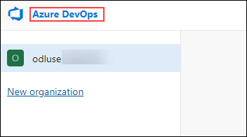

1. In the window that appears, CLICK ON **+ New Project**, give your project the name **eShopOnWeb** and choose **Scrum** on the **Work Item process** dropdown. Click on **Create**

    

## Task 3: Import eShopOnWeb Git Repository

In this task, you will import the eShopOnWeb Git repository that will be used by several laB.

1.  Click on **Files** (1) under Repos from the left navigation pane, click on **Import** (2). On the **Import a Git Repository** window, paste the following URL https://github.com/MicrosoftLearning/eShopOnWeb.git  (3)  and click on **Import**(4).

    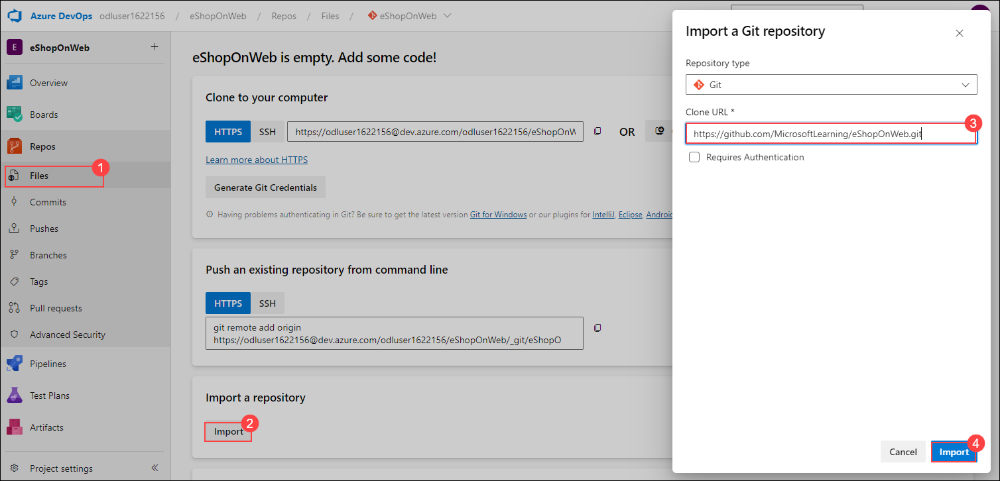

## Task 4: Set main branch as default branch
  
1. Go to **Repos>Branches (1)**.

1. Hover on the **main** branch then click the ellipsis on the right of the column **(2)**.

1. Click on **Set as default branch (3)**.
   
   

   >**Note:** If there's only one branch, it will automatically be set as the default branch, and the option will be greyed out. In this case, you can proceed with the next steps.

# Exercise 1: Setup CI pipeline to build eShopOnWeb container

In this exercise, you will setup CI YAML pipeline  for the creation of an Azure Container Registry.

## Task 1:  Create a Service Principal

In this task, you will create a Service Principal by using the Azure CLI.

1.  On the lab computer, open a web browser, then copy and paste the login link to access the [**Azure Portal**](https://portal.azure.com).

1.  In the Azure portal, click on the **Cloud Shell** icon, located directly to the right of the search textbox at the top of the page.

    

1.  If prompted to select either **Bash** or **PowerShell**, select **Bash**.

1. If this is the first time you are starting **Cloud Shell** and you are presented with the **You have no storage mounted** message, Select **No storage Account Required** (1) select the subscription you are using in this lab (2), and click on **Apply** (3)
    
    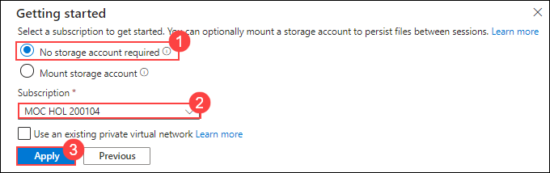

1.  From the **Bash** prompt, in the **Cloud Shell** pane, run the following commands to retrieve the values of the Azure subscription ID and subscription name attributes:

    ```
    az account show --query id --output tsv
    az account show --query name --output tsv
    ```

    > **Note**: Copy both values to a text file. You will need them later in this lab.

1.  From the **Bash** prompt, in the **Cloud Shell** pane, run the following command to create a Service Principal by replacing the following:
    - **myServicePrincipalName** with **spn<inject key="DeploymentID" enableCopy="false" />**
    - **mySubscriptionID** with your Azure subscriptionId that you copied in the previous step.

    ```
    az ad sp create-for-rbac --name myServicePrincipalName \
                         --role contributor \
                         --scopes /subscriptions/mySubscriptionID
    ```

1. Run the following command to create a resource group by making the following changes to the command:

    - Replace **[DID]** with **<inject key="DeploymentID" enableCopy="false" />**
    - Replace **[Location]** with **<inject key="Region" enableCopy="false" />** 

     ```bash
       az group create --name AZ400-EWebShop-[DID] --location [Location]
     ```

1.  Navigate to the Azure DevOps tab with  **eShopOnWeb** project. Click on **Project Settings** (1)  then click on **Service Connections** (under Pipelines) (2)

    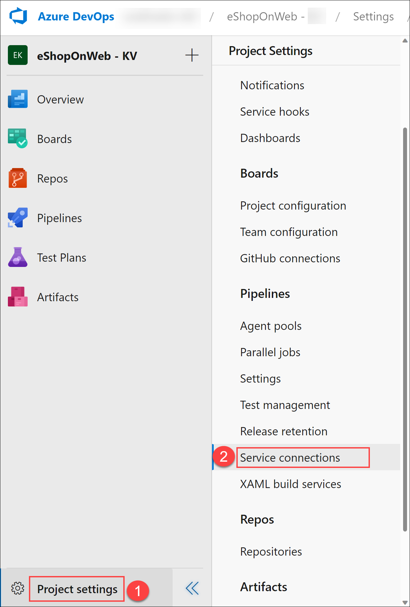

1. Click on **Create Service Connection**

   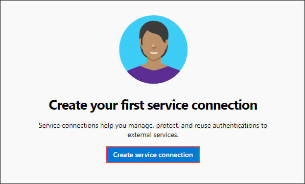

1. On the **New service connection** blade, select **Azure Resource Manager** and **Next** (may need to scroll down).

   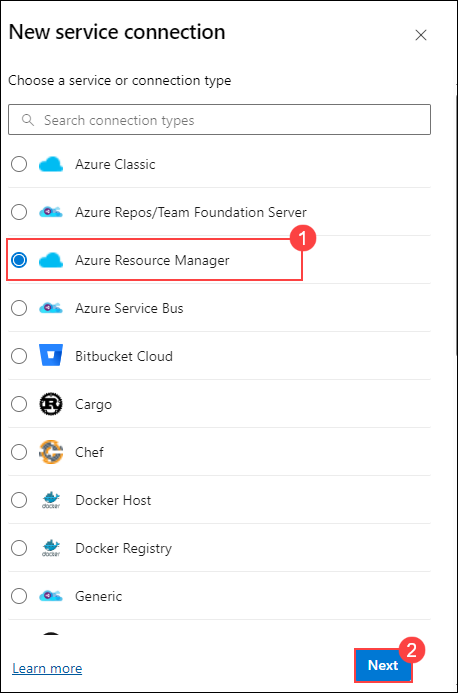

1. Fill in the below fields and leave the others as default:
   
    - Resource Group: **AZ400-EWebShop-<inject key="DeploymentID" enableCopy="false" />** (1)
    - In **Service connection name** type **azure subs**(2). This name will be referenced in YAML pipelines when needing an Azure DevOps Service Connection to communicate with your Azure subscription.
    - Click on **Save**(3).

      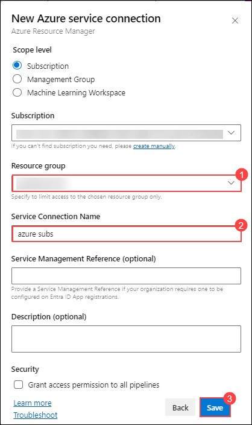

## Task 2: Setup and Run CI pipeline

In this task, you will import an existing CI YAML pipeline definition, modify and run it. It will create a new Azure Container Registry (ACR) and build/publish the eShopOnWeb container images.

1. Now from the left navigation pane, go to **Pipelines (1)>Pipelines (2)**. Click on **Create Pipeline (3)** button.

      

1.  On the **Where is your code?** window, select **Azure Repos Git (YAML)**

    

1. Select the **eShopOnWeb** repository.

    

1.  On the **Configure** section, choose **Existing Azure Pipelines YAML file** (1). Provide the following path **/.ado/eshoponweb-ci-dockercompose.yml** (2) and click on **Continue** (3).

    

1. In the YAML pipeline definition, customize the following:
   
  -  Resource Group name: **AZ400-EWebShop-<inject key="DeploymentID" enableCopy="false"/>** (1)
  -  Location: **<inject key="Region" enableCopy="false" />** (2)
  -  Replace **YOUR-SUBSCRIPTION-ID** with the Azure subscriptionId which you copied in the previous step (3)

     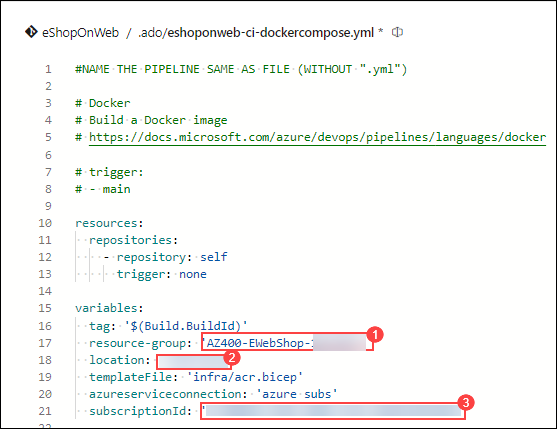
    
1. Click on **Save and Run** twice and wait for the pipeline to execute successfully.

1. **Ignore** any Warnings showing up during the Build Stage. Wait until it completes the Build Stage successfully. (You can select the actual Build stage to see more details from the logs.)

1. Once the Deploy Stage wants to start, you are prompted with **Permissions Needed**. Click on **View**.

   

1. From the **Waiting for Review** pane, click **Permit**.

1. Validate the message in the **Permit popup** window, and confirm by clicking **Permit**.

1. This sets off the Deploy Stage. Wait for this to complete successfully. The pipeline can take around 5 minutes to complete.

1. Your pipeline will take a name based on the project name. Let's **rename** it for identifying the pipeline better. Go to **Pipelines>Pipelines** and click on the recently created pipeline. Click on the ellipsis and **Rename/move** option. Name it **eshoponweb-ci-dockercompose** and click on **Save**.

1. Once the execution is finished, on the Azure Portal, open **AZ400-EWebShop-<inject key="DeploymentID" enableCopy="false"/>** Resource Group, Click on the newly created Azure Container Registry (ACR).

1. To view the container images within the ACR, click on **Repositories** under the **Services** section. From this, we will only use **eshopwebmvc** in the deploy phase.

    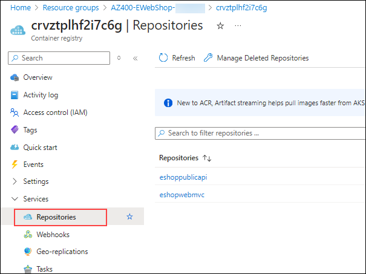

1. From the same window, click on **Access Keys** (1) under the **Settings** section.Enable the **Admin User** (2) option and copy the **password**(3) value, it will be used in the following task, as we will kept it as a secret  in Azure Key Vault.

   >**Note:** Kindly click on **Show** to view the password.

    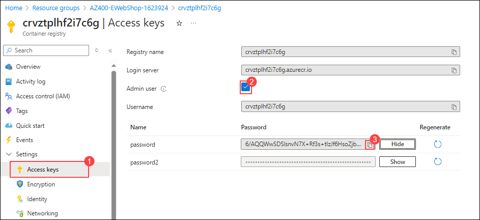

1. On the Access keys page, copy the **Login Server** name (1) and **Username** (2) into a Notepad file for later use.

   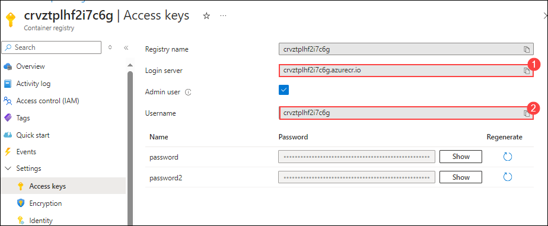

## Task 3: Create an Azure Key vault

In this task, you will create an Azure Key vault by using the Azure portal.

For this lab scenario, we will have a Azure Container Instance (ACI) that pull and runs a container image stored in Azure Container Registry (ACR). We intend to store the password for the ACR as a secret in the key vault.

1. In the Azure portal, in the **Search resources, services, and docs** text box, type **Key vault** and press the **Enter** key. 

1. Select **Key vault** blade, click on **Create>Key Vault**.

1.  On the **Basics** tab of the **Create key vault** blade, specify the following settings and click on **Next**:

    | Setting | Value |
    | --- | --- |
    | Subscription |*Leave it as default subscription* (1)|
    | Resource group | **AZ400-EWebShop-<inject key="DeploymentID" enableCopy="false"/>** (2) |
    | Key vault name | **keyvault<inject key="DeploymentID" enableCopy="false" />** (3)|
    | Region | **<inject key="Region" enableCopy="false" />** (4) |
    | Pricing tier | **Standard** (5) |
    | Days to retain deleted vaults | **7** (6) |
    | Purge protection | **Disable purge protection** (7)|

    

1. Click **Next:Access configuration** under **Permission model** select **Vault access policy** and click on **Review + Create** and **Create**.

    > **Note**: You need to secure access to your key vaults by allowing only authorized applications and users. To access the data from the vault, you will need to provide read (Get/List) permissions to the previously created service principal that you will be using for authentication in the pipeline.

1. Navigate to the newly created key vault, in the left navigation pane, click on **Access Policies** and click on **Create**

    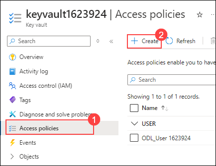

1. On the **Permission** blade, check **Get** and **List** permissions below **Secret Permission**. Click on **Next**.

   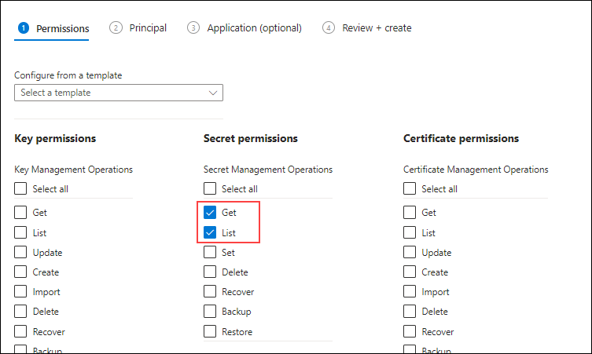

1. On the **Principal** blade, search for the previously created Service Principal **spn<inject key="DeploymentID" enableCopy="false" />** (1). Click on **Next** (2.)

   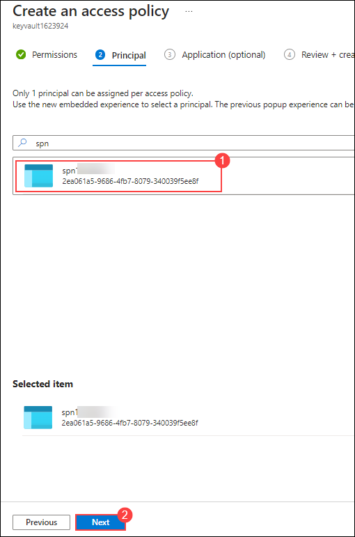

3. Click on **Next** again and on the **Review + create** blade, click on **Create**
  
      > **Note**: Wait for the Azure Key vault to be provisioned. This should take less than 1 minute.

1. On the **Your deployment is complete** blade, click on **Go to resource**.

1. On the Azure Key vault blade, in the vertical menu on the left side of the blade, in the **Objects** section, click on **Secrets**.

   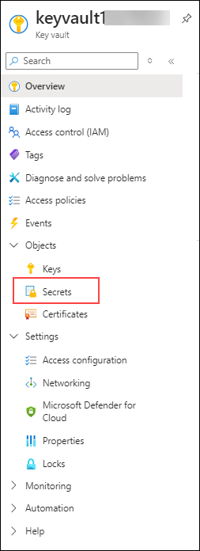

1. On the **Secrets** blade, click on **Generate/Import**.

1. On the **Create a secret** blade, specify the following settings and click on **Create** (4) (leave others with their default values):

    | Setting | Value |
    | --- | --- |
    | Upload options | **Manual** (1) |
    | Name | **acr-secret** (2) |
    | Value | ACR access password copied in Ex 1 task 2 step number 10 (3) |

     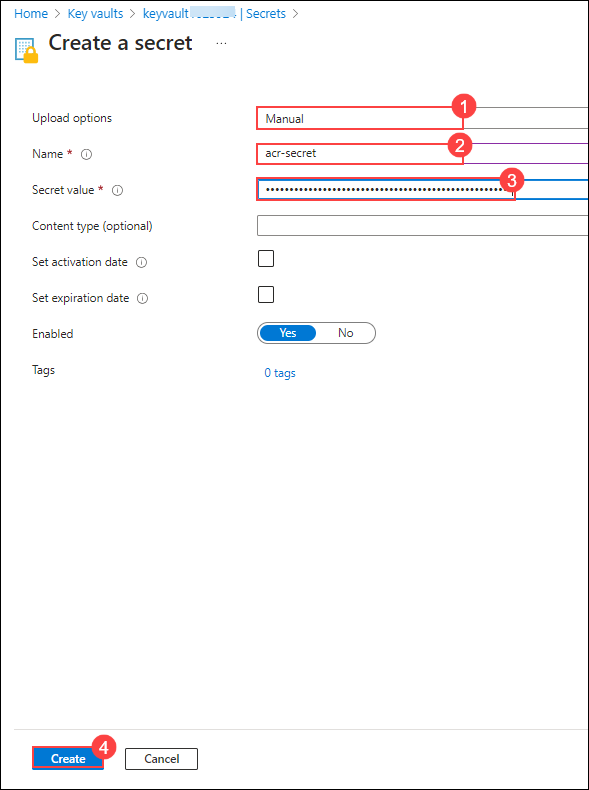

## Task 4: Create a Variable Group connected to Azure Key Vault

In this task, you will create a Variable Group in Azure DevOps that will retrieve the ACR password secret from Key Vault using the Service Connection (Service Principal)

1. Back in the Azure Devops tab, from the vertical left navigational pane, select **Library** (1) under the **Pipelines** section. Click on **+ Variable Group** (2).

    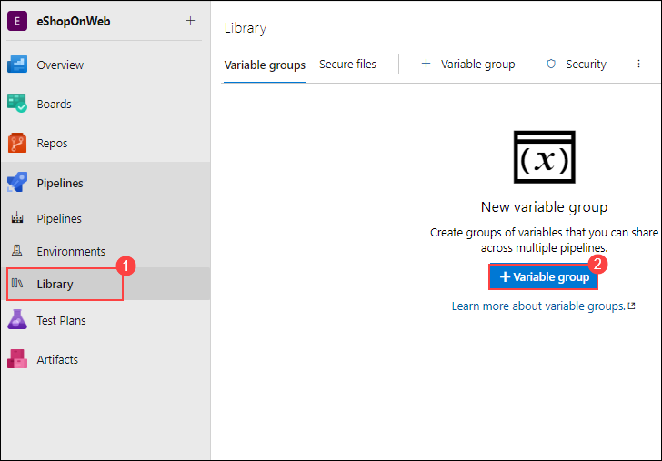

1. On the **New variable group** blade, specify the following settings:

    | Setting | Value |
    | --- | --- |
    | Variable Group Name | **eshopweb-vg** (1) |
    | Link secrets from Azure KV ... | **enable** (2)|
    | Azure subscription | **Available Azure service connection > Azure subs** (3)|
    | Key vault name | Select **keyvault<inject key="DeploymentID" enableCopy="false" />**(4) and click on **Authorize** (5) |

    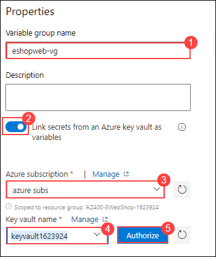

    > **Note**:If you don't find the key vault that you had created in the previous task, in the Azure subscription drop-down list, select the Azure subscription into which you deployed the Azure resources earlier in the lab, click on **Authorize**, and from the dropdown select  **Available Azure service connection > Azure subs** and select the key vault that you had created earlier.

1. Under **Variables**, click on **+ Add**

1. Select the **acr-secret** secret. Click on **OK**.

   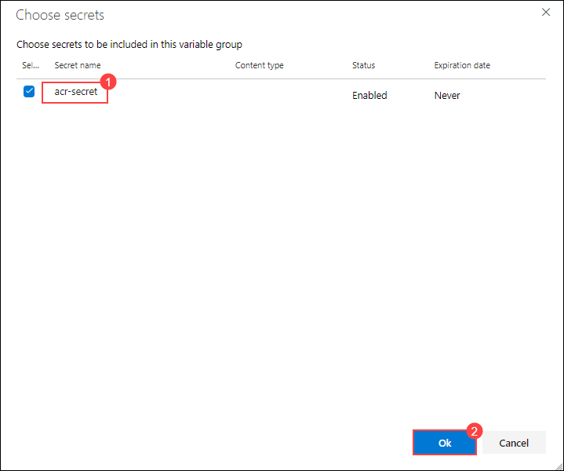

1. Click on **Save**.

   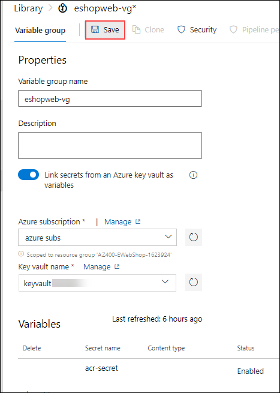

## Task 5: Setup CD Pipeline to deploy container in Azure Container Instance(ACI)

In this task, you will import a CD pipeline, customize it and run it for deploying the container image created before in a Azure Container Instance.

1. In the Azure devops portal from the left pane, select  **Pipelines** (1) under the Pipelines option and click on **New Pipeline** (2).

    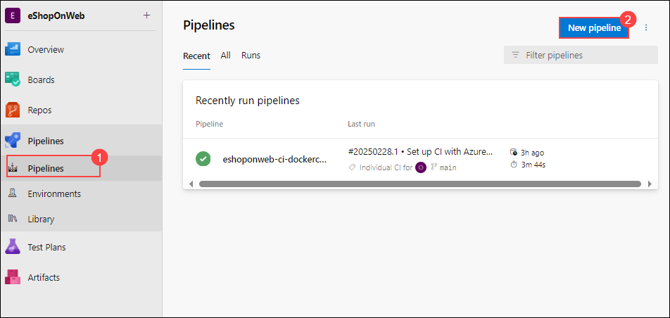

1. On the **Where is your code?** window, select **Azure Repos Git (YAML)** and subsequently select the **eShopOnWeb** repository.

1. On the **Configure** section, choose **Existing Azure Pipelines YAML file**. Provide the following path **/.ado/eshoponweb-cd-aci.yml** and click on **Continue**.

   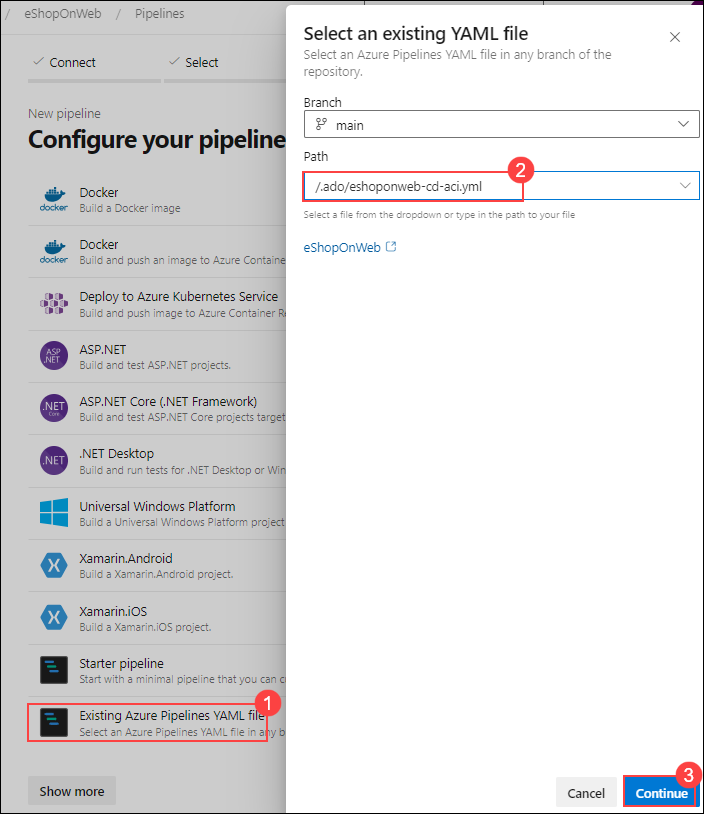

1. In the YAML pipeline definition, customize:

    -  Location: **<inject key="Region" enableCopy="false" />** (1)
    - **YOUR-SUBSCRIPTION-ID** with your Azure subscription id which you copied in the previous task (2).
    - **webappname**: **az400eshop-<inject key="DeploymentID" enableCopy="false"/>** (3)
    - **acr-login-server**: Login Server name of the Container Registry resource copied in Ex 1 Task 2 step number 11 (4)
    - **acr-username**: Username of the Container Registry resource copied in Ex 1 Task 2 step number 11 (5)
    - **resource-group**: **AZ400-EWebShop-<inject key="DeploymentID" enableCopy="false"/>** (6)

     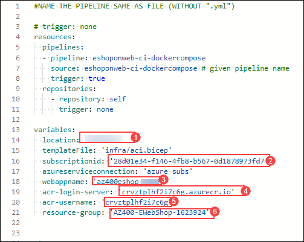

      >**Note:** If you have not copied the Login server name and Username,you can retrieve it by  navigating to azure portal,search for Container Registries and click on the available container registry,from the left navigation pane go to **Access Keys** and copy the login server and the username.
    
1. Click on **Save and Run** twice.

1. Once the Deploy Stage wants to start, you are prompted with **Permissions Needed**, as well as an orange bar saying **"This pipeline needs permission to access a resource before this run can continue to Deploy to an Azure Web App"**.
    
1. Click on **View**

1. From the **Waiting for Review** pane, click **Permit**.

1. Validate the message in the **Permit popup** window, and confirm by clicking **Permit**.

1. Wait for this to complete successfully.

    > **Note**: The deployment may take a few minutes to complete. 

1. Your pipeline will take a name based on the project name. Lets **rename** it for identifying the pipeline better. Go to **Pipelines>Pipelines** and click on the recently created pipeline. Click on the ellipsis and **Rename/move** option. Name it **eshoponweb-cd-aci** and click on **Save**.

  > **Congratulations** on completing the task! Now, it's time to validate it. Here are the steps:
   - If you receive a success message, you can proceed to the next task.
   - If not, carefully read the error message and retry the step, following the instructions in the lab guide.
   - If you need any assistance, please contact us at labs-support@spektrasystems.com. We are available 24/7 to help you out.
  
   <validation step="10127a4a-453b-48da-b290-fea76e5a1dfe" />

## Review

In this lab, you integrated Azure Key Vault with an Azure DevOps pipeline by using the following steps:

- Created an Azure Key vault to store a MySQL server password as a secret.
- Created an Azure service principal to provide access to secrets in the Azure Key vault.
- Configured permissions to allow the service principal to read the secret.
- Configured pipeline to retrieve the password from the Azure Key vault and pass it on to subsequent tasks.

## Click Next to proceed with the next lab.
