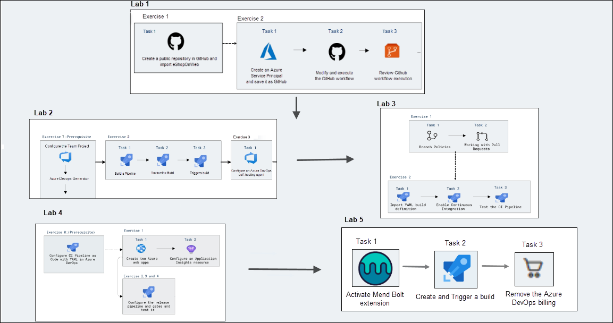
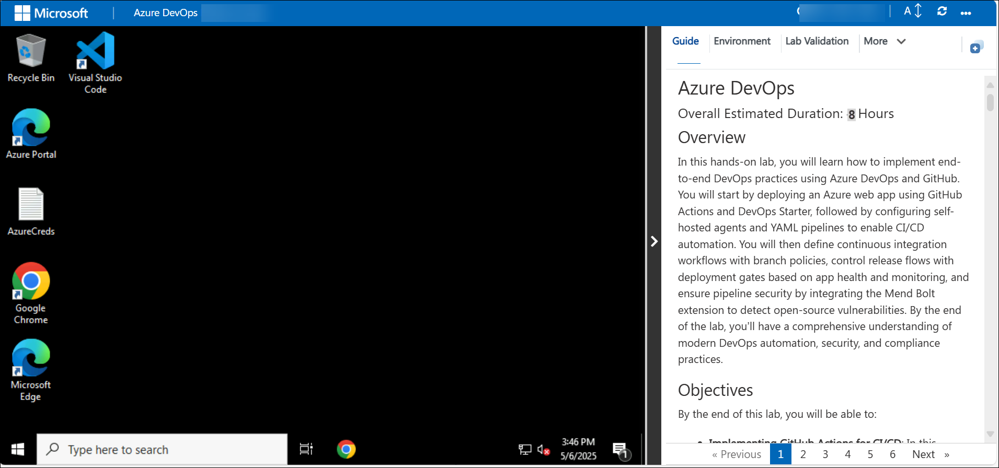
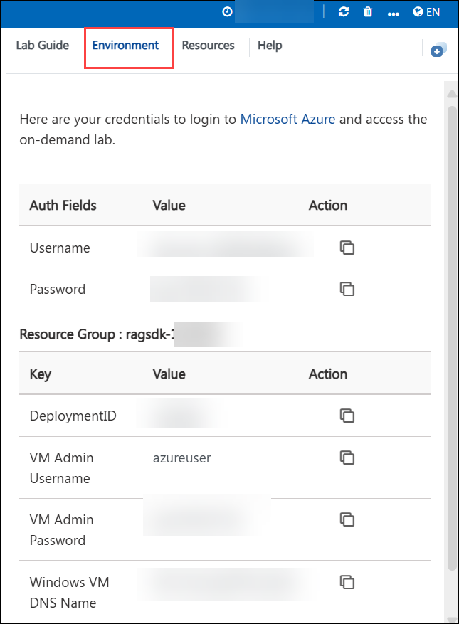
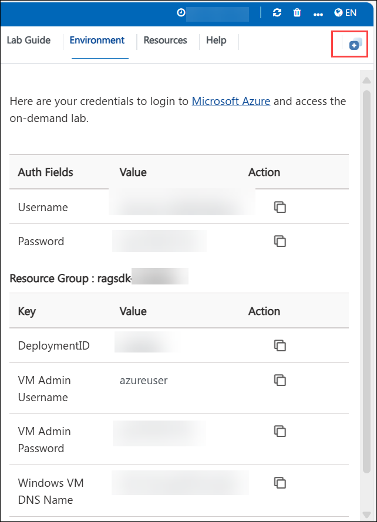
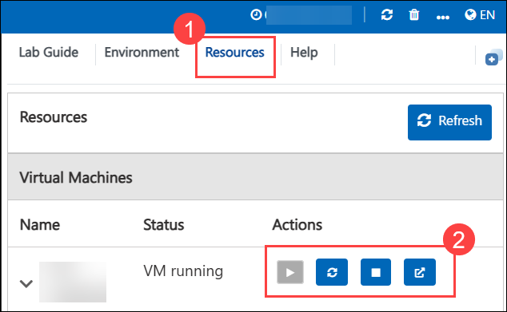
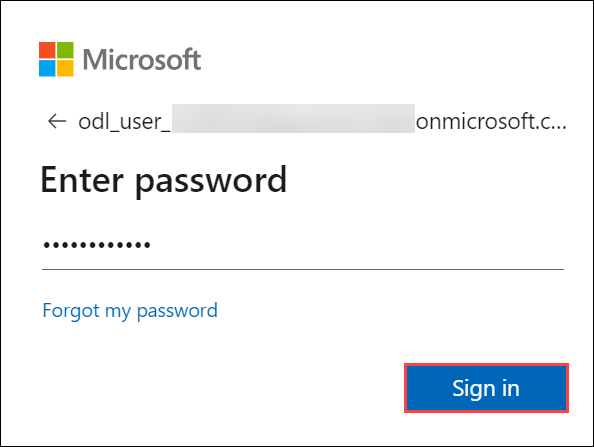
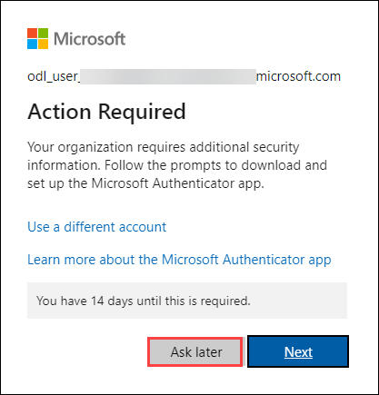
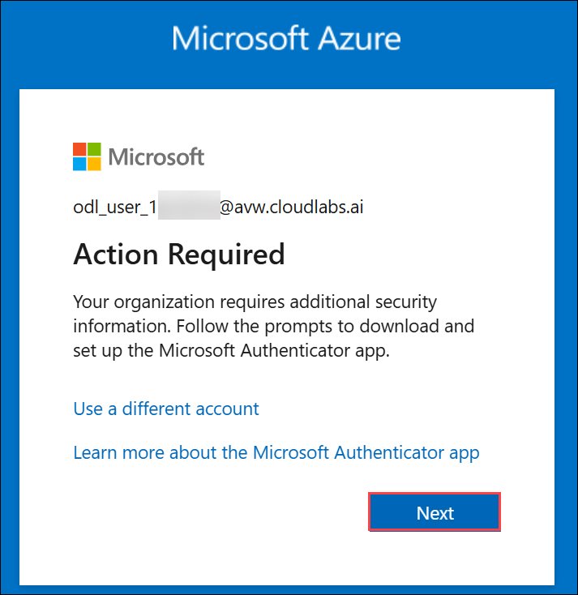
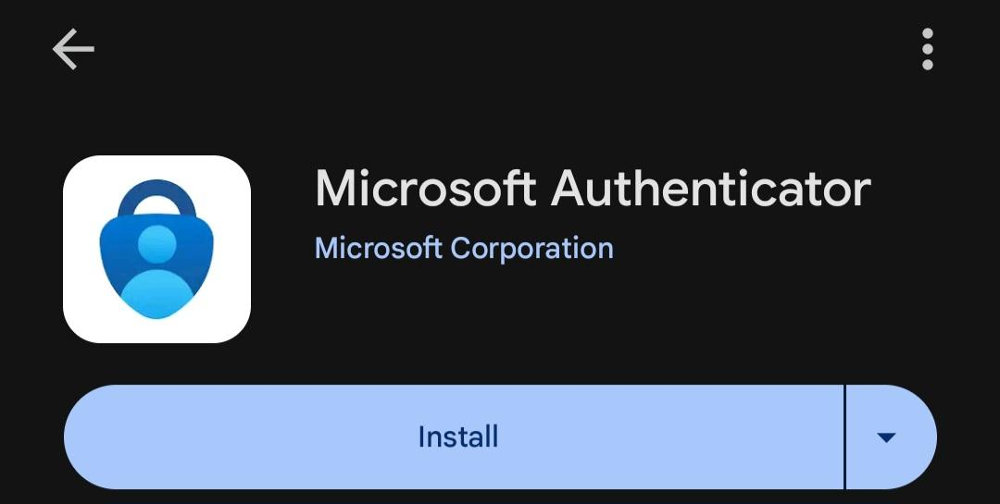
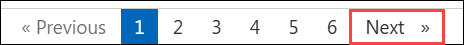

# Azure DevOps 

### Overall Estimated Duration: 4 Hours

## Introduction - Overview of GitHub and Collaborative Development

In this hands-on lab, you will learn how to implement end-to-end DevOps practices using Azure DevOps and GitHub. You will begin by deploying the eShopOnWeb application using GitHub Actions, creating a service principal, and securing credentials with GitHub secrets. Next, you'll configure self-hosted agents and use YAML pipelines to enable code-based CI/CD workflows with support for branching, versioning, and pull requests. You will define build pipelines, enforce branch policies for continuous integration, and manage releases using gates that monitor app health and alerts. Finally, you'll integrate the Mend Bolt extension to secure your pipelines by detecting open-source vulnerabilities, ensuring secure and compliant deployments.

## Objectives

By the end of this lab, you will be able to:

- **Implementing GitHub Actions for CI/CD**: During this hands-on session, participants will learn how to implement a GitHub Action workflow to deploy an Azure web app using DevOps. They will configure GitHub Actions for continuous integration and deployment, connect to Azure services, and automate the deployment process for a streamlined DevOps pipeline.

- **Configuring Agent Pools and Understanding Pipeline Styles**: During this hands-on session, participants will learn how to configure self-hosted Azure DevOps agents, build and release pipelines using YAML, and integrate Selenium testing for automated validation—enabling end-to-end CI/CD automation with version-controlled pipeline definitions.

- **Enabling Continuous Integration with Azure Pipelines**: During this hands-on session, participants will define and manage YAML-based build pipelines in Azure DevOps, configure branch policies, and implement continuous integration to automate and validate code changes through pull requests.

- **Controlling Deployments using Release Gates**: During this hands-on session, participants will configure deployment gates in Azure Pipelines to control and automate application releases across environments, ensuring deployments proceed only when predefined health and compliance checks are met.

- **Implementing Security and Compliance in an Azure Pipeline**: During this hands-on session, participants will implement security and compliance in an Azure DevOps pipeline by integrating the Mend Bolt extension to scan for vulnerabilities, analyze security risks during builds, and manage costs by disabling unnecessary billing.
  
## Prerequisites

- Basic knowledge of Azure DevOps and GitHub repositories.

- Familiarity with CI/CD concepts and pipeline workflows.

- Access to an active Azure subscription and Azure DevOps organization.

- Understanding of YAML syntax and Git-based version control.

- Basic experience working with Azure Web Apps and Application Insights.

## Architecture

The architecture flow involves using GitHub Actions and Azure DevOps Pipelines to implement a full CI/CD pipeline for deploying Azure Web Apps. GitHub is used as the central code repository where developers push code and trigger GitHub Actions for initial builds and deployments via Azure DevOps. Self-hosted and Microsoft-hosted agent pools are configured in Azure DevOps to run YAML-based pipelines, enabling automated CI/CD with complete pipeline-as-code control. Continuous integration is enforced through branch policies and pull request validations, ensuring code quality before merging. Release gates are configured within Azure Pipelines to introduce compliance and environment-specific checks before progressing to production, using criteria such as service health, approval steps, and business rules. Security and compliance are integrated using the Mend Bolt extension in the pipeline to scan for vulnerabilities and enforce build-time governance. The entire DevOps lifecycle—from commit to deploy—is automated, secure, and monitored using Azure-native tools and services.

## Architecture Diagram

## Explanation of Components

1. **GitHub**: GitHub acts as the source code repository where developers collaborate and manage code versions. It integrates with GitHub Actions to automate build, test, and deployment workflows directly from code pushes and pull requests.

1. **GitHub Actions**: GitHub Actions provides a cloud-native automation platform for continuous integration and deployment. It triggers workflows based on events in the GitHub repository and automates the deployment of web applications to Azure using pre-configured or custom YAML-based workflows.

1. **Azure DevOps Pipelines**: Azure Pipelines offers robust CI/CD capabilities using YAML or classic pipelines. It orchestrates the build, test, and release processes across environments with full control and visibility into every stage of the software lifecycle.

1. **Agent Pools (Microsoft-hosted & Self-hosted)**: Agent pools are used to define where pipeline jobs run. Microsoft-hosted agents offer pre-configured environments, while self-hosted agents give teams control over the runtime environment, software tools, and scalability.

1. **YAML Pipelines**: YAML pipelines enable Infrastructure as Code (IaC) for CI/CD processes in Azure DevOps. They allow versioning and code reviews of pipeline definitions alongside application code, enhancing traceability and consistency.

1. **Branch Policies**: Branch policies enforce quality gates such as required reviewers, successful build validations, and status checks before allowing changes to be merged into protected branches, thus enabling secure and stable continuous integration.

1. **Release Gates**: Release gates are checkpoints within release pipelines that ensure specific conditions—like service health, approvals, or compliance checks—are met before advancing to the next environment, helping enforce safe and compliant deployments.

1. **Azure Web Apps**: Azure Web Apps is the target deployment service for web applications. It supports automated deployments from CI/CD pipelines and offers scalability, security, and integration with monitoring and diagnostics tools.

1. **Mend Bolt**: Mend Bolt (formerly WhiteSource Bolt) is a free extension for Azure DevOps that scans open-source dependencies in real-time to detect vulnerabilities and license issues, enabling early detection and remediation of security risks.

1. **Visual Studio Code**: Acts as the integrated development environment (IDE) for coding, debugging, and managing Git repositories. It enables developers to work with both GitHub Actions and Azure DevOps pipelines through extensions and terminal-based workflows.

## Getting Started with the Lab
 
### Accessing Your Lab Environment
 
Once you are ready to dive in, your virtual machine and **Lab Guide** will be right at your fingertips within your web browser.

   

### Lab Guide Zoom In/Zoom Out

To adjust the zoom level for the environment page, click the **A↕ : 100%** icon located next to the timer in the lab environment.

   

### Virtual Machine & Lab Guide
 
Your virtual machine is your workhorse throughout the workshop. The lab guide is your roadmap to success.
 
### Exploring Your Lab Resources
 
To get a better understanding of your lab resources and credentials, navigate to the **Environment** tab.
 
   
 
### Utilizing the Split Window Feature
 
For convenience, you can open the lab guide in a separate window by selecting the **Split Window** button from the top right corner.
 
 
 
### Managing Your Virtual Machine
 
Feel free to **start, stop, or restart (2)** your virtual machine as needed from the **Resources (1)** tab. Your experience is in your hands!
 
 

### Lab Validation

1. After completing the task, hit the **Validate** button under the Validation tab integrated into your lab guide. You can proceed to the next task if you receive a success message. If not, carefully read the error message and retry the step, following the instructions in the lab guide.

   

1. If you need any assistance, please contact us at cloudlabs-support@spektrasystems.com.

## Let's Get Started with Azure Portal

1. On your virtual machine, click on the **Azure Portal** icon as shown below:

   
   
1. You will see the **Sign in to the Microsoft Azure** tab. Here, enter your credentials:
 
   - **Email/Username:** <inject key="AzureAdUserEmail"></inject>
 
       
 
1. Next, provide your password:
 
   - **Password:** <inject key="AzureAdUserPassword"></inject>
 
       

1. If you see the pop-up **Stay Signed in?**, click **No**.       

1. If an **Action required** pop-up window appears, click on **Ask later**.

   
    
1. If prompted to stay signed in, you can click **No**.
 
### Steps to Proceed with MFA Setup if the "Ask Later" Option is Not Visible

1. If you see the pop-up **Stay Signed in?**, click **No**.

1. If **Action required** pop-up window appears, click on **Next**.
   
   

1. On **Start by getting the app** page, click on **Next**.
1. Click on **Next** twice.
1. In **android**, go to the play store and Search for **Microsoft Authenticator** and Tap on **Install**.

   

   > Note: For Ios, Open the app store and repeat the steps.

   > Note: Skip if already installed.

1. Open the app and tap on **Scan a QR code**.

1. Scan the QR code visible on the screen **(1)** and click on **Next (2)**.

   

1. Enter the digit displayed on the Screen in the Authenticator app on mobile and tap on **Yes**.

1. Once the notification is approved, click on **Next**.

   

1. Click on **Done**.

1. If prompted to stay signed in, you can click **"No"**.

1. Tap on **Finish** in the Mobile Device.

   > NOTE: While logging in again, enter the digits displayed on the screen in the **Authenticator app** and click on Yes.

1. If a **Welcome to Microsoft Azure** pop-up window appears, simply click **"Cancel"** to skip the tour.

1. If you see the pop-up **You have free Azure Advisor recommendations!**, close the window to continue the lab.

This hands-on lab will guide you through implementing end-to-end DevOps practices using Azure DevOps and GitHub. You will deploy an Azure web app with GitHub Actions, set up CI/CD automation with YAML pipelines, and configure release gates based on app health. Additionally, you will integrate the Mend Bolt extension to detect open-source vulnerabilities, ensuring security and compliance in your pipeline.

### Support Contact

The CloudLabs support team is available 24/7, 365 days a year, via email and live chat to ensure seamless assistance anytime. We offer dedicated support channels tailored specifically for learners and instructors, ensuring that all your needs are promptly and efficiently addressed.

Learner Support Contacts:

- Email Support: cloudlabs-support@spektrasystems.com
- Live Chat Support: https://cloudlabs.ai/labs-support

Click **Next** from the lower right corner to move on to the next page.

## Happy Learning!!
