# Lab 01: Implementing GitHub Actions for CI/CD

## Estimated duration: 30 minutes

## Lab Scenario

You are a DevOps engineer for Contoso.ltd tasked with deploying a dynamic .NET web app to Azure using GitHub Actions and Infrastructure as Code. In this lab, you will import the eShopOnWeb app into your GitHub repository, configure Azure access using a service principal, and automate deployment via a GitHub Actions workflow backed by Bicep templates.

## Objectives

In this lab you will complete the following exercises:

- Import the eShopOnWeb app into your GitHub repository
- Configure GitHub repository settings and Azure service principal
- Update and run a GitHub Actions workflow to deploy the web app to Azure

## Architecture Diagram

   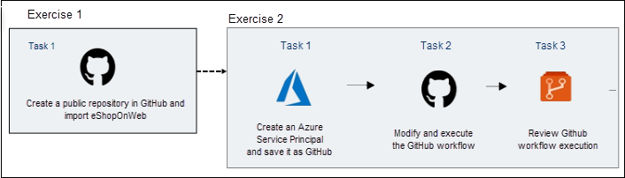

## Lab requirements

- If you don't already have a GitHub account that you can use for this lab, follow instructions available at [Signing up for a new GitHub account](https://docs.github.com/get-started/signing-up-for-github/signing-up-for-a-new-github-account).


## Prepare a GitHub account

1. If you already have a GitHub account that you can use for this lab proceed with Exercise 1, else follow the instructions to create an account.

1. Navigate to the https://github.com/ **(1)** and then Click on **Sign up (2)** in the top right corner.

   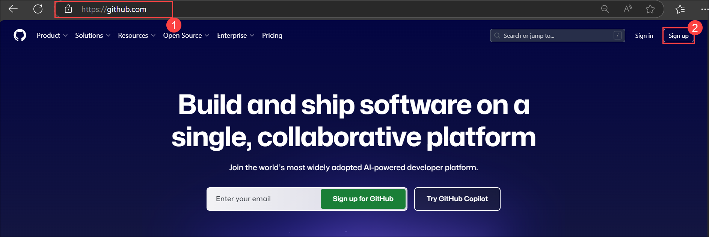
   
1. Provide your **Email address (1)**, **Password (2)**, **Username (3)** and click on **Continue (4)**.

   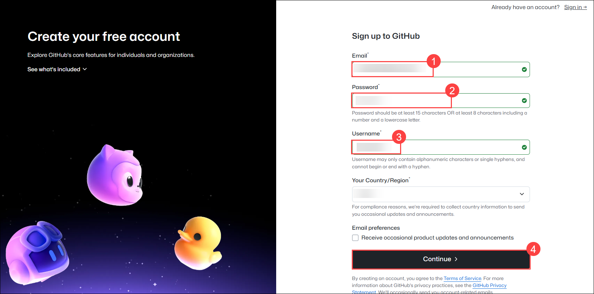

1. If prompted, complete the visual puzzle.

1. Confirm your details, verify your account, and click **'Create Account'**. The process will take approximately 2 minutes to complete.

# Exercise 1: Import eShopOnWeb to your GitHub Repository

In this exercise, you will import the existing [eShopOnWeb](https://github.com/MicrosoftLearning/eShopOnWeb) repository code to your own GitHub private repo.

The repository is organized the following way:
   - **.ado** folder contains Azure DevOps YAML pipelines
   - **.devcontainer** folder container setup to develop using containers (either locally in VS Code or GitHub Codespaces)
   - **.azure** folder contains Bicep&ARM infrastructure as code templates used in some lab scenarios.
   - **.github** folder container YAML GitHub workflow definitions.
   - **src** folder contains the .NET 6 website used on the lab scenarios.

### Task 1: Create a public repository in GitHub and import eShopOnWeb

In this task, you will create an empty public GitHub repository and import the existing [eShopOnWeb](https://github.com/MicrosoftLearning/eShopOnWeb) repository.

1. From the Lab vm, start a web browser, right click on [GitHub website](https://github.com/), paste it on the browser tab.

1. Click on **Sign in**. 
    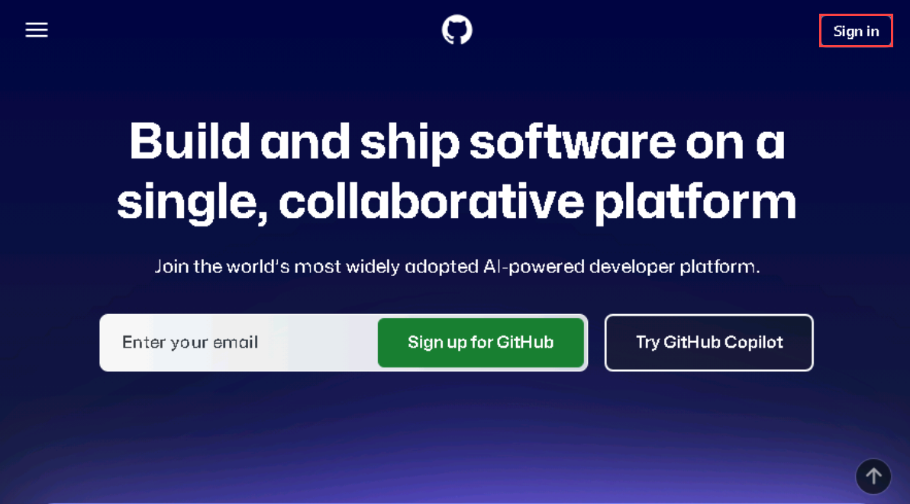

1. Provide your **Github Username/email address** (1) and **Password (2)** then click on **Sign in (3)**.

    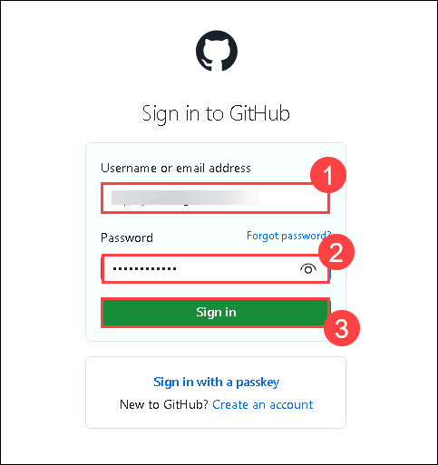

1. Then you will receive a device verification code to your email, enter that **code (1)** and then click on **Verify (2)**. 

    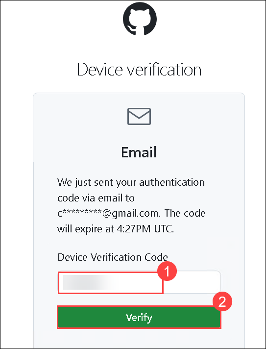

1. Click on **New** to create a new repository.

    
 
1. On the **Create a new repository** page, click on **Import a repository** link (below the page title).

    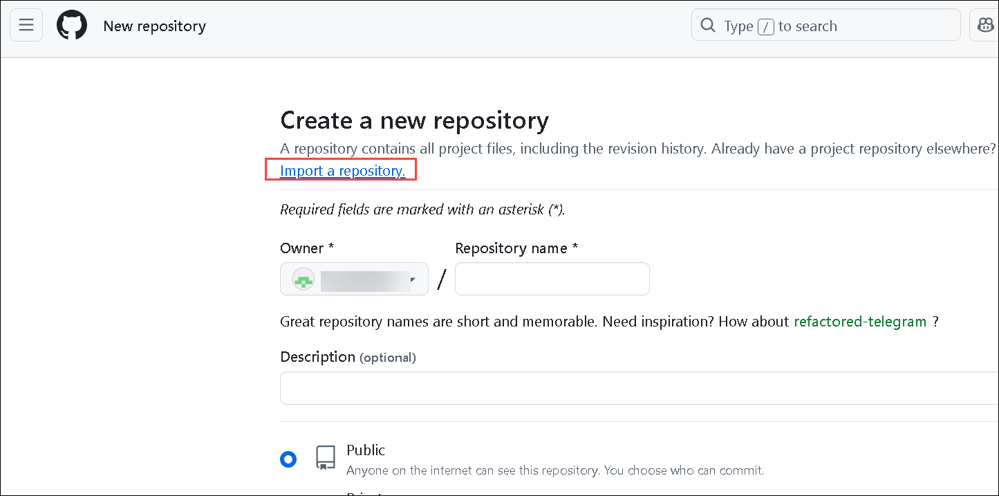

     >**NOTE**: You can also open the import website directly at <https://github.com/new/import>

1. On the **Import your project to GitHub** page, enter the following details and then click on **Begin Import (5)** and wait for your repository to be ready (this may take a few minutes).
    
    | Field | Value |
    | --- | --- |
    | The URL for your source repository| https://github.com/CloudLabs-MOC/eShopOnWeb **(1)** |
    | Owner | Leave your default username **(2)** |
    | Repository Name | **eShopOnWeb (3)** |
    | Privacy | **Public** **(4)** | 

    

1. Wait for the import to complete.

    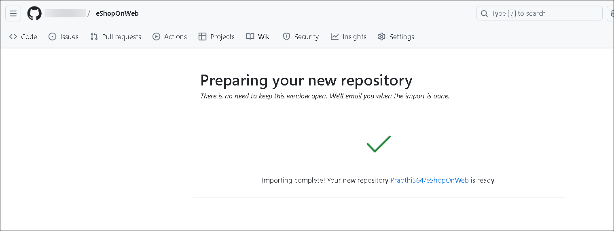

1. On the repository page, go to **Settings (1)**, click on **Actions (2)> General (3)** and choose the option **Allow all actions and reusable workflows (4)**. Click on **Save (5)**.

    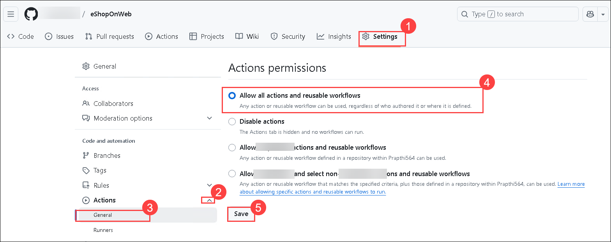

# Exercise 2: Setup your GitHub Repository and Azure access

In this exercise, you will create an Azure Service Principal to authorize GitHub accessing your Azure subscription from GitHub Actions. You will also setup the GitHub workflow that will build, test and deploy your website to Azure. 

### Task 1: Create an Azure Service Principal and save it as GitHub secret

In this task, you will create the Azure Service Principal used by GitHub to deploy the desired resources. As an alternative, you could also use [OpenID connect in Azure](https://docs.github.com/actions/deployment/security-hardening-your-deployments/configuring-openid-connect-in-azure), as a secretless authentication mechanism.

1. On your lab VM, in a edge browser window, open the  [Azure Portal](https://portal.azure.com).

1. In the portal, search for **Resource Groups (1)** and select **Resource Groups (2)**.

    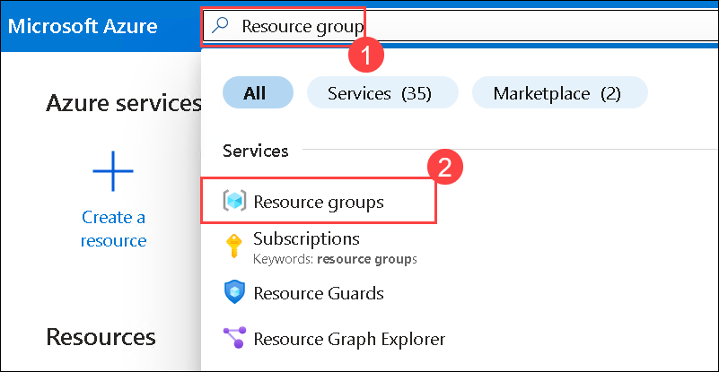

1. Click on **+ Create** to create a new Resource Group for the exercise.

    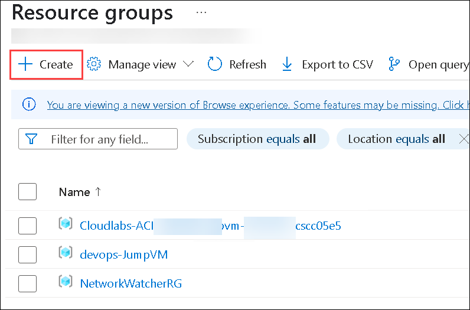

1. On the **Create a resource group** tab, 
     
    - Subscription: Leave it at the default setting  **(1)**
    - Resource Group name: **rg-devOps-eshopeonweb-<inject key="DeploymentID" enableCopy="false"/> (2)**
    - Region: Leave the default one **(3)**
    - Click on **Review + Create (4)**

      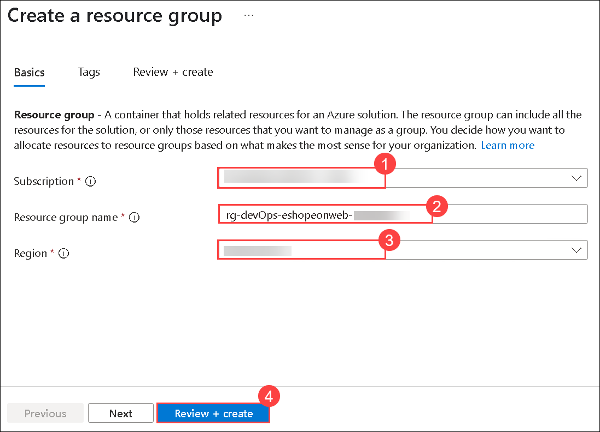

1. Then click on **Create**.

    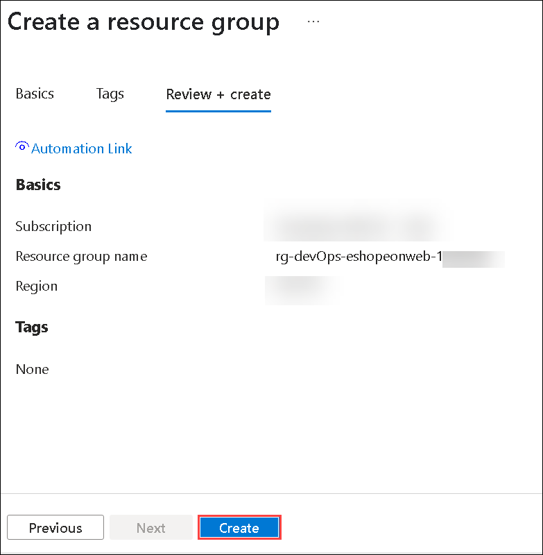

1. In the Azure Portal, open the **Cloud Shell** (next to the search bar).

    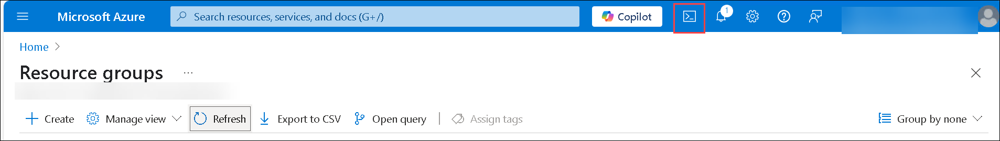

     >**NOTE:** If this is the first time you are starting **Cloud Shell** and you are presented with the **You have no storage mounted** message, select the subscription you are using in this lab, and select **Create storage**

1. Select **Bash** mode.

    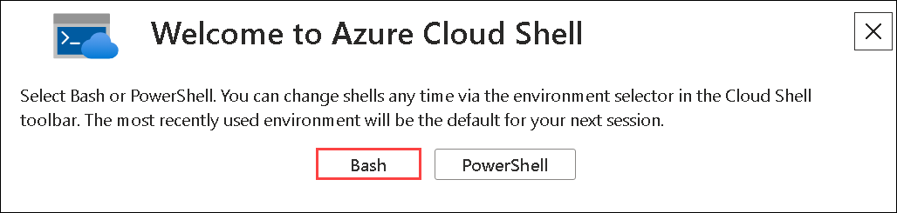

1. On the **Getting started**, 

    - Select **No storage account required (1)**
    - Leave the default subscription **(2)**
    - Select **Apply**

      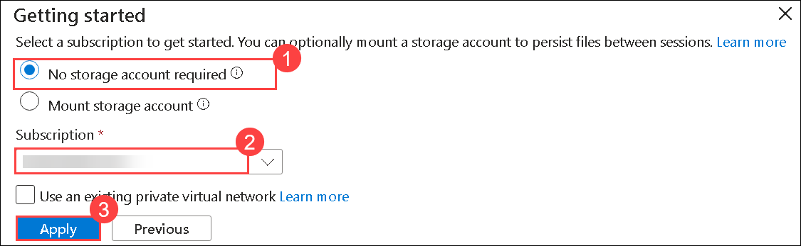

1. Once the Terminal starts, execute the following command **(1)**, replacing **SUBSCRIPTION-ID** and **RESOURCE-GROUP** with your own identifiers (both can be found on the **Overview** page of the Resource Group):

   ```
   az ad sp create-for-rbac --name GH-Action-eshoponweb --role contributor --scopes /subscriptions/SUBSCRIPTION-ID/resourceGroups/RESOURCE-GROUP --sdk-auth
   ```

    >**NOTE**: To get the **SUBSCRIPTION-ID** and **RESOURCE-GROUP**, In the Azure portal navigate to **rg-devOps-eshopeonweb-<inject key="DeploymentID" enableCopy="false"/>** Resource group then copy the **Resource group name (1)** and **SUBSCRIPTION-ID (2)**.

     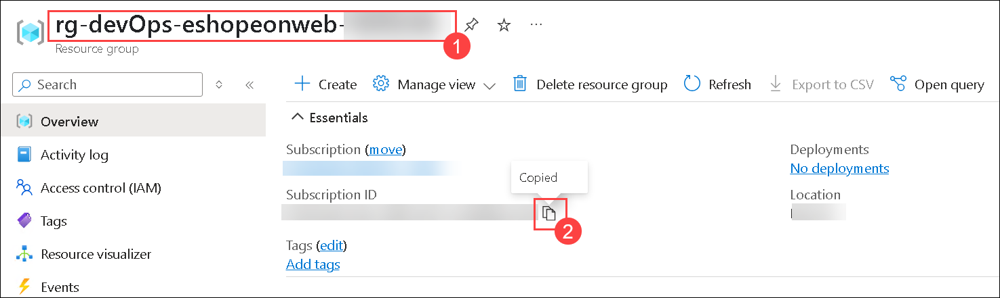
    
    >**NOTE:** Make sure this is typed or pasted as a single line!
    
    >**NOTE:** This command will create a Service Principal with Contributor access to the Resource Group created before. This way we make sure GitHub Actions will only have the permissions needed to interact only with this Resource Group (not the rest of the subscription).

1. The command will output a JSON object, you will later keep it as a GitHub secret for the workflow, **Copy the JSON (2)**. The JSON contains the identifiers used to authenticate against Azure in the name of an Azure Entra application identity (service principal).

    ```JSON
    {
        "clientId": "<GUID>",
        "clientSecret": "<GUID>",
        "subscriptionId": "<GUID>",
        "tenantId": "<GUID>",
        (...)
    }
    ```

    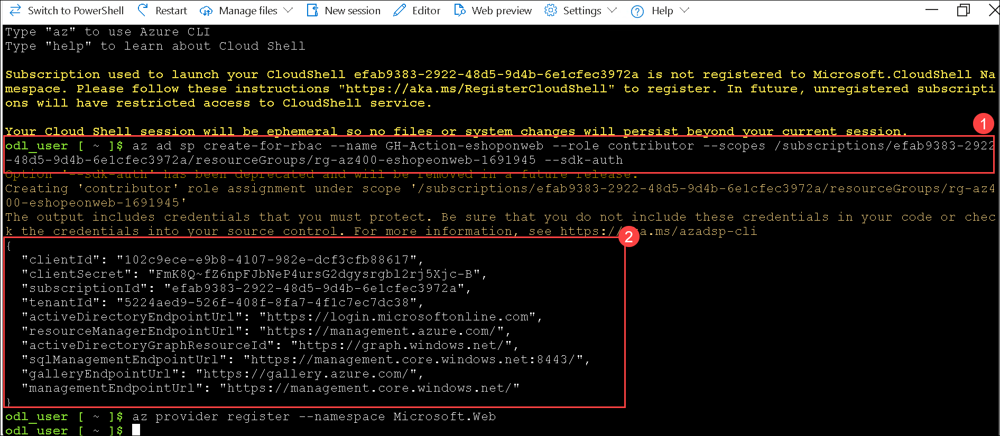

1. You also need to run the following command to register the resource provider for the **Azure App Service** you will deploy later:

   ```bash
   az provider register --namespace Microsoft.Web
   ```

    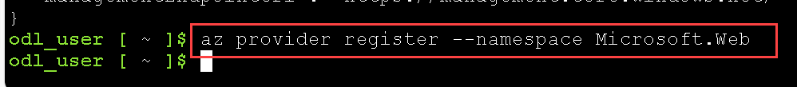   

1. Navigate back to your **eShopOnWeb** GitHub repository opened in the browser.

1. On the repository page, go to **Settings (1)**, click on **Secrets and variables (2)> Actions (3)**. Click on **New repository secret (4)** under Repository secrets.

      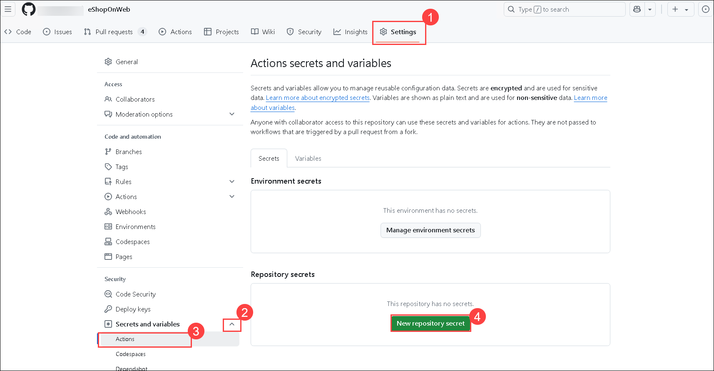

1. On the **Action Secret/New secret** tab, add the following:
    
    - Name : **AZURE_CREDENTIALS (1)**
    - Secret: **paste the previously copied  JSON object (2)** (GitHub is able to keep multiple secrets under same name, used by  [azure/login](https://github.com/Azure/login) action )
    - Click on **Add secret  (3)**. Now GitHub Actions will be able to reference the service principal, using the repository secret.

      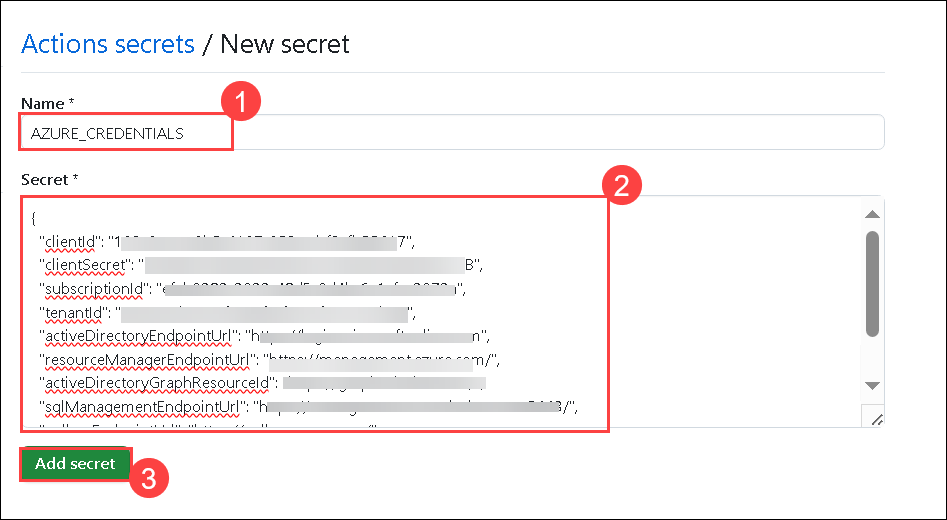

### Task 2: Modify and execute the GitHub workflow

In this task, you will modify the given GitHub workflow and execute it to deploy the solution in your own subscription.

1. Navigate to your **eShopOnWeb** GitHub repository.

1. On the repository page, go to **Code**.

    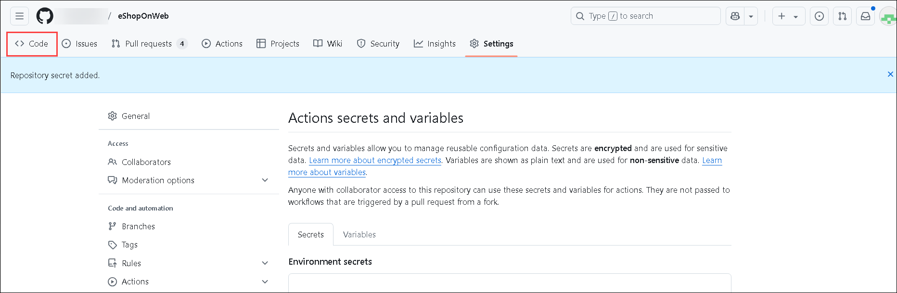

1. Open the following file: **eShopOnWeb/.github (1)/workflows (2)/eshoponweb-cicd.yml (3)**. This workflow defines the CI/CD process for the given .NET 6 website code.

    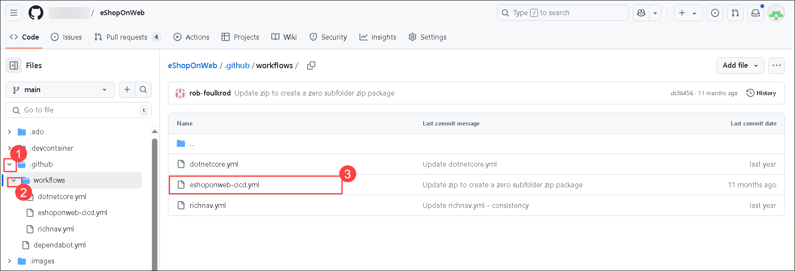

1. Select the **Edit** (pencil icon). 

    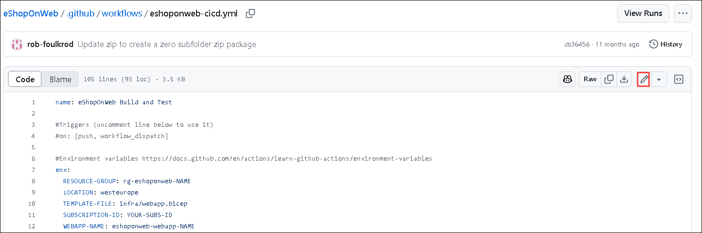

1. Uncomment the **on** section (delete "#" symbol). The workflow triggers with every push to the main branch and also offers manual triggering ("workflow_dispatch").

    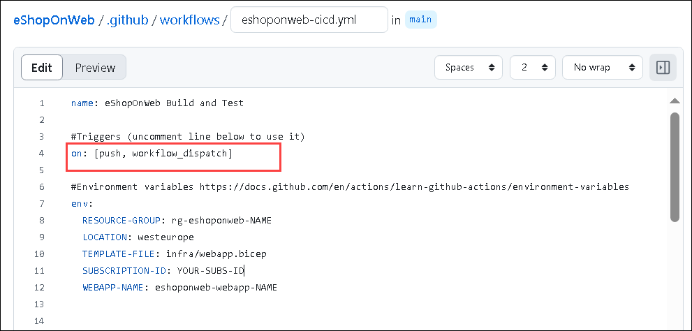

1. In the **env** section, make the following changes:
    - **RESOURCE-GROUP**: Replace `RESOURCE-GROUP` variable with **rg-devOps-eshopeonweb-<inject key="DeploymentID" enableCopy="false"/>** 
    - **Location**: **westus**
    - **SUBSCRIPTION-ID**: Replace **YOUR-SUBS-ID** in **SUBSCRIPTION-ID**. You can find your subscription ID from the Overview page of **rg-devOps-eshopeonweb-<inject key="DeploymentID" enableCopy="false"/>** Resource group in Azure portal. 
    - **WEBAPP-NAME**: Enter **eshoponweb-webapp-<inject key="DeploymentID" enableCopy="false"/>**. It will be used to create a globally unique website using Azure App Service.

      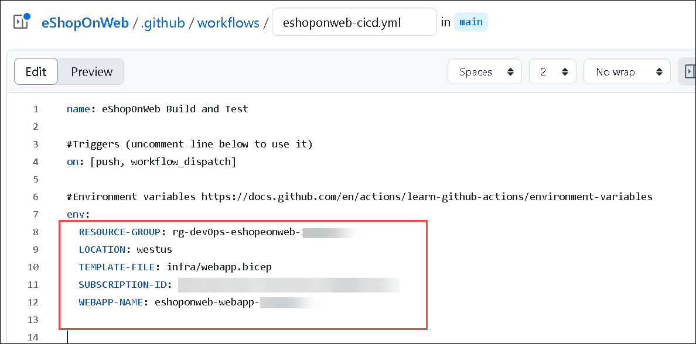

1. Scroll down, within the **publish (1)** section. Replace **${{ env.WEBAPP-NAME }}** with **app-name: eshoponweb-webapp-<inject key="DeploymentID" enableCopy="false"/> (2)** and then click on **Commit changes (3)**.

    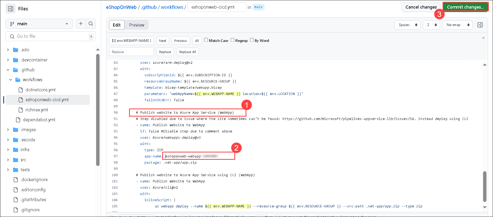

     >**NOTE**: Read the workflow carefully, comments are provided to help understand.

1. **Commit changes** again leaving defaults (changing the main branch). The workflow will get automatically executed.

    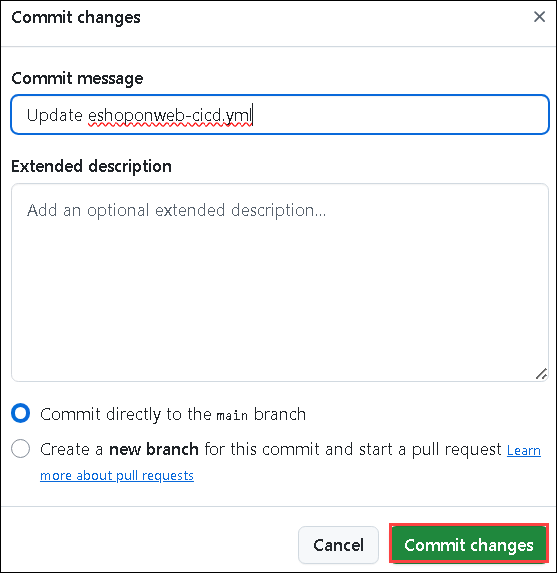

### Task 3: Review GitHub Workflow execution
 
In this task, you will review the GitHub workflow execution.

1. On the **eShopOnWeb** repository page, go to **Actions**.

    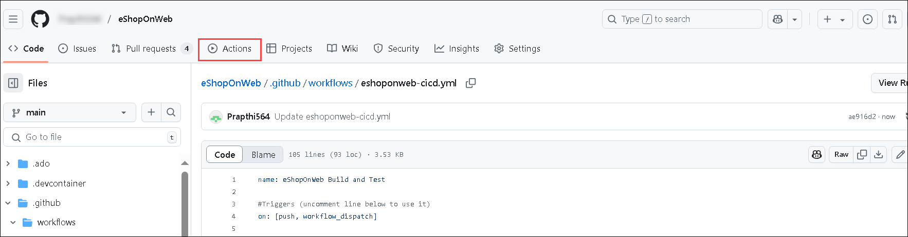

1. You will see the workflow setup on top before executing. Click on **Update eshoponweb-ccid.yml** which is associated with **eShopOnWeb Build and Test**.

    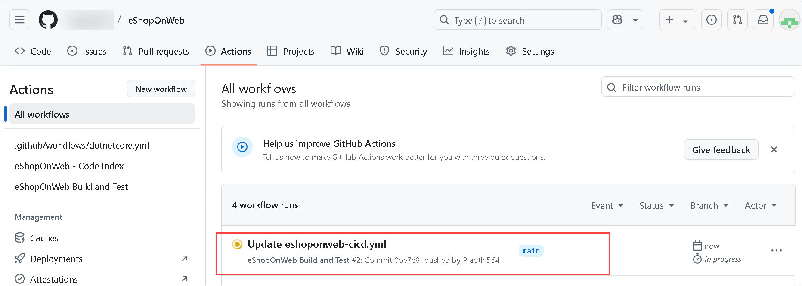

    >**NOTE:** If it shows you the **Workflows aren’t being run on this repository**, select **Enable Actions on this repository**.

   > And then on the select workflow that is **eShopOnWeb Build and Test (1)** page, select **Run workflow (2)** drop-down, and select **Run workflow (3)**.

   > 

1. From the **Summary** you can see the two workflow jobs, the status and Artifacts retained from the execution. You can click in each job to review logs.

    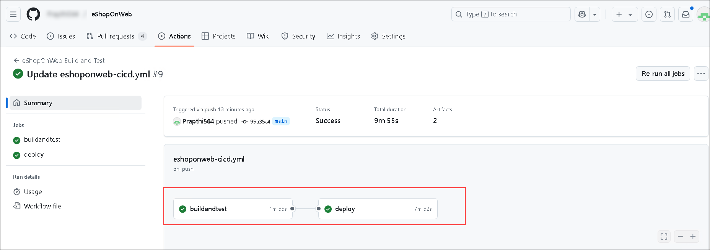

     >**NOTE**: The workflow might take around 10 minutes to complete. Please wait until it is _Succeeded_, as illustrated above.

1. Navigate to the Azure Portal (https://portal.azure.com/).

1. Open the resource group **rg-devOps-eshopeonweb-<inject key="DeploymentID" enableCopy="false"/>** that have created earlier in Exercise 2, Task 1. **Refresh** the resource group. You will notice that the GitHub Action, using a bicep template, has deployed an **Azure App Service Plan**  and an **App Service**.

    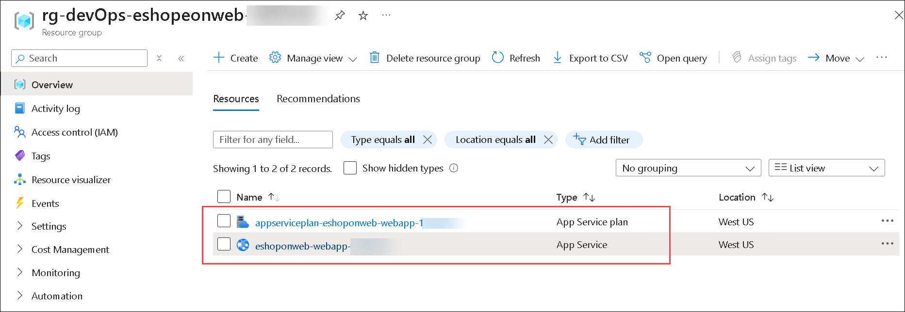

1. Select **eshoponweb-webapp-<inject key="DeploymentID" enableCopy="false"/>** App service.

    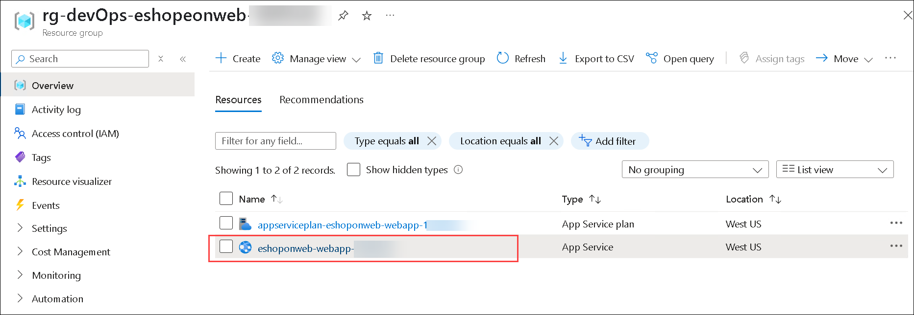

1. You can view the published website by opening the App Service and clicking on **Browse**.

    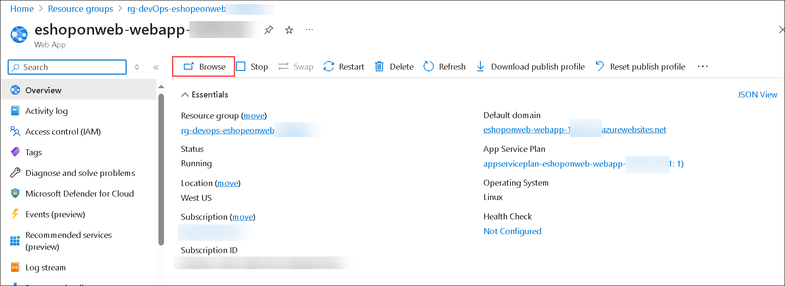
    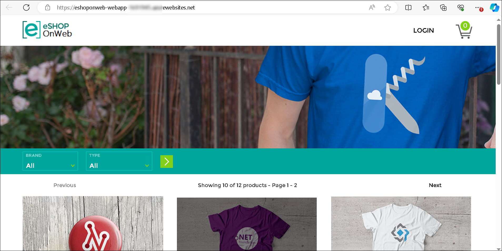
    
### Review

In this lab, you implemented a GitHub Action workflow that deploys a dynamic Azure web app by using Azure DevOps.

In this lab, you have accomplished the following:

- Exercise 1: Imported eShopOnWeb to your GitHub Repository
- Exercise 1: Setup your GitHub Repository and Azure access

### You have successfully completed the lab. Click on **Next >>** to procced with next lab.
