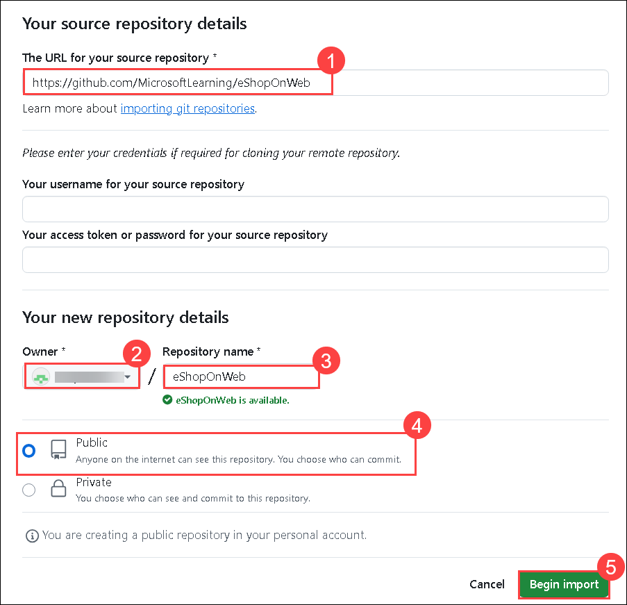
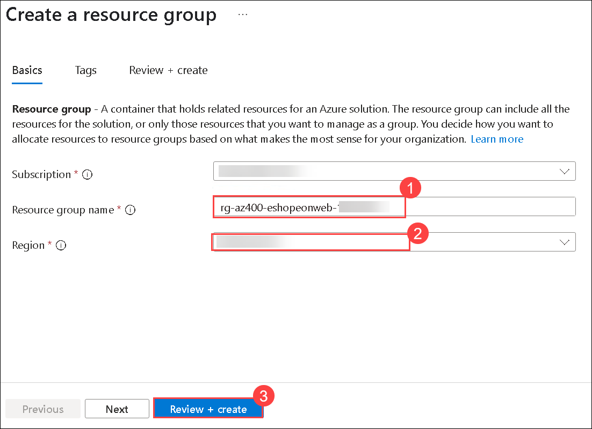
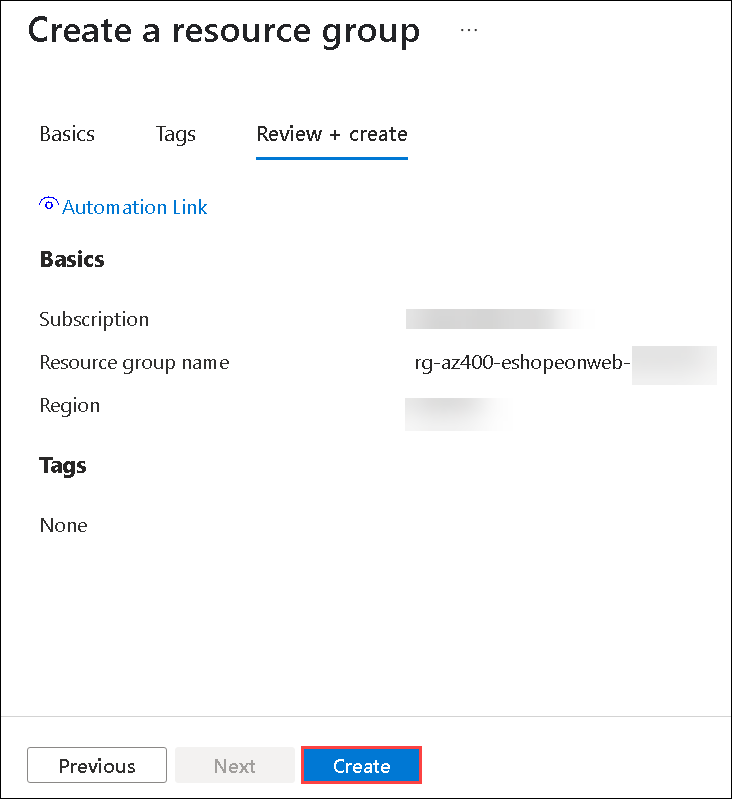
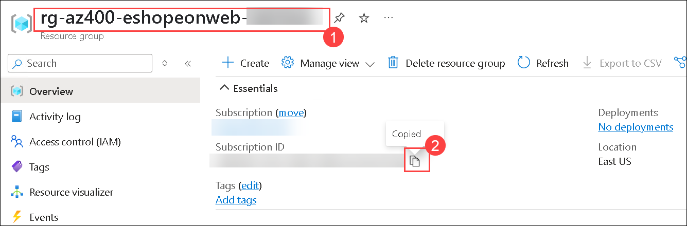
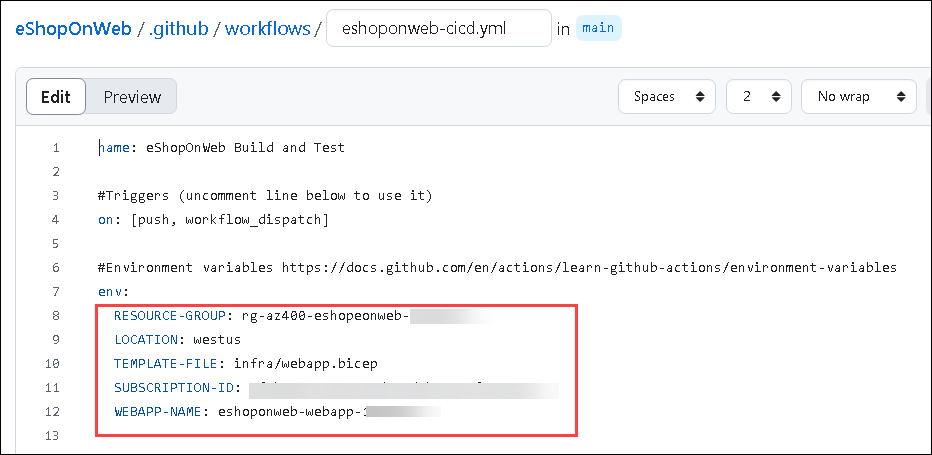
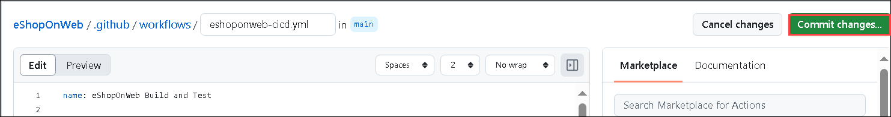
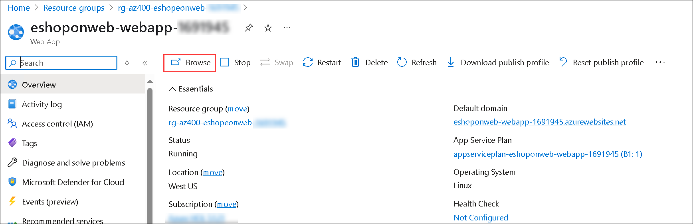

# Lab 01: Implementing GitHub Actions for CI/CD

## Lab overview

In this lab, you will learn how to implement a GitHub Action workflow that deploys an Azure web app by using DevOps Starter.

## Objectives

In this lab you will complete the following exercises:

- Exercise 0: Import eShopOnWeb to your GitHub Repository
- Exercise 1: Setup your GitHub Repository and Azure access

## Estimated timing: 40 minutes

## Architecture Diagram

   

## Lab requirements

- If you don't already have a GitHub account that you can use for this lab, follow instructions available at [Signing up for a new GitHub account](https://docs.github.com/get-started/signing-up-for-github/signing-up-for-a-new-github-account).


## Prepare a GitHub account

1. If you already have a GitHub account that you can use for this lab proceed with Exercise 1, else follow the instructions to create an account.

1. Navigate to the https://github.com/ Click on Signup.
   
1. Provide the **Email address (1)**, **Password (2)**, **Username (3)** and click on **Continue (4)**.

   

1. If prompted, complete the the visual puzzle.

1. Provide the confirmation and verify your account and click on create account. This would take 2 minutes to create.

# Exercise 1: Import eShopOnWeb to your GitHub Repository

In this exercise, you will import the existing [eShopOnWeb](https://github.com/MicrosoftLearning/eShopOnWeb) repository code to your own GitHub private repo.

The repository is organized the following way:
   - **.ado** folder contains Azure DevOps YAML pipelines
   - **.devcontainer** folder container setup to develop using containers (either locally in VS Code or GitHub Codespaces)
   - **.azure** folder contains Bicep&ARM infrastructure as code templates used in some lab scenarios.
   - **.github** folder container YAML GitHub workflow definitions.
   - **src** folder contains the .NET 6 website used on the lab scenarios.

## Task 1: Create a public repository in GitHub and import eShopOnWeb

In this task, you will create an empty public GitHub repository and import the existing [eShopOnWeb](https://github.com/MicrosoftLearning/eShopOnWeb) repository.

1. From the lab computer, start a web browser, right click on [GitHub website](https://github.com/), paste it on the browser tab. Click on **Sign in** and sign in using your account. 

1. Click on **New** to create a new repository.

    
 
1. On the **Create a new repository** page, click on **Import a repository** link (below the page title).

    

     >**NOTE**: You can also open the import website directly at <https://github.com/new/import>

1. On the **Import your project to GitHub** page, enter the following details and then click on **Begin Import (5)** and wait for your repository to be ready (this may take a few minutes).
    
    | Field | Value |
    | --- | --- |
    | Thw URL for your source repository| https://github.com/MicrosoftLearning/eShopOnWeb **(1)** |
    | Owner | Leave your default username **(2)** |
    | Repository Name | **eShopOnWeb (3)** |
    | Privacy | **Public** **(4)** | 

    

1. Wait for the import to complete.

    

1. On the repository page, go to **Settings (1)**, click on **Actions (2)> General (3)** and choose the option **Allow all actions and reusable workflows (4)**. Click on **Save (5)**.

    

# Exercise 2: Setup your GitHub Repository and Azure access

In this exercise, you will create an Azure Service Principal to authorize GitHub accessing your Azure subscription from GitHub Actions. You will also setup the GitHub workflow that will build, test and deploy your website to Azure. 

## Task 1: Create an Azure Service Principal and save it as GitHub secret

In this task, you will create the Azure Service Principal used by GitHub to deploy the desired resources. As an alternative, you could also use [OpenID connect in Azure](https://docs.github.com/actions/deployment/security-hardening-your-deployments/configuring-openid-connect-in-azure), as a secretless authentication mechanism.

1. On your lab VM, in a browser window, open the  [Azure Portal](https://portal.azure.com).

1. In the portal, search for **Resource Groups (1)** and select **Resource Groups (2)**.

    

1. Click on **+ Create** to create a new Resource Group for the exercise.

    

1. On the **Create a resource group** tab, 

    - Resource Group name: **rg-az400-eshopeonweb-<inject key="DeploymentID" enableCopy="false"/> (1)**
    - Region: Leave the deafult one **(2)**
    - Click on **Review + Create (3)**

    

1. Then click on **Create**.

    

1. In the Azure Portal, open the **Cloud Shell** (next to the search bar).

    

     >**NOTE:** If this is the first time you are starting **Cloud Shell** and you are presented with the **You have no storage mounted** message, select the subscription you are using in this lab, and select **Create storage**

1. Select **Bash** mode.

    

1. On the **Getting started**, 

    - Select **No storage account required (1)**
    - Leave the deafault subscription **(2)**
    - Select **Apply**

      

1. Once the Terminal starts, execute the following command **(1)**, replacing **SUBSCRIPTION-ID** and **RESOURCE-GROUP** with your own identifiers (both can be found on the **Overview** page of the Resorce Group):

   ```
   az ad sp create-for-rbac --name GH-Action-eshoponweb --role contributor --scopes /subscriptions/SUBSCRIPTION-ID/resourceGroups/RESOURCE-GROUP --sdk-auth
   ```

    >**Note**: To get the **SUBSCRIPTION-ID** and **RESOURCE-GROUP**, In the Azure portal navigate to **rg-az400-eshopeonweb-<inject key="DeploymentID" enableCopy="false"/>** Resource group then copy the **Resource group name (1)** and **SUBSCRIPTION-ID (2)**.

     
    
    >**Note:** Make sure this is typed or pasted as a single line!
    
    >**Note:** This command will create a Service Principal with Contributor access to the Resource Group created before. This way we make sure GitHub Actions will only have the permissions needed to interact only with this Resource Group (not the rest of the subscription).

    >**Note:** If the error message states, **Please run 'az login'**, then follow these steps:-

   ```bash 
    az login
    ```
    
   > Navigate to the **https://microsoft.com/devicelogin** page, and enter the **device code** which is mentioned in the Bash session, and follow the instructions which is mentioned in the page.

1. The command will output a JSON object, you will later keep it as a GitHub secret for the workflow, **Copy the JSON (2)**. The JSON contains the identifiers used to authenticate against Azure in the name of an Azure AD application identity (service principal).

    ```JSON
    {
        "clientId": "<GUID>",
        "clientSecret": "<GUID>",
        "subscriptionId": "<GUID>",
        "tenantId": "<GUID>",
        (...)
    }
    ```

    

1. You also need to run the following command to register the resource provider for the **Azure App Service** you will deploy later:

   ```bash
   az provider register --namespace Microsoft.Web
   ```

1. In a browser window, go back to your **eShopOnWeb** GitHub repository.

1. On the repository page, go to **Settings (1)**, click on **Secrets and variables (2)> Actions (3)**. Click on **New repository secret (2)**

      

1. On the **Action Secret/New secret**,
    
    - Name : **AZURE_CREDENTIALS (1)**
    - Secret: **paste the previously copied  JSON object (2)** (GitHub is able to keep multiple secrets under same name, used by  [azure/login](https://github.com/Azure/login) action )
    - Click on **Add secret  (3)**. Now GitHub Actions will be able to reference the service principal, using the repository secret.

      

## Task 2: Modify and execute the GitHub workflow

In this task, you will modify the given GitHub workflow and execute it to deploy the solution in your own subscription.

1. In a browser window, go back to your **eShopOnWeb** GitHub repository.

1. On the repository page, go to **Code**.

    

1. Open the following file: **eShopOnWeb/.github (1)/workflows (2)/eshoponweb-cicd.yml (3)**. This workflow defines the CI/CD process for the given .NET 6 website code.

    

1. Select the **Edit** (pencil icon). 

    

1. Uncomment the **on** section (delete "#"). The workflow triggers with every push to the main branch and also offers manual triggering ("workflow_dispatch").

    

1. In the **env** section, make the following changes:
    - Replace **NAME** in **RESOURCE-GROUP** variable. It should be the same resource group created in previous steps 
    - (Optional) You can choose your closest [azure region](https://azure.microsoft.com/en-gb/explore/global-infrastructure/geographies/#geographies) for **LOCATION**. For example, "westtus", "eastasia", "eastus", etc.
    - Replace **YOUR-SUBS-ID** in **SUBSCRIPTION-ID**. You can find your subscription ID from the Overview page of Resource group in Azure portal. 
    - Replace **WEBAPP-NAME** with **eshoponweb-webapp-<inject key="DeploymentID" enableCopy="false"/>**. It will be used to create a globally unique website using Azure App Service.

    

1. Read the workflow carefully, comments are provided to help understand.

1. Click on **Commit changes...**.

    

1. **Commit changes** again leaving defaults (changing the main branch). The workflow will get automatically executed.

    

## Task 3: Review GitHub Workflow execution
 
In this task, you will review the GitHub workflow execution:

1. On the repository page, go to **Actions**.

    

1. You will see the workflow setup on top before executing. Click on **eShopOnWeb Build and Test** (make sure you are selecting the **eShopOnWeb Build and Test** workflow which is associated with the **eshoponweb-ccid.yml**).

    

    >**Note:** If it shows you the **Workflows aren’t being run on this repository**, select **Enable Actions on this repository**.

   > And then on the select workflow that is **eShopOnWeb Build and Test (1)** page, select **Run workflow (2)** drop-down, and select **Run workflow (3)**.

   > 

1. Click on the Workflow, wait for the workflow to finish. From the **Summary** you can see the two workflow jobs, the status and Artifacts retained from the execution. You can click in each job to review logs.

    

    >**Note**: If the job fails, you should navigate back to the **Code** section and locate to **eShopOnWeb/.github/workflows/eshoponweb-cicd.yml** file. Then, select the **Edit** (pencil icon) within the **publish (1)** section. Replace **${{ env.WEBAPP-NAME }}** with **app-name: eshoponweb-webapp-<inject key="DeploymentID" enableCopy="false"/> (2)** and save the changes by committing them **(3)**. 
    - Navigate to **Actions**, and then check the workflow again. Wait untill it is succeeded.

      

1. In a browser window, go back to the Azure Portal (https://portal.azure.com/).

1. Open the resource group **rg-az400-eshopeonweb-<inject key="DeploymentID" enableCopy="false"/>** yo have created before. You will see that the GitHub Action, using a bicep template, has created an Azure App Service Plan + App Service.

1. Select **eshoponweb-webapp-<inject key="DeploymentID" enableCopy="false"/>** App service.

1. You can see the published website opening the App Service and clicking **Browse**.

    
    
    

## Review

In this lab, you implemented a GitHub Action workflow that deploys an Azure web app by using DevOps Starter.

## Click Next to proceed with the next lab.
