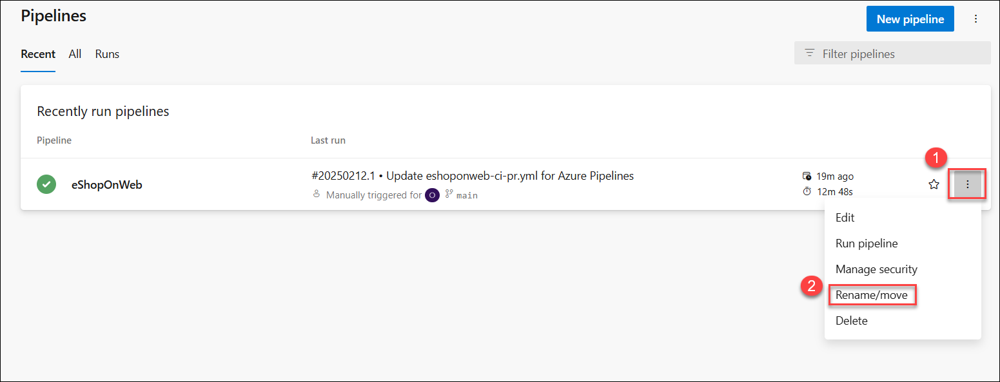

# Hands-on Lab 3: Configuring Agent Pools and Understanding Pipeline Styles

# Exercise 1: Author YAML-based Azure DevOps pipelines

In this exercise, you will create an application lifecycle build pipeline, using a YAML-based template.

## Task 1: Create an Azure DevOps YAML pipeline

In this task, you will create a template-based Azure DevOps YAML pipeline.

1. Go to **Pipelines (1)>Pipelines (2)**. Click on **Create Pipeline (3)** or **New Pipeline** button.

      

2. Select **Azure Repos Git (YAML)**

    

3. Select the **eShopOnWeb** repository.

    

4. Select **Existing Azure Pipelines YAML File**

    

5. Select the path **/.ado/eshoponweb-ci-pr.yml(1)** file then click on **Continue(2)**.

    
 
6. On the **Review your pipeline YAML** pane, review the sample pipeline. This is a rather straight-forward .NET application Build pipeline, which does the following:

   - A single Stage: Build
   - A single Job: Build
   - 4 tasks within the Build Job:
   - **DotNet Restore:** With NuGet Package Restore you can install all your project's dependency without having to store them in source control.      
   - **DotNet Build:** Builds a project and all of its dependencies.     
   - **DotNet Test:** .Net test driver used to execute unit tests.    
   - **DotNet Publish:** Publishes the application and its dependencies to a folder for deployment to a hosting system. In this case, it's **Build.ArtifactStagingDirectory**.
        
   

7. On the **Review your pipeline YAML** pane, click the down-facing caret symbol next to the **Run** button, click **Save**.

    

    > Note: we are just creating the pipeline definition for now, without running it. You will first set up an Azure DevOps agent pool and run the pipeline in a later exercise. 

# Exercise 2: Manage Azure DevOps agent pools

In this exercise, you will implement self-hosted Azure DevOps agent.

## Task 1: Configure an Azure DevOps self-hosting agent

In this task, you will configure your lab Virtual Machine as an Azure DevOps self-hosting agent and use it to run a build pipeline.

1.  In the Azure DevOps portal, in the upper right corner of the Azure DevOps page, click the **User settings** icon, in the dropdown menu, click **Personal access tokens**.

     
  
1.  On the **Personal Access Tokens** pane, and click **+ New Token**.

1.  On the **Create a new personal access token** pane, click the **Show all scopes** link and, specify the following settings and click **Create** (leave all others with their default values):

    | Setting | Value |
    | --- | --- |
    | Name | **eShopOnWeb** |
    | Scope (custom defined) | **Agent Pools** click Show all scopes (at the bottom of the window)|
    | Agent Pools | **Read and manage** |
    
     

1. On the **Success** pane, copy the value of the personal access token to Clipboard.

    > **Note**: Make sure you copy the token. You will not be able to retrieve it once you close this pane. 

    

1. On the **Success** pane, click **Close**.

1. On the **Personal Access Token** pane of the Azure DevOps portal, click **Azure DevOps** symbol in the upper left corner and then click **Organization settings** label in the lower left corner.

1. To the left side of the **Overview** pane, in the vertical menu, in the **Pipelines** section, click **Agent pools**.

1. On the **Agent pools** pane, in the upper right corner, click **Add pool**. 

1. On the **Add agent pool** pane, in the **Pool type** dropdown list, select **Self-hosted**, in the **Name** text box, type **az400m05l05a-pool**, under **Pipeline permissions** select the checkboxes and then click **Create**.

        
    
1.  Back on the **Agent pools** pane, click the entry representing the newly created **az400m05l05a-pool**. 

1.  On the **Jobs** tab of the **az400m05l05a-pool** pane,  click the **New agent** button.

1. On the **Get the agent** pane, ensure that the **Windows** and **x64** tabs are selected, and click **Download** to download the zip archive containing the agent binaries to download it into the local **Downloads** folder within your user profile.

   

   > **Note**: If you receive an error message at this point indicating that the current system settings prevent you from downloading the file, in the Browser window, in the upper right corner, click the gearwheel symbol designating the **Settings** menu header, in the dropdown menu, select **Internet Options**, in the **Internet Options** dialog box, click **Advanced**, on the **Advanced** tab, click **Reset**, in the **Reset Browser Settings** dialog box, click **Reset** again, click **Close**, and try the download again.

1.  Start Windows PowerShell as administrator and in the **Administrator: Windows PowerShell** console run the following lines to create the **C:\\agent** directory and extract the content of the downloaded archive into it.

    ```powershell
    cd \
    mkdir agent ; cd agent
    $TARGET = Get-ChildItem "$Home\Downloads\vsts-agent-win-x64-*.zip"
    Add-Type -AssemblyName System.IO.Compression.FileSystem
    [System.IO.Compression.ZipFile]::ExtractToDirectory($TARGET, "$PWD")
    ```

    >**Note**: If you encounter an error indicating that the item already exists, please disregard it and proceed with the next steps.

1.  In the same **Administrator: Windows PowerShell** console, run the following to configure the agent:

    ```powershell
    .\config.cmd
    ```

1.  When prompted, specify the values of the following settings:

    | Setting | Value |
    | ------- | ----- |
    | Enter server URL | Enter https://dev.azure.com/<organization_name>, where <organization_name> is your Azure DevOps organization name (after updating the url it look similar to https://dev.azure.com/odluser<inject key="DeploymentID" enableCopy="false"/>/) |
    | Enter authentication type (press enter for PAT) | **Hit Enter** |
    | Enter personal access token | The access token you recorded earlier in this task |
    | Enter agent pool (press enter for default) | enter **az400m05l05a-pool** |
    | Enter agent name (press enter for labvm-<inject key="DeploymentID" enableCopy="false"/>) | **Hit Enter** |
    | Enter work folder (press enter for _work) | **Hit Enter** |
    | **(Only if shown)** Enter Perform an unzip for tasks for each step. (press enter for N) | **WARNING**: only press **Enter** if the message is shown|
    | Enter run agent as service? (Y/N) (press enter for N) | **Y** |
    | enter enable SERVICE_SID_TYPE_UNRESTRICTED (Y/N) (press enter for N) | **Y** |
    | Enter User account to use for the service (press enter for NT AUTHORITY\NETWORK SERVICE) | **Hit Enter** |
    | Enter whether to prevent service starting immediately after configuration is finished? (Y/N) (press enter for N) | **Enter** |

    > **Note**: You can run self-hosted agent as either a service or an interactive process. You might want to start with the interactive mode, since this simplifies verifying agent functionality. For production use, you should consider either running the agent as a service or as an interactive process with auto-logon enabled, since both persist their running state and ensure that the agent starts automatically if the operating system is restarted.

    > **Note**: Verify that the agent is reporting the **Listening for Jobs** status.

      

1.  Switch to the browser window displaying the Azure DevOps portal and close the **Get the agent** pane.

1.  Back on the **Agents** tab of the **az400m05l05a-pool** pane, note that the newly configured agent is listed with the **Online** status.

1.  In the web browser window displaying the Azure DevOps portal, in the upper left corner, click the **Azure DevOps** label.

1.  In the browser window displaying the list of projects, click the tile representing your **eShopOnWeb** project.
 
1.  On the **eShopOnWeb** pane, in the vertical navigational pane on the left side, in the **Pipelines** section, click **Pipelines**. 

1.  On the **Recent** tab of the **Pipelines** pane, select **eShopOnWeb** and, on the **eShopOnWeb** pane, select **Edit**.

1. On the **eShopOnWeb** edit pane, in the existing YAML-based pipeline, replace line 13 which says  `vmImage: ubuntu-latest` designating the target agent pool the following content, designating the newly created self-hosted agent pool:

    ```yaml
    name: az400m05l05a-pool
    demands:
    - agent.name -equals Agentname
    ```
    > **Note**: Replace Agentname with **labvm-<inject key="DeploymentID" enableCopy="false"/>**

 
    
    
    > **WARNING**: Be careful with copy/paste, make sure you have same indentation shown above. 
 
1.  On the **eShopOnWeb** edit pane, in the upper right corner of the pane, click **Validate + Save** and, on the **Save** pane, click **Save** again. This will automatically trigger the build based on this pipeline. 

1. On the **Recent** tab of the **Pipelines** pane, click the **eShopOnWeb** entry, click on **Run** to run the pipeline

1. Depending on your lab setup, the pipeline might prompt you for permissions. Click **Permit** to allow the pipeline to run. 

1. Wait until the build  succeeds.

1. Your pipeline will take a name based on the project name. Let's **rename** it for identifying the pipeline better. Go to **Pipelines>Pipelines** and click on the recently created pipeline. Click on the **ellipsis (1)** and **Rename/move (2)** option.
   
      

1. Name it **eshoponweb-ci-pr (1)** and click on **Save (2)**.

        


   > **Congratulations** on completing the task! Now, it's time to validate it. Here are the steps:
   > - If you receive a success message, you can proceed further.
   > - If not, carefully read the error message and retry the step, following the instructions in the lab guide.
   > - If you need any assistance, please contact us at labs-support@spektrasystems.com. We are available 24/7 to help you out.


   <validation step="38dc84d9-2b4f-44c8-bf6f-1da2f5a9cde7" />


## Exercise 3: Implement Selenium tests by using a self-hosted Azure DevOps agent 

### Task 2: Configure the release pipeline

In this exercise, you will configure a release pipeline.

### Task 1: Set Up Release Tasks

In this task, you will set up the release tasks as part of the Release Pipeline.

1. From the **eShopOnWeb_MultiStageYAML** project in the Azure DevOps portal, in the vertical navigational pane, select **Pipelines** and then, within the **Pipelines** section, click **Releases(1)**.
1. Click **New Pipeline(2)**.
    
     
   
   > **Note** - If you are unable to see the **Releases** under pipelines, Navigate to Azure DevOps page, from the bottom left, click on **Organization settings**, Go to the Pipelines (1) section, and click Settings (2). Turn off(3) the Disable creation of classic release pipelines.
   
   
   
1. Navigate back to your project and now you will be able to see the releases under pipelines   
  
1. From the **Select a template** window, **choose** **Azure App Service Deployment** (Deploy your application to Azure App Service. Choose from Web App on Windows, Linux, containers, Function Apps, or WebJobs) under the **Featured** list of templates.    

1. Click **Apply**.

    

1. From the **Stage** window appearing, update the default "Stage 1" Stage Name to **Canary**. Close the popup window by using the **X** button. You are now in the graphical editor of the Release Pipeline, showing the Canary Stage.

    

1. Hover the mouse over the Canary Stage, and click the **Clone** button, to copy the Canary Stage to an additional Stage. Name this Stage **Production**.

    

    > **Note**: The pipeline now contains two stages named **Canary** and **Production**.

     

1. On the **Pipeline** tab, select the **+ Add an artifact** rectangle.

     
     
1. Select the **eShopOnWeb_MultiStageYAML** in the **Source (build pipeline)** field. Click **Add** to confirm the selection of the artifact.
    
     

1. From the **Artifact** rectangle, notice the **Continuous Integration Trigger** (lightning bolt) appearing. 

     
    
1. Click it to open the **Continuous deployment trigger** settings. Click the continuous deployment trigger to toggle the switch to enable it. Leave all other settings at default and close the **Continuous deployment trigger** pane, by clicking the **x** mark in its upper right corner.

       
   
1. Within the **Canary Environments** stage, click the **1 job, 1 tasks** label and review the tasks within this stage.
     
    

    > **Note**: The canary environment has 1 task which, respectively, publishes the artifact package to Azure Web App.

1. On the **All pipelines > New Release Pipeline** pane, ensure that the **Canary(1)** stage is selected. In the **Azure subscription(2)** dropdown list, Confirm the App Type is set to "Web App on Windows(3)". Next, in the **App Service name** dropdown list, select the name of the **Canary(4)** web app.

    
      
    >**Note:** After Selecting your Azure subscription and click **Authorize**. If prompted, authenticate by using the user account with the Owner role in the Azure subscription
    
    
     
1. Select the Task **Deploy Azure App Service**. In the **Package or Folder** field, update the default value of "$(System.DefaultWorkingDirectory)/\*\*/\*.zip" to **"$(System.DefaultWorkingDirectory)/\*\*/Web.zip"**

    > Notice an exclamation mark next to the Tasks tab. This is expected, as we need to configure the settings for the Production Stage.
    
    

1. Scroll down and open the **Application and Configuration Settings** pane and enter `-UseOnlyInMemoryDatabase true -ASPNETCORE_ENVIRONMENT Development` in the **App settings** box.

1. Under **All pipelines > New Release Pipeline** pane, Click on **Tasks**,from the drop-down selct Select **Production**.

    

1. In **Production(1)** stage Similar to the Canary stage earlier, complete the pipeline settings. Under the Tasks tab / Production Deployment process, in the **Azure subscription(2)** dropdown list, select the Azure subscription you used for the **Canary Environment** stage, shown under **Available Azure Service connections**, as we already created the service connection before when authorizing the subscription use. In the **App type** from the dropdown list select **Web App on Windows(3)**, In the **App Service name(4)** from the dropdown list, select the name of the **Prod** web app.

    
     
1. Select the Task **Deploy Azure App Service**. In the **Package or Folder** field, update the default value of "$(System.DefaultWorkingDirectory)/\*\*/\*.zip" to **"$(System.DefaultWorkingDirectory)/\*\*/Web.zip"**

    

1. Open the **Application and Configuration Settings** pane and enter `-UseOnlyInMemoryDatabase true -ASPNETCORE_ENVIRONMENT Development` in the **App settings** box.
   
1. On the **All pipelines > New Release Pipeline** pane, click **Save** and, in the **Save** dialog box, click **OK**.

    

   You have now successfully configured the Release Pipeline.

1. In the browser window displaying the **eShopOnWeb_MultiStageYAML** project, in the vertical navigational pane, in the **Pipelines** section, click **Pipelines**.

    

1. On the **Pipelines** pane, click the entry representing **eShopOnWeb_MultiStageYAML** build pipeline and then, on the **eShopOnWeb_MultiStageYAML** pane, click on **Run Pipeline**.

    

1. On the **Run pipeline** pane, accept the default settings and click **Run** to trigger the pipeline. **Wait for the build pipeline to finish**.

    > **Note**: After the build succeeds, the release will be triggered automatically, and the application will be deployed to both the environments. Validate the release actions, once the build pipeline completed successfully.

1. In the vertical navigational pane, in the **Pipelines** section, click **Releases** and, on the **eShopOnWeb_MultiStageYAML** pane, click the entry representing the most recent release.
1. On the **eShopOnWeb_MultiStageYAML > Release-1** blade, track the progress of the release and verify that the deployment to both web apps completed successfully.

   

1. Switch back to the Azure portal interface, navigate to the resource group **az400m04l09-RG**, in the list of resources, click the **Canary** web app.

    

1. On the web app blade, click **Browse**, and verify that the web page (E-commerce website) loads successfully in a new web browser tab.
    
    
   
1. Switch back to the Azure portal interface, this time navigating  to the resource group **az400m04l09-RG**, in the list of resources, click the **Production** web app. 

   

1. On the web app blade, click **Browse**, and verify that the web page loads successfully in a new web browser tab.

   
   
1. Close the web browser tab displaying the **EShopOnWeb** web site.

    > **Note**: Now you have the application with CI/CD configured. In the next exercise we will set up Quality Gates as part of a more advanced release pipeline.

