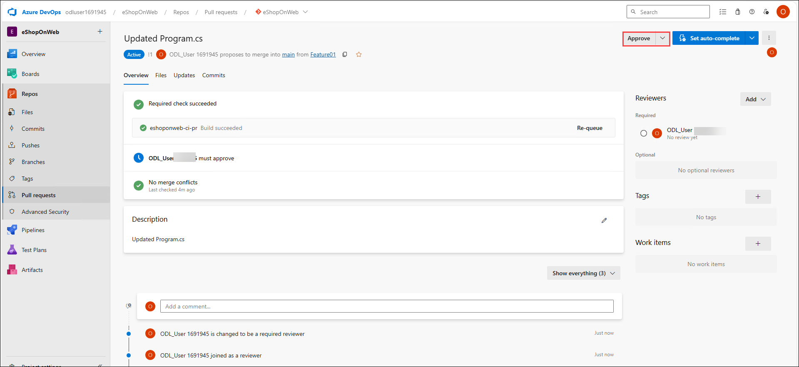
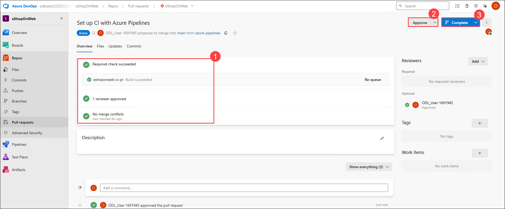

# Lab 3: Configuring Agent Pools and Understanding Pipeline Styles

## Lab overview

In this lab, you will learn how to define build pipelines in Azure DevOps using YAML.
The pipelines will be used in two scenarios:

- As part of Pull Request validation process.
- As part of the Continuous Integration implementation.

## Objectives

In this lab, you will complete the following exercises:

- Exercise 1: Include build validation as part of a Pull Request 
- Exercise 2: Configure CI Pipeline as Code with YAML

## Estimated timing: 45 minutes

## Architecture Diagram

  

## Exercise 1: Include build validation as part of a Pull Request 

### Task 1: Branch Policies

In this task, you will add policies to the main branch and only allow changes using Pull Requests that comply with the defined policies. You want to ensure that changes in a branch are reviewed before they are merged.

1. Go to **Repos (1)>Branches (2)** section. On the **Mine** tab of the **Branches** pane, hover the mouse pointer over the **main (3)** branch entry to reveal the **ellipsis symbol (4)** on the right side. Select **Branch Policies (5)**.

    

1. On the main tab of the repository settings, enable the option for **Require minimum number of reviewers (1)**. Add **1 (2)** reviewer and check the box **Allow requestors to approve their own changes (3)**(as you are the only user in your project for the lab)

    

1. Click on the **main (1)** tab of the repository settings, in the **Build Validation (2)** section, **click + (Add a new build policy) (3)**.

    

1. On the Build pipeline list, select **eshoponweb-ci-pr (4)** then click **Save (5)**
    
      
     >**Note**: If you get any error while saving the branch validation refresh the page and try again.

## Task 2: Working with Pull Requests
 
In this task, you will use the Azure DevOps portal to create a Pull Request, using a new branch to merge a change into the protected main branch.
 
1. Navigate to the **Repos (1)->Branches (2)** section in the eShopOnWeb navigation and click **New Branch (3)**.

    

1. Create a new branch named **Feature01 (1)** based on the **main** branch and click **Create (2)**.

    

1. Click **Feature01**.

1. Navigate to the **/eShopOnWeb/src(1)/Web(2)/Program.cs (3)** file as part of the **Feature01** branch.

    
    

1. Click on **Edit**.

    

1. Add the following line on the first line **(1)** and click on **Commit (2)**.
    
   ```
   // Testing my PR
   ```

    
   
1. Click on **Commit** again (leave default commit message).

    

1. A message will pop-up, proposing to create a Pull Request (as your **Feature01** branch is now ahead in changes, compared to **main**). Click on **Create a Pull Request (1)**.

    

1. In the **New pull request** tab, leave defaults and click on **Create (2)**.
   
    
   
1. The Pull Request will show some pending requirements, based on the policies applied to the target **main** branch.

    - It shows **At least 1 user should review and approve the changes (1)**, 
    - Click **Add (2)** select **Required Reviewer (3)**

          
    
1. Search for the ODL user email **<inject key="AzureAdUserEmail"></inject> (1)** and select from the list **(2)**. 

    

1. Build validation, you will see that the build **eshoponweb-ci-pr** was triggered automatically
         
        

1. On the top-right click on **Approve**.

        
      
1. Wait for the validation to succeed before proceeding.

    

     >**Note**: It might take around 2-3 minutes.

1. Now from the **Complete (1)** dropdown you can click on **Complete (2)**. 

    

1. On the **Complete Pull Request** tab, select only **Complete associated work items after merging (1)** checkbox  and Click on **Complete Merge (2)**

   

   


## Exercise 2: Configure CI Pipeline as Code with YAML

In this exercise, you will configure CI Pipeline as code with YAML.

### Task 1: Import the YAML build definition

In this task, you will add the YAML build definition that will be used to implement the Continuous Integration.

Let's start by importing the CI pipeline named **eshoponweb-ci.yml**.

1. Go to **Pipelines (1)>Pipelines (2)** and click on **New Pipeline (3)** button.

    

1. Select **Azure Repos Git (YAML)**.

    

1. Select the **eShopOnWeb** repository.

    

1. Select **Existing Azure Pipelines YAML File**

    

1. Select the **/.ado/eshoponweb-ci.yml (1)** file then click on **Continue (2)**

    

    The CI definition consists of the following tasks:
     
    - **DotNet Restore:** With NuGet Package Restore you can install all your project's dependency without having to store them in source control.
       
    - **DotNet Build:** Builds a project and all of its dependencies.
       
    - **DotNet Test:** .Net test driver used to execute unit tests.
       
    - **DotNet Publish:** Publishes the application and its dependencies to a folder for deployment to a hosting system. In this case, it's             **Build.ArtifactStagingDirectory**.
       
    - **Publish Artifact - Website:** Publish the app artifact (created in the previous step) and make it available as a pipeline artifact.
       
    - **Publish Artifact - Bicep:** Publish the infrastructure artifact (Bicep file) and make it available as a pipeline artifact.
       
              
### Task 2: Enable Continuous Integration
   
The default build pipeline definition doesn't enable Continuous Integration
   
1. Now, you need to replace the **trigger: none** code in `line 8` with the following code:
   
    ```
      trigger:
       branches:
        include:
        - main
      paths:
        include:
        - src/web/*
    ``` 

     

      >**Note**: Be careful with copy/paste, make sure you have same indentation shown above.
      
      >**Note**: This will automatically trigger the build pipeline if any change is made to the main branch and the web application code (the src/web folder).Since you enabled Branch Policies, you need to pass by a Pull Request in order to update your code. 
    
1. Click the on the **Save and run (1)** dropdown and **Save (2)** button (not **Save and run**) to save the pipeline definition.

    
  
1. Select **Create a new branch for this commit (1)** Keep the default branch name and **Start a pull request(2)** checked. and Click on **Save(3)**

    

1. Your pipeline will take a name based on the project name. Let's **rename** it for identifying the pipeline better. Click on the **ellipsis (1)** and **Rename/move (2)** option.

    

1. Name it **eshoponweb-ci (1)**  and click on **Save (2)**.

    

1. Go to **Repos (1)>Pullrequests (2)** and click on the existing pull request **(3)**. 

    

1. After all validations are successful **(1)**, on the top-right click on **Approve (2)**. Now you can click on **Complete (3)**.

    

1. On the **Complete Pull Request** tab, select only **Complete associated work items after merging** checkbox  and Click on **Complete Merge**

    

    

### Task 3: Test the CI pipeline
 
 In this task, you will create a Pull Request, using a new branch to merge a change into the protected main branch and automatically trigger the CI pipeline Navigate to the Repos section.
 
1. Navigate to the **Repos (1)->Branches (2)** section. Create a **new branch (3)**.

    

1. Create a branch named **Feature02 (1)** based on the **main** branch and Click on **Create (2)**.    
    
    

1. Click the new **Feature02 (1)** branch.

1. Navigate to the **/eShopOnWeb/src (1)/Web (2)/Program.cs (3)** file.

    
    

1. Click on **Edit (1)** to remove the first line // **Testing my PR (2)**.
   
    

1. Click on **Commit**.    
   
    

1. Click on **Commit** (leave default commit message).
   
    

1. A message will pop-up, proposing to create a Pull Request (as your **Feature02** branch is now ahead in changes, compared to main).

1. Click on **Create a Pull Request**

    

1. In the **New pull request** tab, leave defaults and click on **Create** The Pull Request will show some pending requirements, based on the policies applied to the target **main** branch and wait until build completes.

    

1. Wait for the build to get succeeded **(1)**, then on the top-right click on **Approve (2)**, select the **Complete (3)** drop down and then click on **Complete (4)**.

    

     >**Note**: Wait for the build to get succeed. It might take around 5 - 7 minutes.

1. On the **Complete Pull Request** tab, select only **Complete associated work items after merging** checkbox  and Click on **Complete Merge**.

     

1. Go back to **Pipelines (1)>Pipelines (2)**, you will notice that the build **eshoponweb-ci (3)** was triggered automatically after the code was merged. Select it.

    
 
1. On the **eshoponweb-ci** build, select the last run.

    

1. After its successful execution, click on **Related (1) > Published (2)** to check the published artifacts:
           
     
     
    - **Bicep**: the infrastructure artifact  
    - **Website**: the app artifact
     
      
     
   > **Congratulations** on completing the task! Now, it's time to validate it. Here are the steps:
   - If you receive a success message, you can proceed to the next task.
   - If not, carefully read the error message and retry the step, following the instructions in the lab guide.
   - If you need any assistance, please contact us at labs-support@spektrasystems.com. We are available 24/7 to help you out.
 
   <validation step="acd984e3-6678-4326-9460-21caeb9889c7" />
          
 ## Review
  
  In this lab, you enabled pull request validation using a build definition and configured CI pipeline as code with YAML in Azure DevOps. 

### Click Next to proceed with the next lab.


## Exercise 3: Implement Selenium tests by using a self-hosted Azure DevOps agent 

### Task 2: Configure the release pipeline

In this exercise, you will configure a release pipeline.

### Task 1: Set Up Release Tasks

In this task, you will set up the release tasks as part of the Release Pipeline.

1. From the **eShopOnWeb_MultiStageYAML** project in the Azure DevOps portal, in the vertical navigational pane, select **Pipelines** and then, within the **Pipelines** section, click **Releases(1)**.
1. Click **New Pipeline(2)**.
    
     
   
   > **Note** - If you are unable to see the **Releases** under pipelines, Navigate to Azure DevOps page, from the bottom left, click on **Organization settings**, Go to the Pipelines (1) section, and click Settings (2). Turn off(3) the Disable creation of classic release pipelines.
   
   
   
1. Navigate back to your project and now you will be able to see the releases under pipelines   
  
1. From the **Select a template** window, **choose** **Azure App Service Deployment** (Deploy your application to Azure App Service. Choose from Web App on Windows, Linux, containers, Function Apps, or WebJobs) under the **Featured** list of templates.    

1. Click **Apply**.

    

1. From the **Stage** window appearing, update the default "Stage 1" Stage Name to **Canary**. Close the popup window by using the **X** button. You are now in the graphical editor of the Release Pipeline, showing the Canary Stage.

    

1. Hover the mouse over the Canary Stage, and click the **Clone** button, to copy the Canary Stage to an additional Stage. Name this Stage **Production**.

    

    > **Note**: The pipeline now contains two stages named **Canary** and **Production**.

     

1. On the **Pipeline** tab, select the **+ Add an artifact** rectangle.

     
     
1. Select the **eShopOnWeb_MultiStageYAML** in the **Source (build pipeline)** field. Click **Add** to confirm the selection of the artifact.
    
     

1. From the **Artifact** rectangle, notice the **Continuous Integration Trigger** (lightning bolt) appearing. 

     
    
1. Click it to open the **Continuous deployment trigger** settings. Click the continuous deployment trigger to toggle the switch to enable it. Leave all other settings at default and close the **Continuous deployment trigger** pane, by clicking the **x** mark in its upper right corner.

       
   
1. Within the **Canary Environments** stage, click the **1 job, 1 tasks** label and review the tasks within this stage.
     
    

    > **Note**: The canary environment has 1 task which, respectively, publishes the artifact package to Azure Web App.

1. On the **All pipelines > New Release Pipeline** pane, ensure that the **Canary(1)** stage is selected. In the **Azure subscription(2)** dropdown list, Confirm the App Type is set to "Web App on Windows(3)". Next, in the **App Service name** dropdown list, select the name of the **Canary(4)** web app.

    
      
    >**Note:** After Selecting your Azure subscription and click **Authorize**. If prompted, authenticate by using the user account with the Owner role in the Azure subscription
    
    
     
1. Select the Task **Deploy Azure App Service**. In the **Package or Folder** field, update the default value of "$(System.DefaultWorkingDirectory)/\*\*/\*.zip" to **"$(System.DefaultWorkingDirectory)/\*\*/Web.zip"**

    > Notice an exclamation mark next to the Tasks tab. This is expected, as we need to configure the settings for the Production Stage.
    
    

1. Scroll down and open the **Application and Configuration Settings** pane and enter `-UseOnlyInMemoryDatabase true -ASPNETCORE_ENVIRONMENT Development` in the **App settings** box.

1. Under **All pipelines > New Release Pipeline** pane, Click on **Tasks**,from the drop-down selct Select **Production**.

    

1. In **Production(1)** stage Similar to the Canary stage earlier, complete the pipeline settings. Under the Tasks tab / Production Deployment process, in the **Azure subscription(2)** dropdown list, select the Azure subscription you used for the **Canary Environment** stage, shown under **Available Azure Service connections**, as we already created the service connection before when authorizing the subscription use. In the **App type** from the dropdown list select **Web App on Windows(3)**, In the **App Service name(4)** from the dropdown list, select the name of the **Prod** web app.

    
     
1. Select the Task **Deploy Azure App Service**. In the **Package or Folder** field, update the default value of "$(System.DefaultWorkingDirectory)/\*\*/\*.zip" to **"$(System.DefaultWorkingDirectory)/\*\*/Web.zip"**

    

1. Open the **Application and Configuration Settings** pane and enter `-UseOnlyInMemoryDatabase true -ASPNETCORE_ENVIRONMENT Development` in the **App settings** box.
   
1. On the **All pipelines > New Release Pipeline** pane, click **Save** and, in the **Save** dialog box, click **OK**.

    

   You have now successfully configured the Release Pipeline.

1. In the browser window displaying the **eShopOnWeb_MultiStageYAML** project, in the vertical navigational pane, in the **Pipelines** section, click **Pipelines**.

    

1. On the **Pipelines** pane, click the entry representing **eShopOnWeb_MultiStageYAML** build pipeline and then, on the **eShopOnWeb_MultiStageYAML** pane, click on **Run Pipeline**.

    

1. On the **Run pipeline** pane, accept the default settings and click **Run** to trigger the pipeline. **Wait for the build pipeline to finish**.

    > **Note**: After the build succeeds, the release will be triggered automatically, and the application will be deployed to both the environments. Validate the release actions, once the build pipeline completed successfully.

1. In the vertical navigational pane, in the **Pipelines** section, click **Releases** and, on the **eShopOnWeb_MultiStageYAML** pane, click the entry representing the most recent release.
1. On the **eShopOnWeb_MultiStageYAML > Release-1** blade, track the progress of the release and verify that the deployment to both web apps completed successfully.

   

1. Switch back to the Azure portal interface, navigate to the resource group **az400m04l09-RG**, in the list of resources, click the **Canary** web app.

    

1. On the web app blade, click **Browse**, and verify that the web page (E-commerce website) loads successfully in a new web browser tab.
    
    
   
1. Switch back to the Azure portal interface, this time navigating  to the resource group **az400m04l09-RG**, in the list of resources, click the **Production** web app. 

   

1. On the web app blade, click **Browse**, and verify that the web page loads successfully in a new web browser tab.

   
   
1. Close the web browser tab displaying the **EShopOnWeb** web site.

    > **Note**: Now you have the application with CI/CD configured. In the next exercise we will set up Quality Gates as part of a more advanced release pipeline.

