# Lab 4: Controlling Deployments using Release Gates 

## Estimated timing: 70 minutes

## Lab Scenario

You are a DevOps engineer for Contoso.ltd, tasked with implementing a safe and controlled deployment process for a mission-critical .NET web application hosted in Azure. In this lab, you will configure a multi-stage release pipeline in Azure DevOps that deploys the app to two environments: Canary and Production. You will first define release gates to ensure the Canary deployment proceeds only when there are no high-severity bugs logged in the work item tracking system. You will then configure post-deployment gates that evaluate Application Insights telemetry to verify application health before promoting the release to Production. This lab demonstrates how to automate gradual rollouts, monitor real-time usage metrics, and use approvals and gate logic to enforce compliance and operational readiness. Your objective is to minimize risk and ensure only healthy builds are promoted across environments, aligning with Contoso’s standards for secure and reliable software delivery.

## Objectives

In this lab, you will be performing the following exercises:

- Exercise 0: Configure the lab prerequisites
- Exercise 1: Creating the necessary Azure Resources for the Release Pipeline
- Exercise 2: Configure the release pipeline
- Exercise 3: Configure release gates
- Exercise 4: Test release gates


## Architecture Diagram

   

## Exercise 0: Configure the lab prerequisites

In this exercise, you will set up the prerequisites for the lab, which consist of a new Azure DevOps project with a repository based on the [eShopOnWeb](https://dev.azure.com/unhueteb/_git/eshopweb-az400).

### Task 1: Create and configure the team project

In this task, you will create an **eShopOnWeb_MultiStageYAML** Azure DevOps project to be used by several labs.

1. On your lab computer, in a browser window, click on **Azure DevOps** from the top left corner. Click on **+ New Project**.

    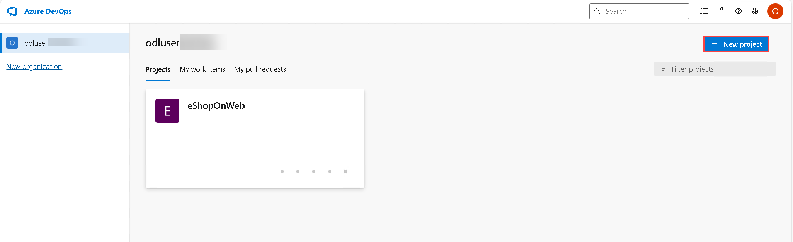

1. Provide your project as **eShopOnWeb_MultiStageYAML (1)**, then select **Private (2)** and leave the other fields with defaults. Click on **Create (3)**.

    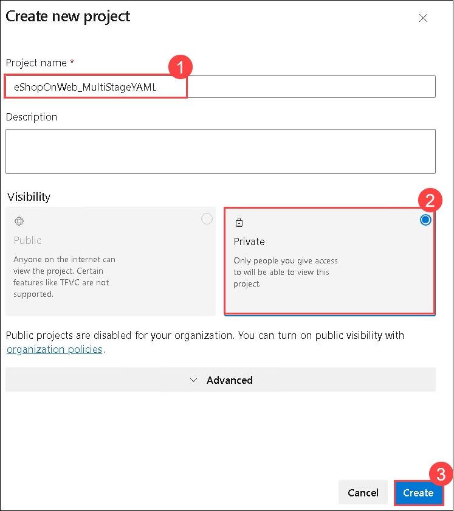

### Task 2: Import eShopOnWeb Git Repository

In this task you will import the eShopOnWeb Git repository that will be used by several labs.

1. Access the previously created **eShopOnWeb_MultiStageYAML** project.

1. Navigate to **Repos (1)>Files (2)** and then click on **Import (3)** within the **Import a repository** card. On the **Import a Git Repository** window, paste the following URL https://github.com/CloudLabs-MOC/eShopOnWeb.git **(4)** and click on **Import (5)**:

    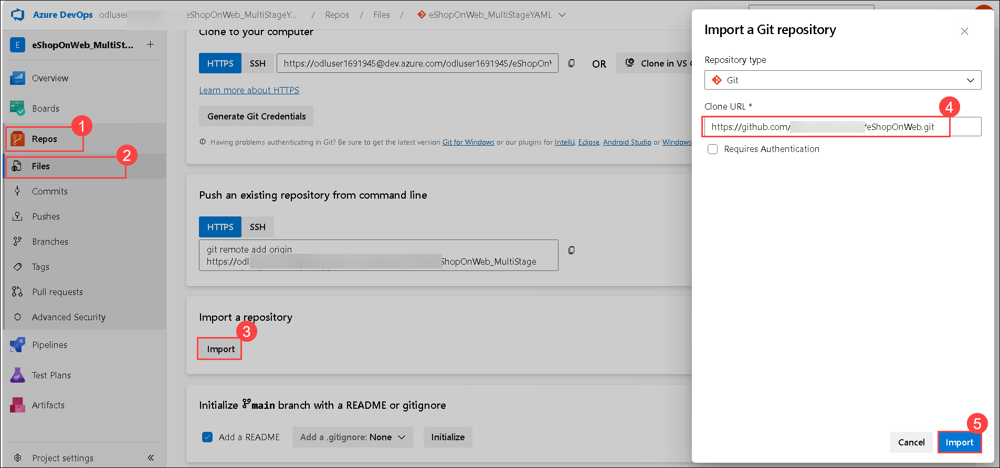

1. The repository is organized in the following way:

    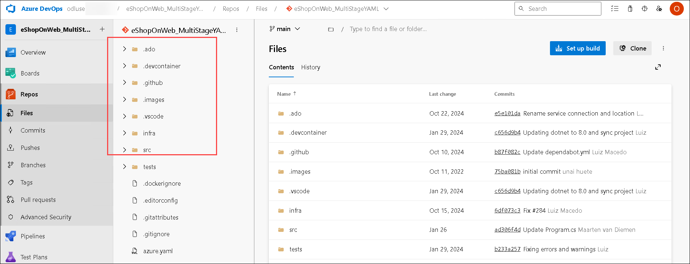

    - **.ado** folder contains Azure DevOps YAML pipelines
    - **.devcontainer** folder container setup to develop using containers (either locally in VS Code or GitHub Codespaces)
    - **infra** folder contains Bicep & ARM infrastructure as code templates used in some lab scenarios.
    - **.github** folder contains YAML GitHub workflow definitions.
    - **src** folder contains the .NET 6 website used in the lab scenarios.

1. Go to **Repos (1)>Branches (2)**. Make sure the **main** branch is set as a **default** branch **(3)**.

    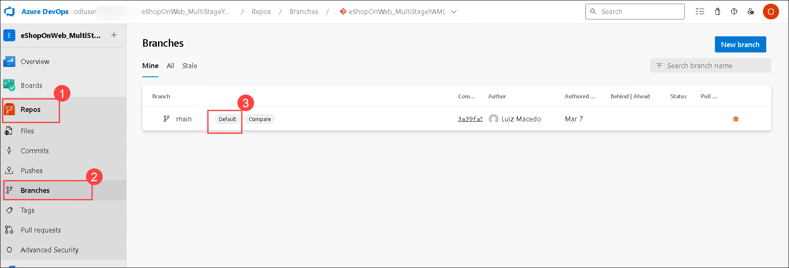

1. If not, on the **Branches** **(1)**, hover on the **main** branch, then click the ellipsis on the right of the column **(2)**. Click on **Set as default branch (3)**.

    

     >**Note:** If there is only one branch, then it is considered as the default branch automatically. You can proceed with the next task.

### Task 3: Configure CI Pipeline as Code with YAML in Azure DevOps

In this task, you will add a YAML build definition to the existing project.

1. Navigate back to the **Pipelines (1)** pane in of the **Pipelines** hub. Click **Create pipeline (2)**.

    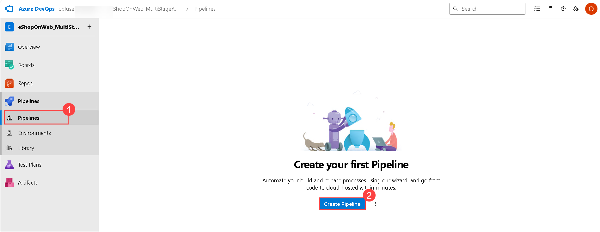
       
1. On the **Where is your code?** pane, click **Azure Repos Git (YAML)** option.
   
    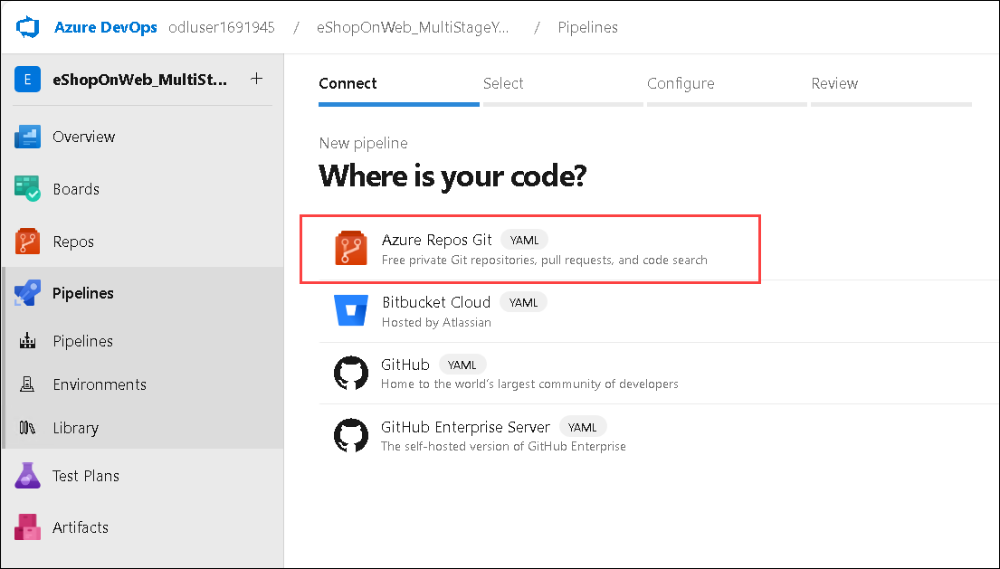
      
1. On the **Select a repository** pane, click **eShopOnWeb_MultiStageYAML**.
   
    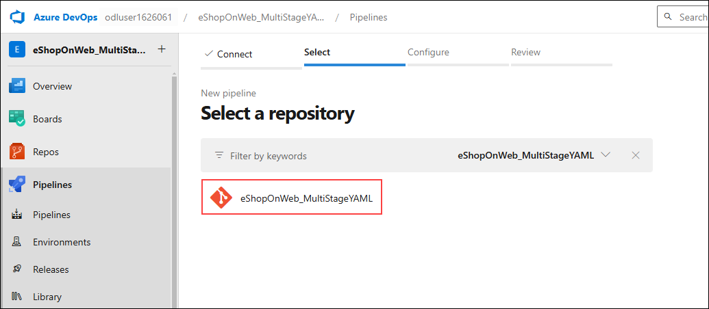
   
1. On the **Configure your pipeline** pane, scroll down and select **Existing Azure Pipelines YAML File**.
   
   
   
1. In the **Selecting an existing YAML File** blade, specify the following parameters:
    
    - Branch: **main (1)**
    - Path: Select **/.ado/eshoponweb-ci.yml (2)** from the drop-down
    - Click **Continue (3)** to save these settings

      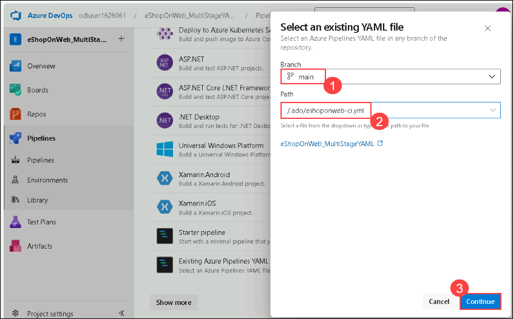
   
1. From the **Review your Pipeline YAML** screen, click **Run** to start the Build Pipeline process.
   
    
   
1. Wait for the Build Pipeline to complete successfully. Ignore any warnings regarding the source code itself, as they are not relevant for this lab exercise.
   
    

     >**Note**: Wait for the pipeline build to succeed. It might take around 5 minutes.
   
     >**Note**: Each task from the YAML file is available for review, including any warnings and errors.

## Exercise 1: Creating the necessary Azure Resources for the Release Pipeline

In this exercise, you will create the necessary Azure resources for the release pipeline by setting up two Azure web apps for deployment and configuring an Application Insights resource to monitor the application's performance and health.

### Task 1: Create two Azure web apps

In this task, you will create two Azure web apps representing the **Canary** and **Production** environments, into which you'll deploy the application via Azure Pipelines.

1. Switch back to the **Azure portal**.

1. In the Azure portal, click the **Cloud Shell** icon, located directly to the right of the search textbox at the top of the page.

   
    
1. From the **Bash** prompt, in the **Cloud Shell** pane, run the following command to create a resource group. 

   >**Note**: If the region is not available, Possible locations can be found by running the following command: `az account list-locations -o table`. Then use the **Name** on the region name.

    ```bash
    REGION='westeurope'
    RESOURCEGROUPNAME='Web-RG'
    az group create -n $RESOURCEGROUPNAME -l $REGION
    ```

     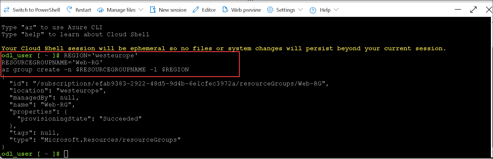    

1. To create an **App service plan**.

    ```bash
    SERVICEPLANNAME='Web-sp1'
    az appservice plan create -g $RESOURCEGROUPNAME -n $SERVICEPLANNAME --sku S1
    ```

     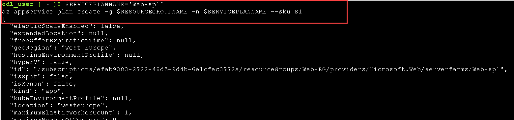    

1. Create two **Web apps** with unique app names.
 
    ```bash
    SUFFIX=$RANDOM$RANDOM
    az webapp create -g $RESOURCEGROUPNAME -p $SERVICEPLANNAME -n RGATES$SUFFIX-Canary
    az webapp create -g $RESOURCEGROUPNAME -p $SERVICEPLANNAME -n RGATES$SUFFIX-Prod
    ```

1. Wait for the Web App Services Resources provisioning process to complete and close the **Cloud Shell** pane.    

1. Run the below command to list the web apps.

    ```bash
    az webapp list --query "[].name" -o tsv
    ```

     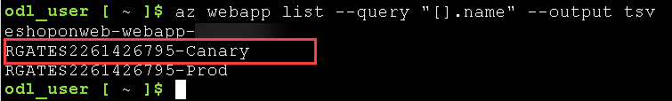     

      > **Note:** Record the name of the Canary web app. You will need it later in this lab. The canary web app should look like: **RGATES495017526-Canary**

> **Congratulations** on completing the task! Now, it's time to validate it. Here are the steps:
 
- Hit the Validate button for the corresponding task. If you receive a success message, you can proceed to the next task. 
- If not, carefully read the error message and retry the step, following the instructions in the lab guide.
- If you need any assistance, please contact us at cloudlabs-support@spektrasystems.com. We are available 24/7 to help you out.

   <validation step="abc690c9-65ed-4bb7-a3e1-c7b943d91eeb" /> 


### Task 2: Configure an Application Insights resource

In this task, you will configure an Application Insights resource in the Azure portal, link it to the Canary web app, and create an alert rule to monitor failed requests, which will be used in later stages of the lab.

1. In the Azure portal, use the **Search resources, services, and docs** text box at the top of the page to search for **Application Insights (1)** and, in the list of results, select **Application Insights (2)**.

    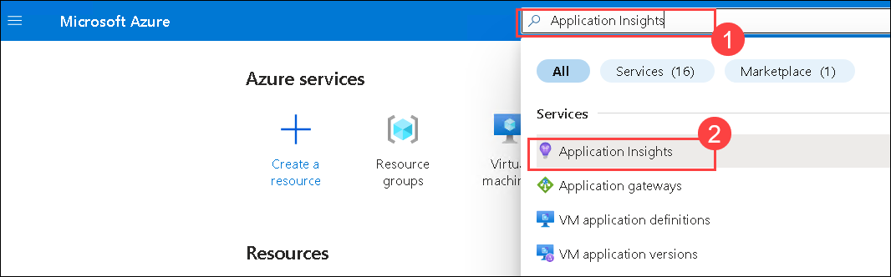 
   
1. On the **Application Insights** blade, select **+ Create**.

    
      
1. On the **Application Insights** blade, on the **Basics** tab, specify the following settings (leave others with their default values) and then click on **Review + create (5)**. 

    | Setting | Value |
    | --- | --- |
    | Sunscription | Leave the default one **(1)** |    
    | Resource group | **Web-RG (2)** |
    | Name | the name of the Canary web app you recorded in the previous task **(3)** |
    | Region | the same Azure region to which you deployed the web apps earlier in the previous task **(4)** |
    
    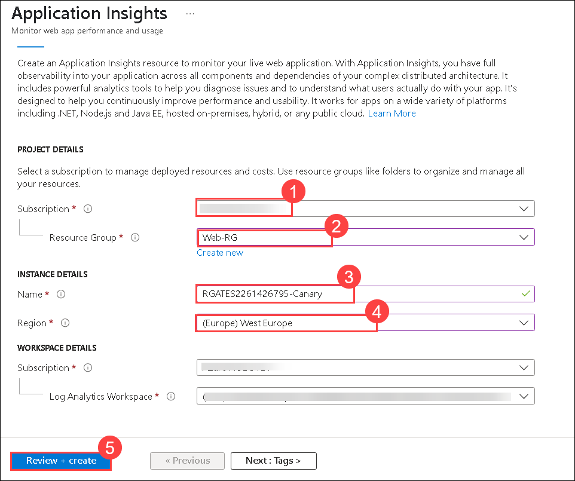 

     > **Note**: Disregard the deprecation message. This is required to prevent failures of the Enable Continuous Integration DevOps task you will be using later in this lab.

1. Then click **Create**.
   
1. Wait for the provisioning process to complete.

1. In the Azure portal, use the **Search resources, services, and docs** text box at the top of the page to search for **App service(1)** and, in the list of results, select **App service(2)**.

    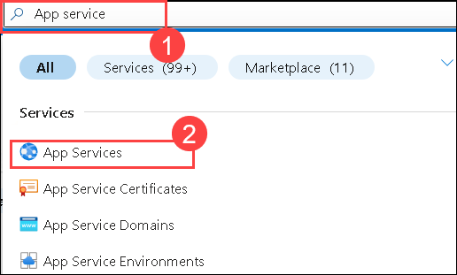 

1. Click the **Canary(2)** web app.

    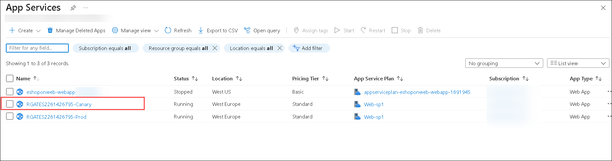
  
1. On the **Canary** web app page, in the properties tab, click **Application Insights**.

    
  
1. On the **Application Insights** blade, click **Turn on Application Insights**.

    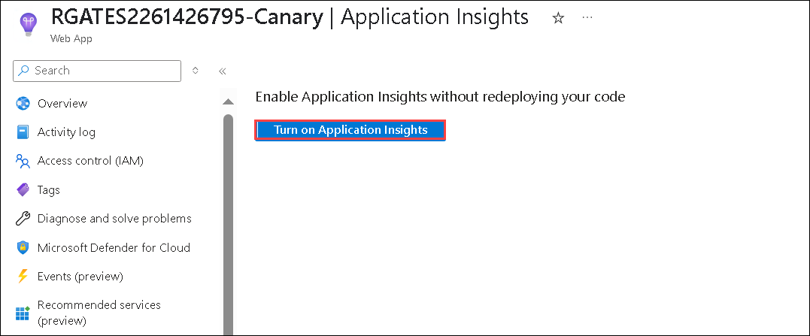

1. In the **Change your resource** section, scroll down and click on the **Select existing resource(1)** option, in the list of existing resources, select the newly created **Application Insight resource(2)**, click **Apply(3)**.

    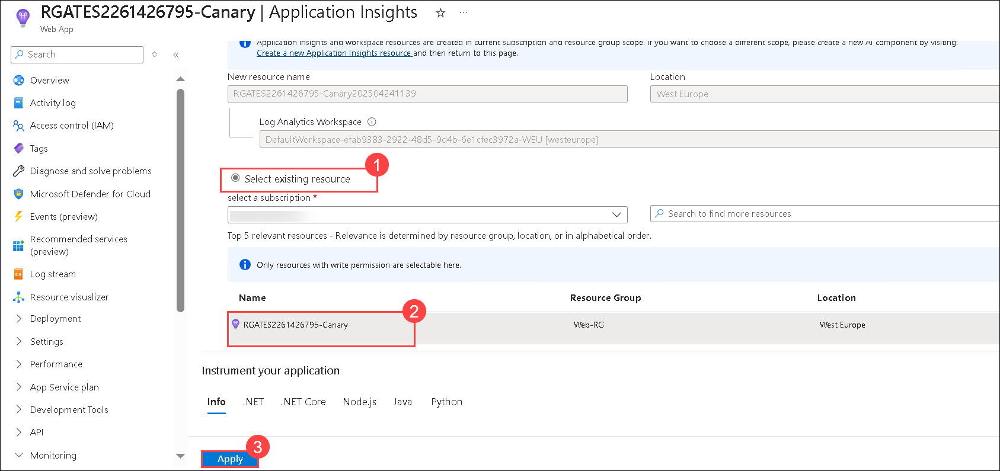

1. When prompted for confirmation, click on **Yes**.
  
    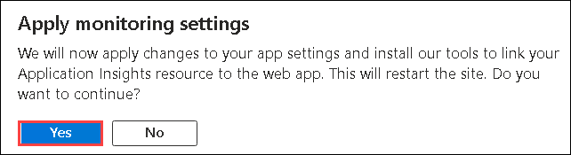

1. Wait until the change takes effect.

    > **Note**: You will create monitor alerts here, which you will use in the later part of this lab.

1. From the same **Settings** / **Application Insights** menu option within the Web App, select **View Application Insights Data**. This redirects you to the Application Insights blade in the Azure Portal.

    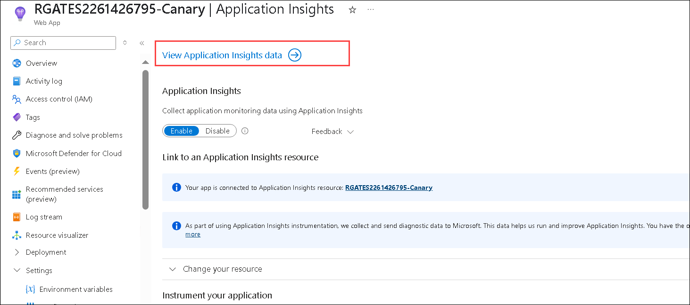

1. On the Application Insights resource blade, in the **Monitoring** section, click **Alerts (1)** and then click **+ Create (2) > Alert rule (3)**.

    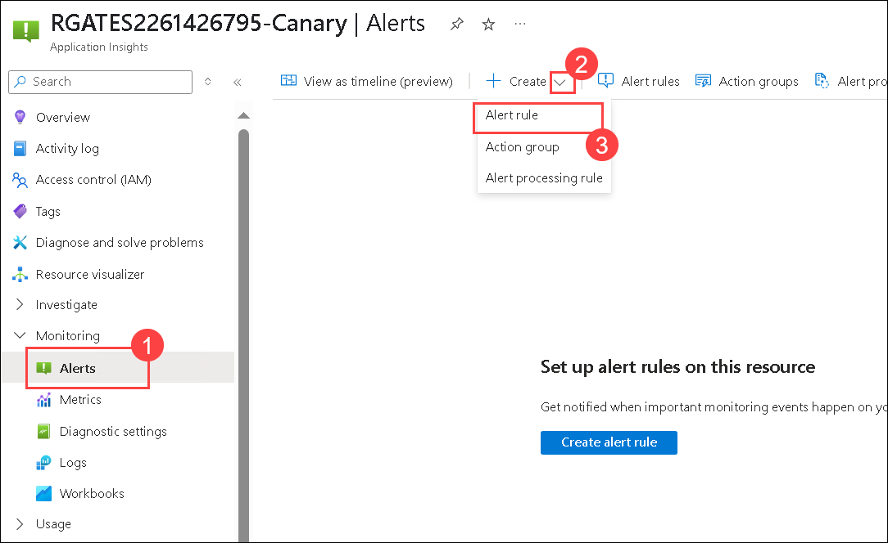
       
1. On the **Create an alert rule** blade, provide the following details and then click on **Next: Actions > (7)**:

    - **Select a signal**: Select  **Failed Requests(1)** from the drop-down. 
    - Leave the **Threshold** set to **Static(2)**
    - Aggregation Type: **Count (3)**
    - Operator: **Greater Than (4)**
    - Unit: **Count (5)**
    - Threshold value: type **0** **(6)**

      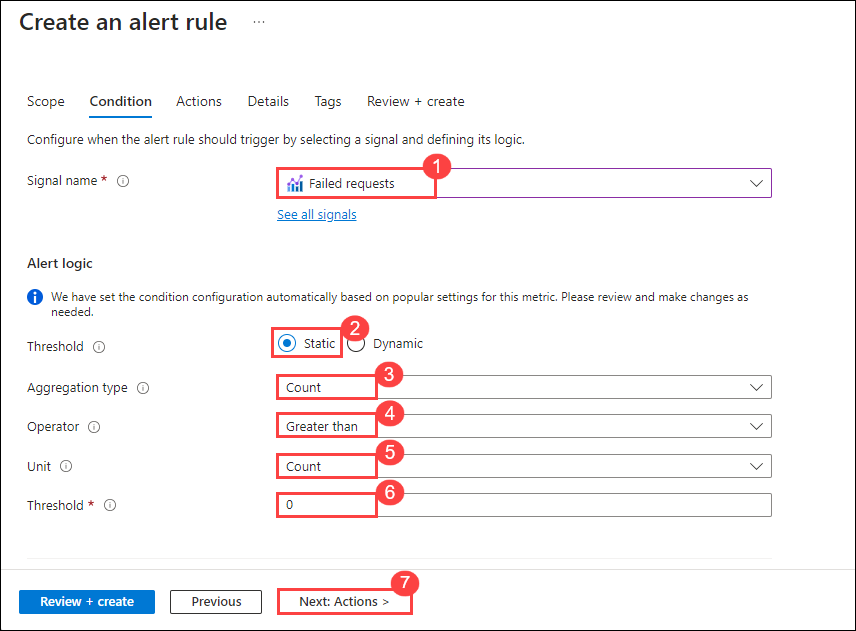
    
1. Don't make any changes in the **Actions** settings blade, click on **Next: Details >**.

    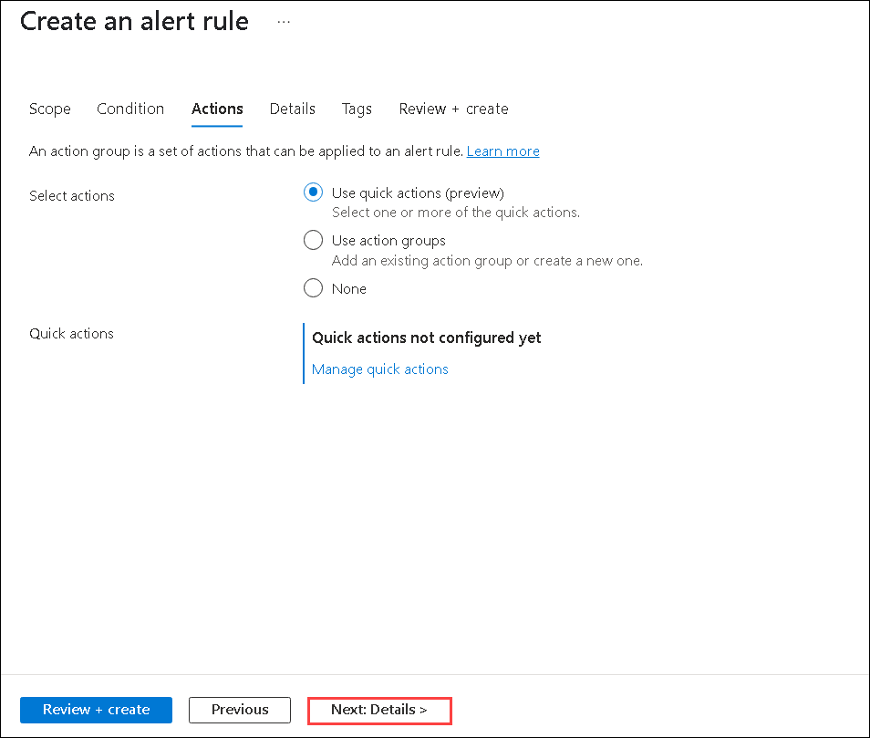

1. Define the following parameters under the **Details** section and then confirm the creation of the Alert rule by clicking **Review + create (5)**

    | Setting | Value |
    | --- | --- |
    | Severity | **2- Warning(1)** |
    | Alert rule name | **RGATESCanary_FailedRequests(2)** |
    | Advanced Options: Automatically resolve alerts | **Unchecked (3)(4)** |
    
    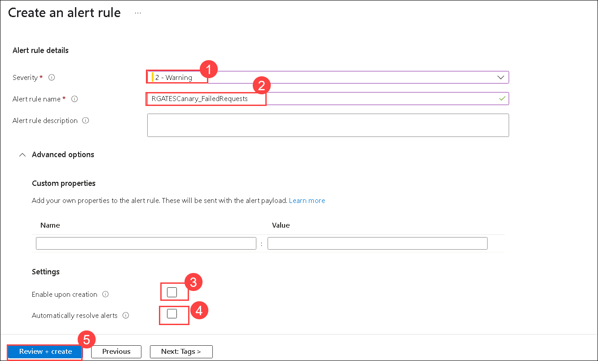

    > **Note**: Metric alert rules might take up to 10 minutes to activate.

    > **Note**: You can create multiple alert rules on different metrics such as availability < 99 percent, server response time > 5 Seconds, or server exceptions > 0

1. Confirm once more by clicking **Create**. Wait for the alert rule to get created successfully.

## Exercise 2: Configure the release pipeline

In this exercise, you will configure a release pipeline.

### Task 1: Set Up Release Tasks

In this task, you will set up the release tasks as part of the Release Pipeline.

1. From the **eShopOnWeb_MultiStageYAML** project in the Azure DevOps portal, in the vertical navigational pane, select **Pipelines (1)** and then, within the **Pipelines** section, click **Releases(2)** and then click **New Pipeline(3)**.
    
    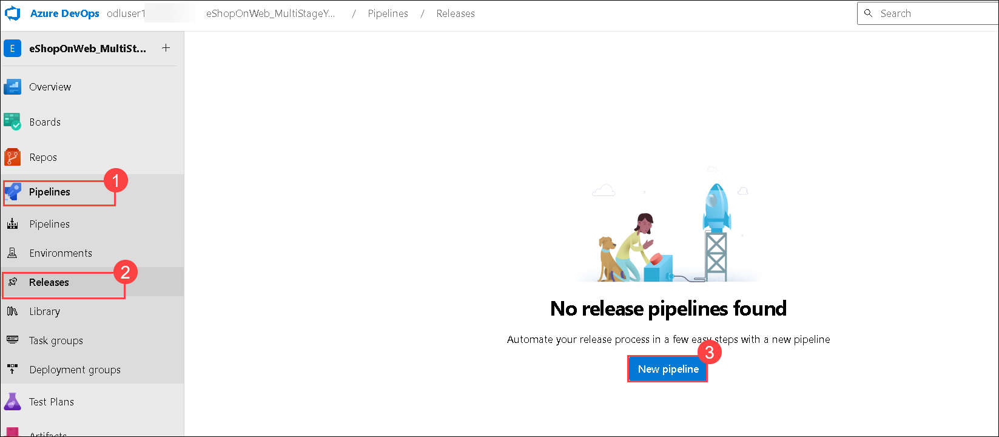
   
     > **Note** - If you are unable to see the **Releases** under pipelines, navigate to the Azure DevOps page, from the bottom left, click on **Organization settings**, go to the **Pipelines (1)** section, and click **Settings (2)**. **Turn off(3)** the **Disable creation of classic release pipelines**.
   
    
   
1. Navigate back to your project and now you will be able to see the releases under pipelines   
  
1. From the **Select a template** window, choose **Azure App Service Deployment** (Deploy your application to Azure App Service. Choose from Web App on Windows, Linux, containers, Function Apps, or WebJobs) under the **Featured** list of templates. Click **Apply**.

    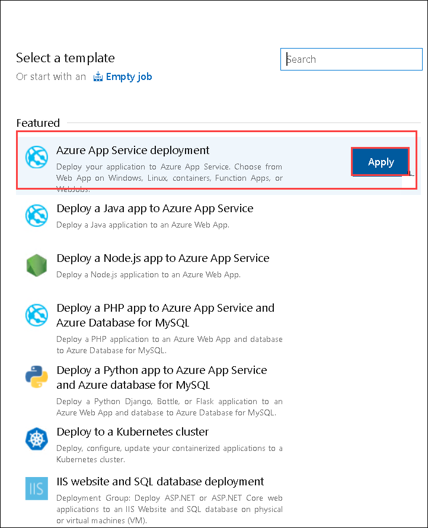

1. From the **Stage** window, update the default `Stage 1` Stage Name to **Canary**. 

    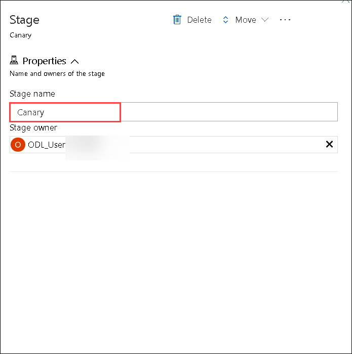

1. Close the pop-up window by using the **X** button. You are now in the graphical editor of the Release Pipeline, showing the Canary Stage.

1. Hover the mouse over the Canary Stage, and click the **Clone** button, to copy the Canary Stage to an additional Stage. 

    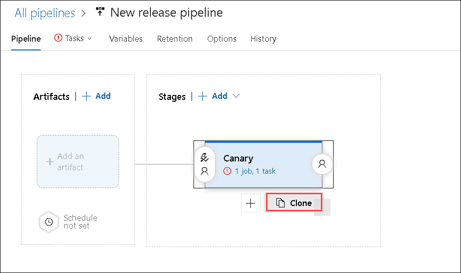

1. Name this Stage **Production**.

    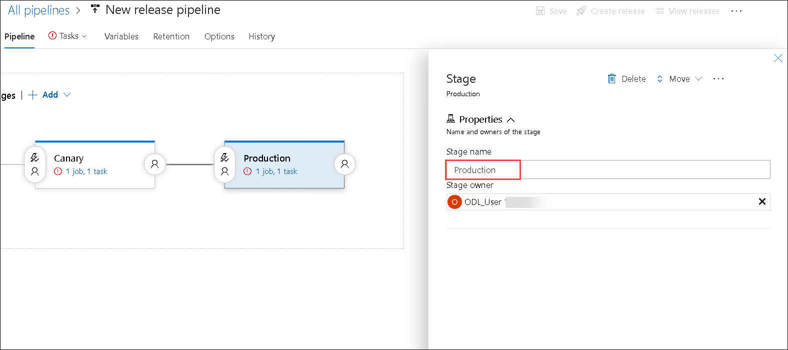

1. The pipeline now contains two stages named **Canary** and **Production**.

     

1. On the **Pipeline** tab, select the **+ Add an artifact** rectangle.

     
     
1. Select the **eShopOnWeb_MultiStageYAML (1)** in the **Source (build pipeline)** field. It will appear by default in **Source alias (2)**, then click **Add (3)** to confirm the selection of the artifact.
    
     

1. From the **Artifact** rectangle, notice the **Continuous Integration Trigger** (lightning bolt) appearing. Click it to open the **Continuous deployment trigger** settings.

     
    
1. Enable the **continuous deployment trigger** toggle to enable it. Leave all other settings at default and close the **Continuous deployment trigger** pane by clicking the **x** mark in its upper right corner.

       
   
1. Within the **Canary Environments** stage, click the **1 job, 1 task** label and review the tasks within this stage.
     
    

    > **Note**: The canary environment has 1 task which, respectively, publishes the artifact package to Azure Web App.

1. Select the Task **Deploy Azure App Service (1)** and click on **Remove (2)**.

    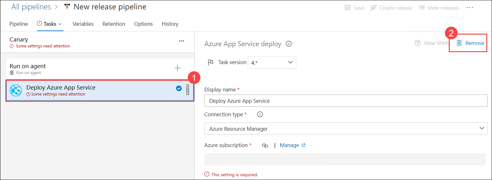

1. Next to the **Run on Agent** click on the **+** icon **(1)**.In the new window that appears, search for **App Service** **(2)** and click on **Add** **(3)** next to the Azure App Service Deploy option.

    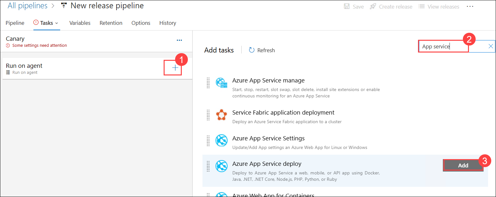

1. Select the **Azure App Service Deploy** Agent.

    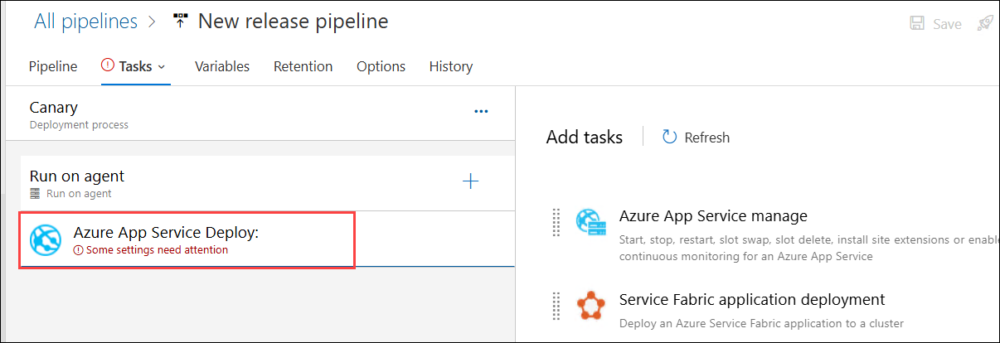    

1. In the **Azure subscription** dropdown list,select your **subscription (1)**.

     >**Important:** After Selecting your Azure subscription and click **Authorize (2)**. If prompted, authenticate by using the Azure user account.
    
      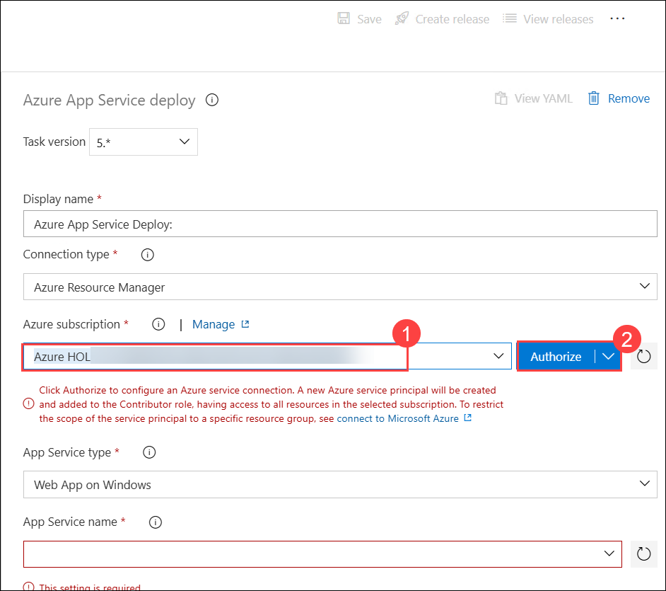

1. Confirm the App Type is set to **Web App on Windows (1)**.

    - Next, in the **App Service name** dropdown list, select the name of the **Canary (2)** web app.

      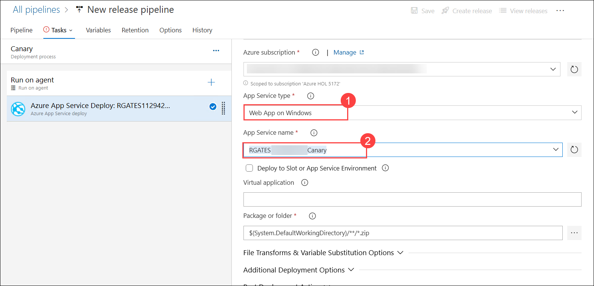   

1. Further update the following settings in the App Service Deploy Task

    - In the **Package or Folder** field, update the default value of "$(System.DefaultWorkingDirectory)/\*\*/\*.zip" to **"$(System.DefaultWorkingDirectory)/\*\*/Web.zip"** **(1)**

    - Scroll down and open the **Application and Configuration Settings** pane and enter `-UseOnlyInMemoryDatabase true -ASPNETCORE_ENVIRONMENT Development` in the **App settings** box **(2)**.

      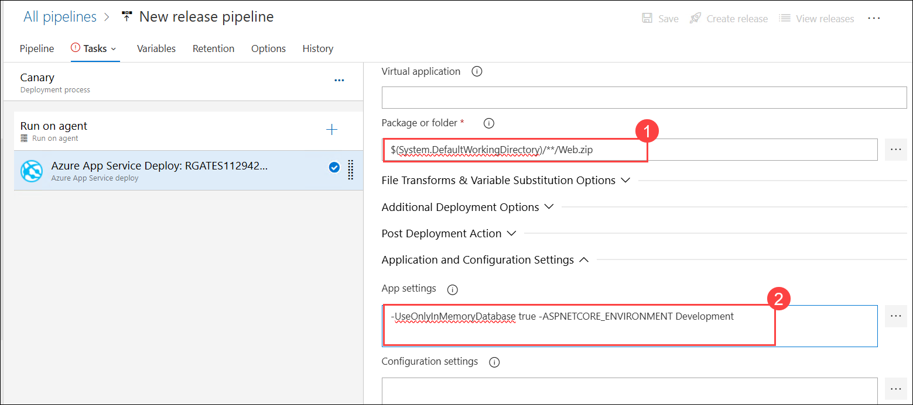
     

1. Under **All pipelines > New Release Pipeline** pane, Click on **Tasks (1)**,from the drop-down selct Select **Production (2)**.

     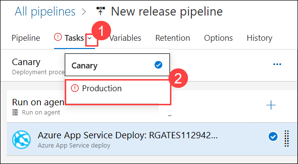

1. Select the Task **Deploy Azure App Service** **(1)** and click on **Remove** **(2)**.

     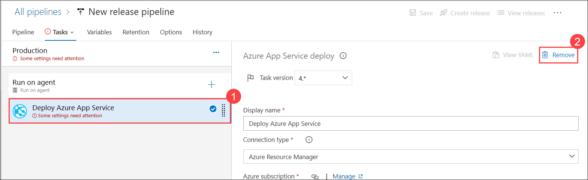

1.  Next to the **Run on Agent** click on the **+** icon **(1)**.In the new window that appears, search for **App Service** **(2)** and click on **Add** **(3)** next to the Azure App Service Deploy option.

     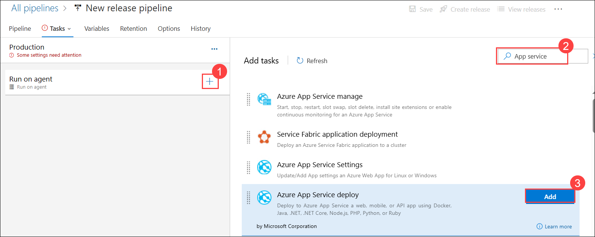

1. Select the Azure App Service Deploy Agent.

    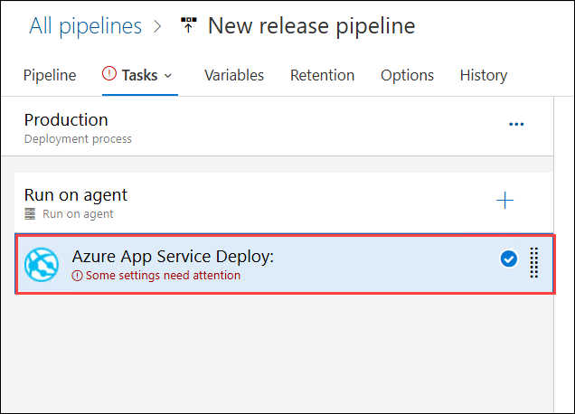    

1. In **Production(1)** stage, complete the following  pipeline settings:
    
    - Under the Tasks tab / Production Deployment process, in the **Azure subscription** dropdown list, select the **Azure service connection**, as we already created the service connection before when authorizing the subscription use.

      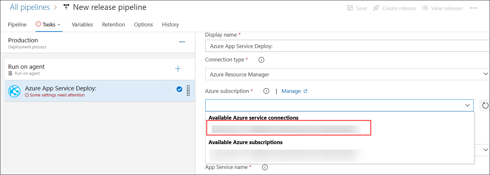
  
    - In the **App type** from the dropdown list select **Web App on Windows (1)**, In the **App Service name** from the dropdown list, select the name of the **Prod (2)** web app.

      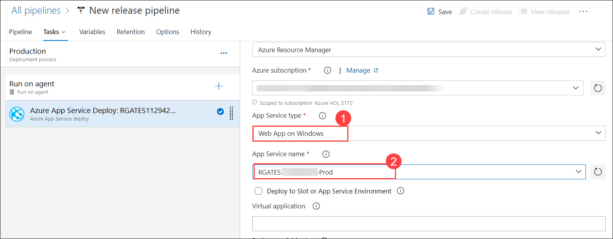

1. Further update the following settings in the App Service Deploy Task

    - In the **Package or Folder** field, update the default value of "$(System.DefaultWorkingDirectory)/\*\*/\*.zip" to **"$(System.DefaultWorkingDirectory)/\*\*/Web.zip"** **(1)**

    - Scroll down and open the **Application and Configuration Settings** pane and enter `-UseOnlyInMemoryDatabase true -ASPNETCORE_ENVIRONMENT Development` in the **App settings** box **(2)**

      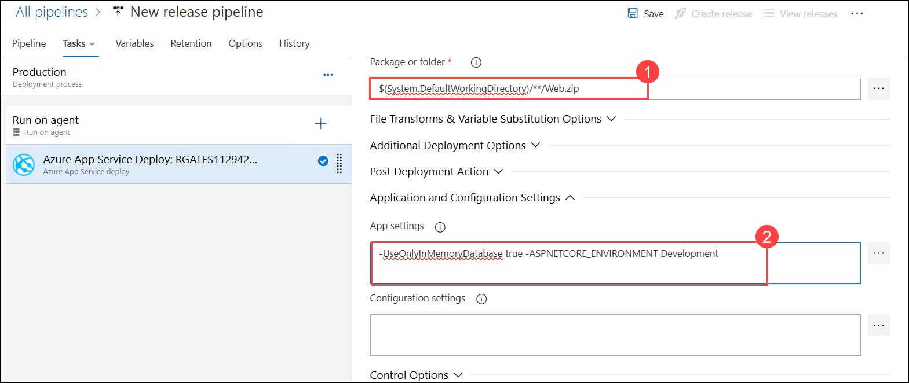      

1. On the **All pipelines > New Release Pipeline** pane, click **Save**.

    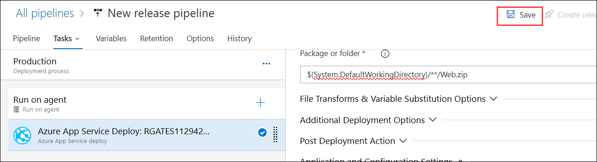     
 
1. On the **Save** dialog box, click **OK**.

    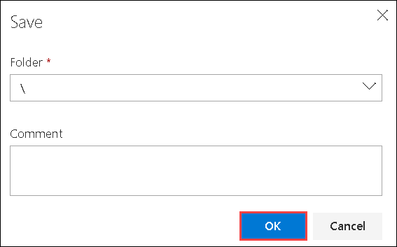

1. You have now successfully configured the Release Pipeline.

1. In the browser window displaying the **eShopOnWeb_MultiStageYAML** project, in the vertical navigational pane, in the **Pipelines** section, click **Pipelines**. Click the entry representing **eShopOnWeb_MultiStageYAML** build pipeline

    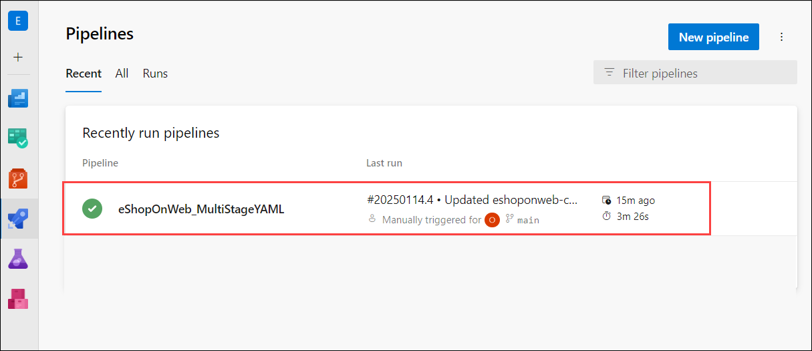

1. On the **eShopOnWeb_MultiStageYAML** pane, click on **Run Pipeline**.

    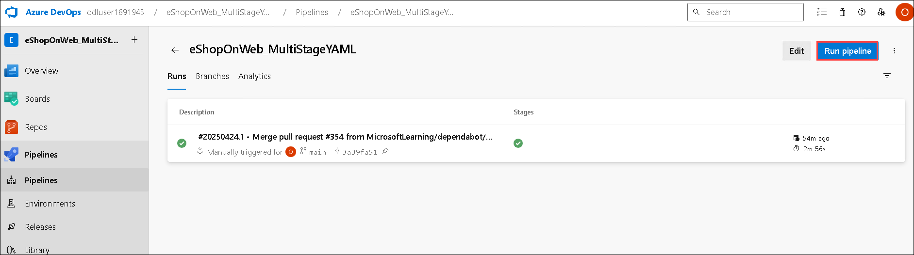

1. On the **Run pipeline** pane, accept the default settings and click **Run** to trigger the pipeline.

    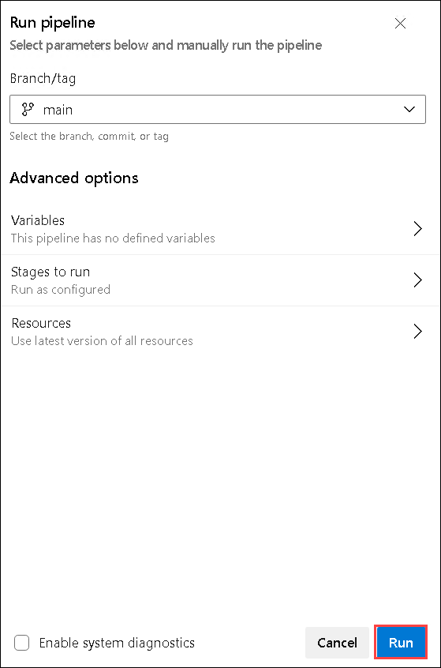

1. Wait for the build pipeline to finish.

    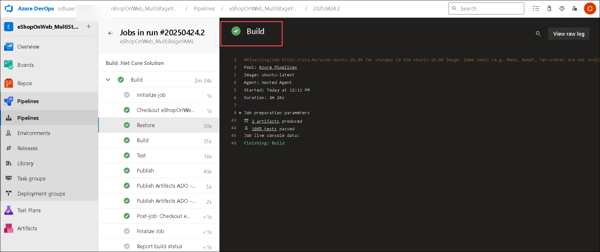

    > **Note**: After the build succeeds, the release will be triggered automatically, and the application will be deployed to both environments. Validate the release actions once the build pipeline has completed successfully.

1. In the vertical navigational pane, in the **Pipelines** section, click **Releases (1)** and, on the **eShopOnWeb_MultiStageYAML** pane, click the entry representing the most recent release **(2)**. On the **eShopOnWeb_MultiStageYAML > Release-1** blade, track the progress of the release and verify that the deployment to both web apps completed successfully **(3)**.

    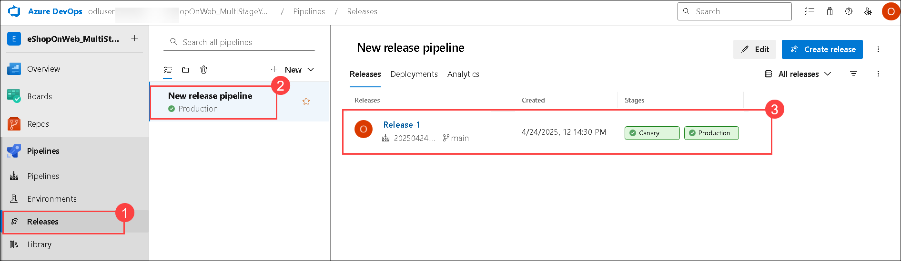

1. Switch back to the Azure portal interface, navigate to the resource group **Web-RG**, in the list of resources, click the **Canary** web app.

    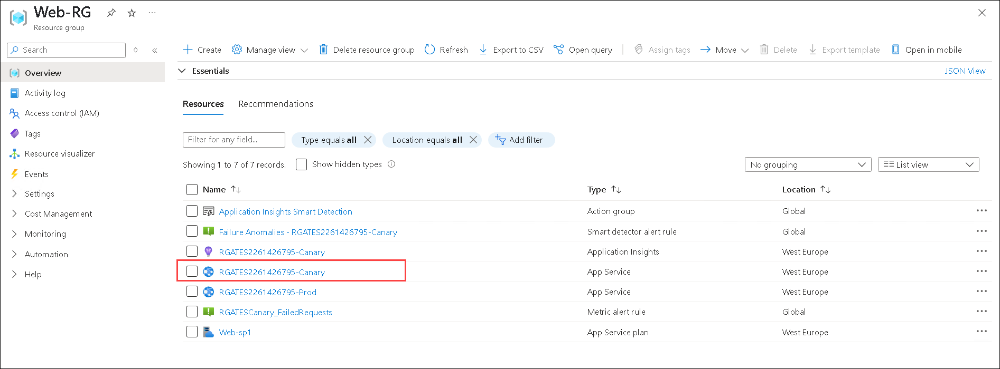

1. On the web app blade, click **Browse**.

    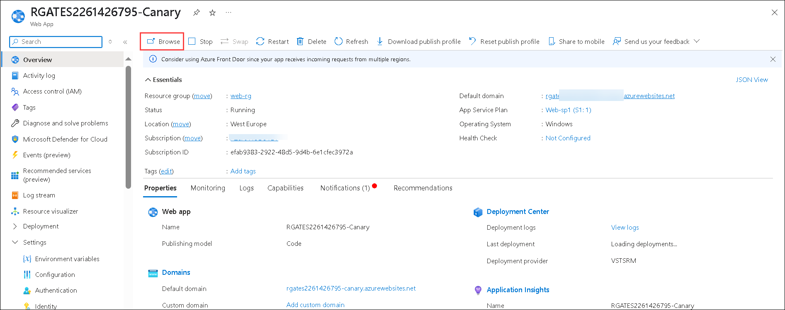

1. Verify that the web page (E-commerce website) loads successfully in a new web browser tab.
    
    
   
1. Switch back to the Azure portal interface, this time navigating  to the resource group **Web-RG**, in the list of resources, click the **Production** web app. 

    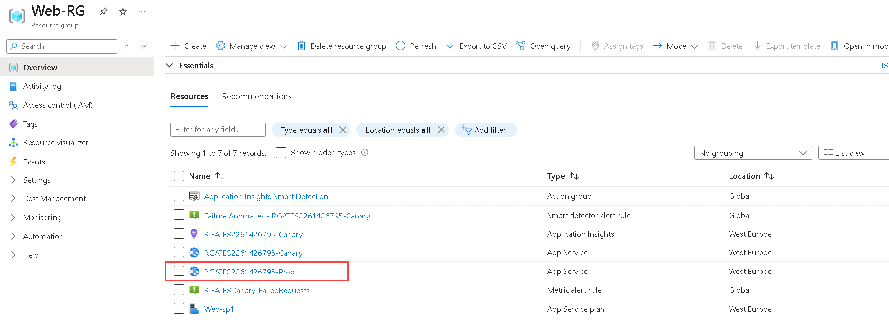

1. On the web app blade, click **Browse**.

    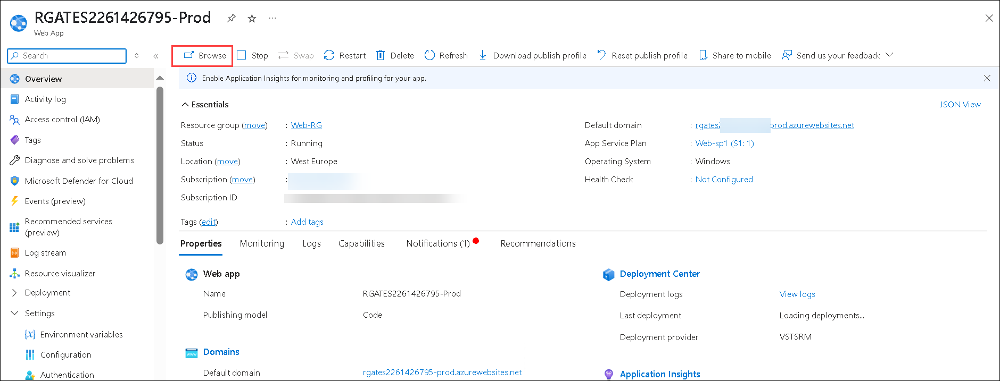

1. Verify that the web page loads successfully in a new web browser tab.

    
   
1. Close the web browser tab displaying the **EShopOnWeb** website.

    > **Note**: Now you have the application with CI/CD configured. In the next exercise, we will set up Quality Gates as part of a more advanced release pipeline.

## Exercise 3: Configure release gates

In this exercise, you will set up Quality Gates in the release pipeline.

### Task 1: Configure pre-deployment gates for approvals

In this task, you will configure pre-deployment gates.

1. Switch to the web browser window displaying the Azure DevOps portal, and open the **eShopOnWeb_MultiStageYAML** project. In the vertical navigational pane, in the **Pipelines** section, click **Releases (1)** and, on the **New Release Pipeline (2)** pane, click **Edit (3)**.

    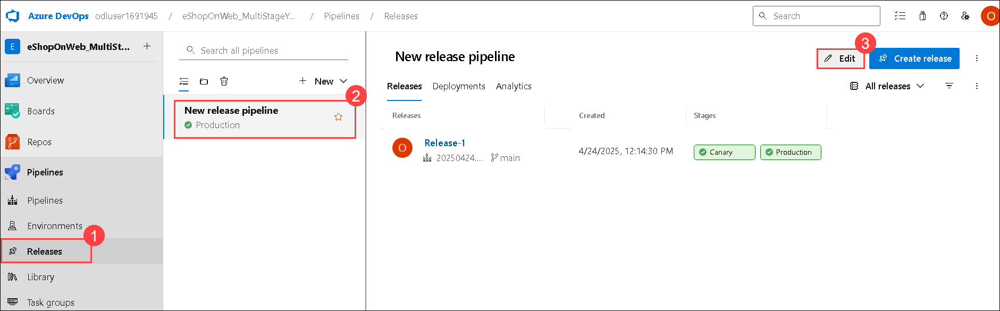

1. On the **All pipelines > New Release Pipeline** pane, on the left edge of the rectangle representing the **Canary Environment** stage, click the oval shape representing the **Pre-deployment conditions**.

    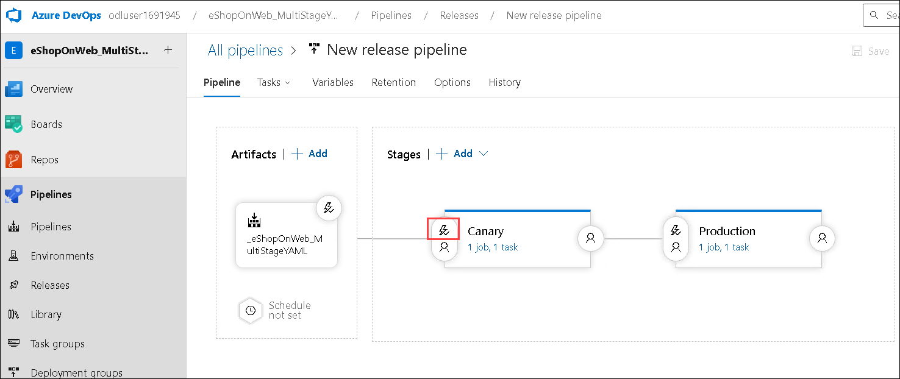
    
1. On the **Pre-deployment conditions** pane, set the **Pre-deployment approvals** slider to **Enabled (1)** and, in the **Approvers** text box, type and select your Azure DevOps account name **<inject key="AzureAdUserEmail"></inject> (2)**.

    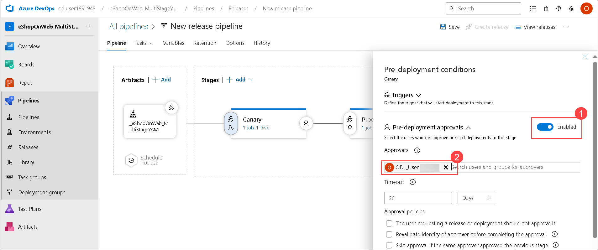

    > **Note**: In a real-life scenario, this should be a DevOps Team name alias instead of your name.  

1. Click on the **X** mark in its upper right corner to **Save** the pre-approval settings and close the popup window.

1. Click on **Save**.

    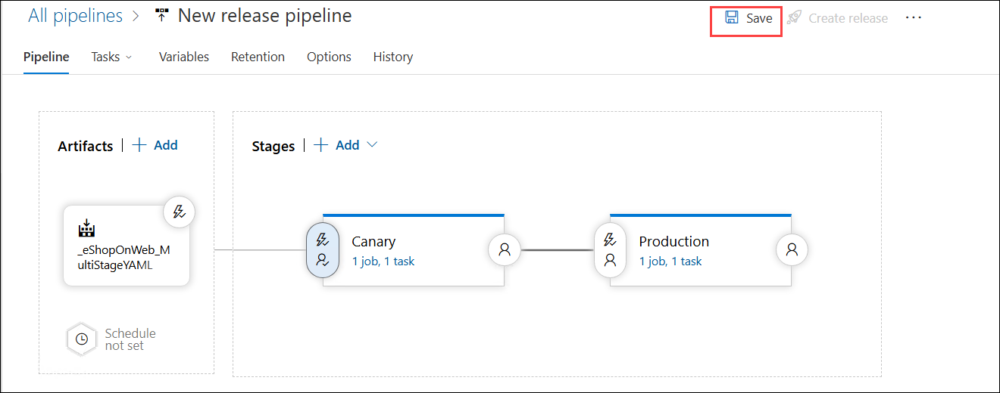

1. Back on the **New Release Pipeline** pane, click **Save**, and in the **Save** dialog box, click **OK**.

    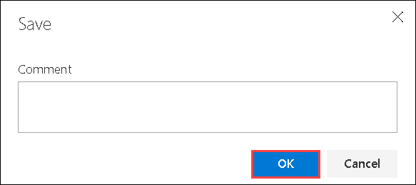

1. Return to the Azure DevOps Portal, open the **eShopOnWeb_MultiStageYAML*** Project. Navigate to **Pipelines**, select **Releases (1)** and select the **New Release Pipeline (2)**. Click the **Create release (3)** button.

    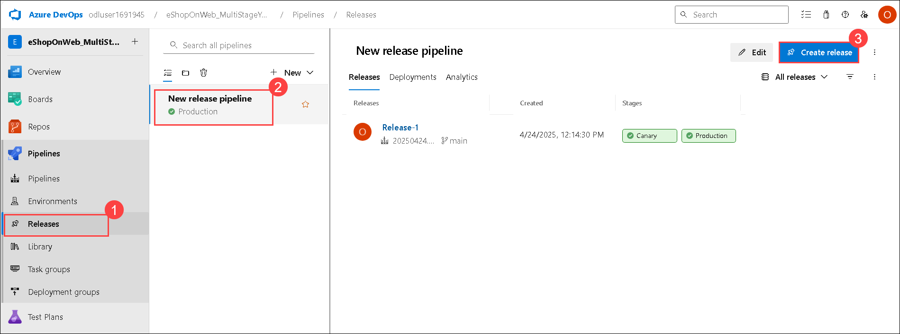 
 
1. On **Create a new release** page, click on **Create**.

    
1. Notice the green confirmation message, saying **Release-2** has been created. 

1. Click the link of **Release-2** to navigate to its details.

    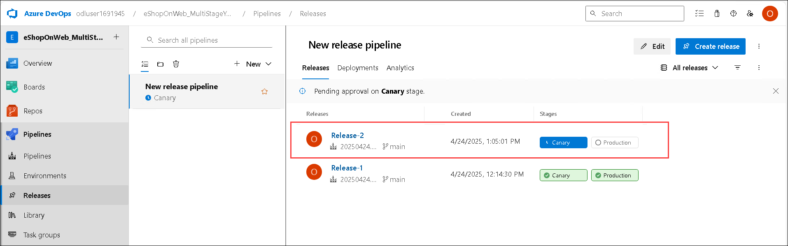 

1. Notice the **Canary** Stage is in a **Pending Approval** state. Click the **Approve (1)(2)** button. This sets off the Canary Stage again.

    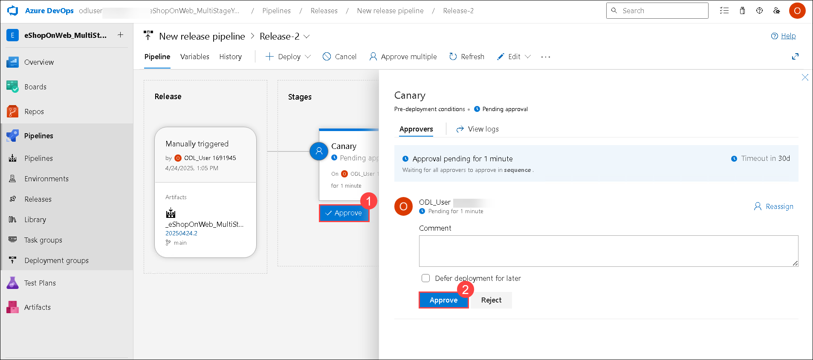 

### Task 2: Configure post-deployment gates for Azure Monitor

In this task, you will enable the post-deployment gate for the Canary Environment.

1. Again, switch to the **New Release Pipeline** pane, click **Edit**.

    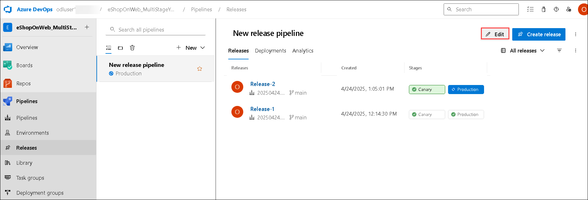

1. On the right edge of the rectangle representing the **Canary Environment** stage, click the oval shape representing the **Post-deployment conditions**.

   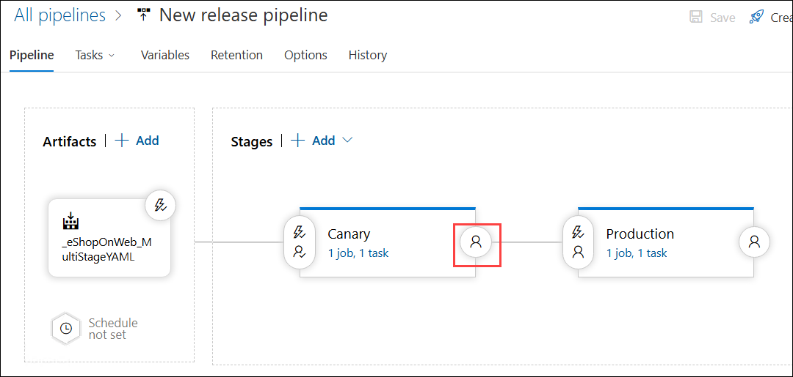
   
1. On **Post-deployment conditions** pane, set the **Gates** slider to **Enabled**.
    
    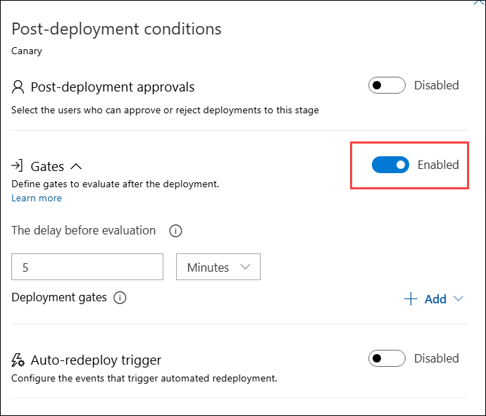 
     
1. Click **+ Add (1)**, and, in the pop-up menu, click **Query Azure Monitor Alerts (2)**.

    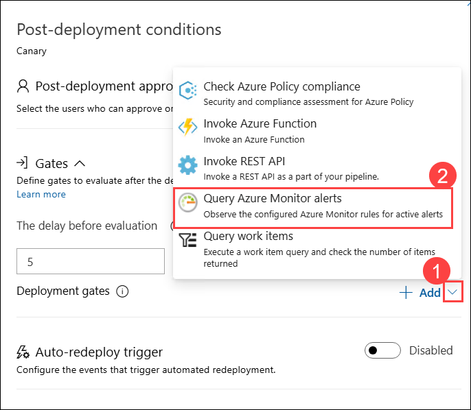 
      
1. On **Post-deployment conditions** pane, in the **Query Azure Monitor Alerts** section, in the **Azure Subscription(1)** dropdown list, select the **service connection** entry representing the connection to your Azure subscription, and, in the **Resource group** dropdown list, select the **Web-RG(2)** entry.

    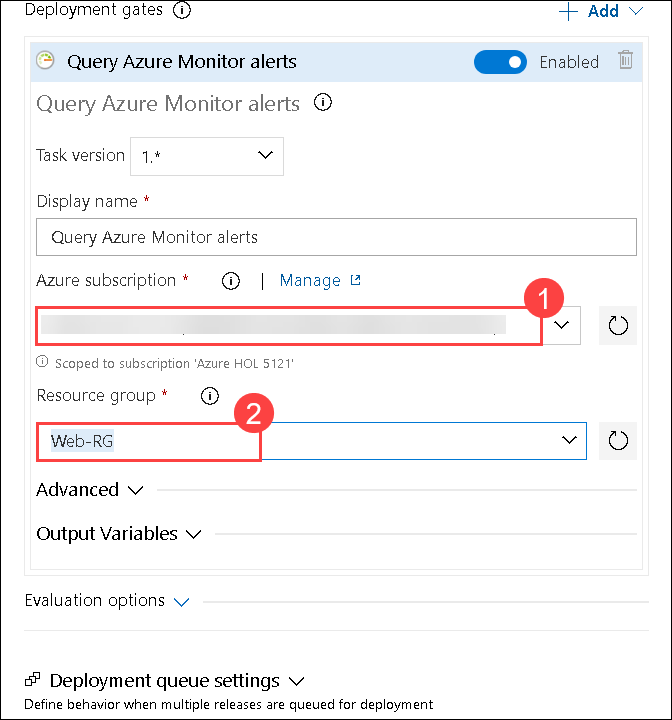 

1. On the **Post-deployment conditions** pane, expand the **Advanced (1)** section and configure the following options:

    - Filter type: **None(2)**
    - Severity: **Sev0, Sev1, Sev2, Sev3, Sev4(3)**
    - Time Range: **Past Hour(4)**
    - Alert State: **Acknowledged, New(5)**
    - Monitor Condition: **Fired(6)**
    
      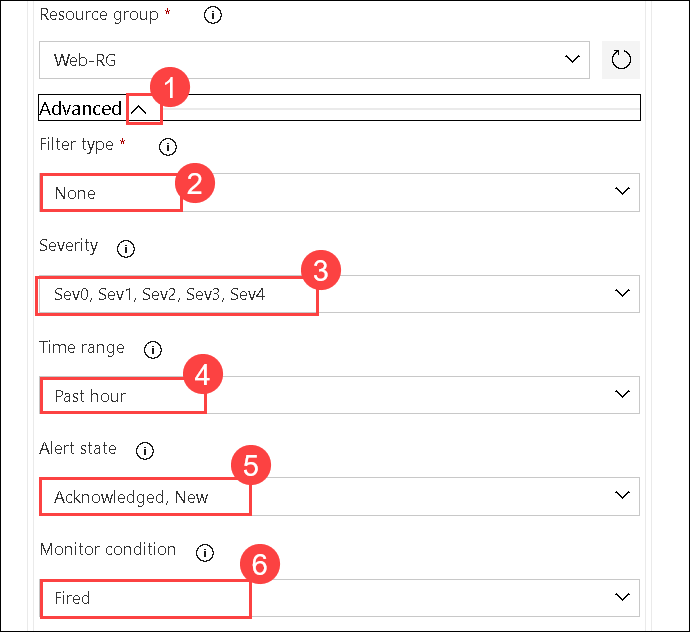 
     
1. On **Post-deployment conditions** pane, expand the **Evaluation options (1)** and configure the following options:

    - Set the value of **Time between re-evaluation of gates** to **5 Minutes(2)**
    - Set the value of **Timeout after which gates fail** to **8 Minutes(3)**
    - Select the **On successful gates, ask for approvals(4)** option

      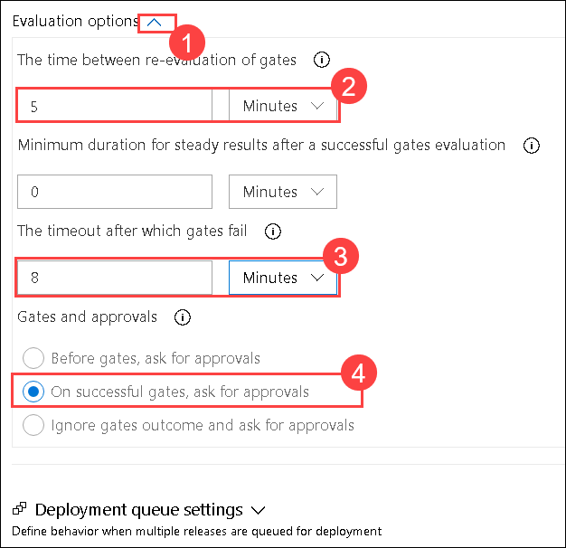 

       > **Note**: The sampling interval and timeout work together so that the gates will call their functions at suitable intervals and reject the deployment if they don't succeed during the same sampling interval within the timeout period.

1. Close the **Post-deployment conditions** pane, by clicking the **x** mark in its upper right corner.

1. Back on the **New Release Pipeline** pane, click **Save (1)**, and in the **Save** dialog box, click **OK (2)**.

    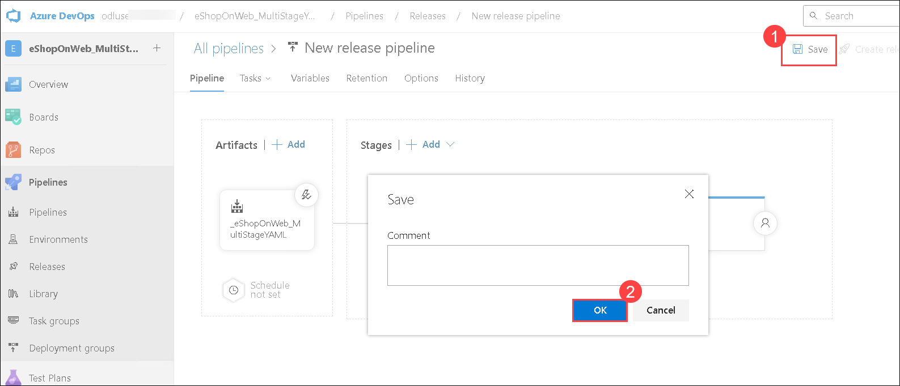

## Exercise 4: Test release gates

In this exercise, you will test the release gates by updating the application, which will trigger a deployment.

### Task 1: Update and deploy the application after adding release gates

In this task, you will first generate some alerts for the Canary Web App, followed by tracking the release process with the release gates enabled.

1. From the Azure Portal, browse to the **Canary Web App** Resource deployed earlier.
1. From the Overview pane, notice the **URL** field showing the Hyperlink of the web application. Click this link, which redirects you to the EShopOnWeb web application in the browser.

    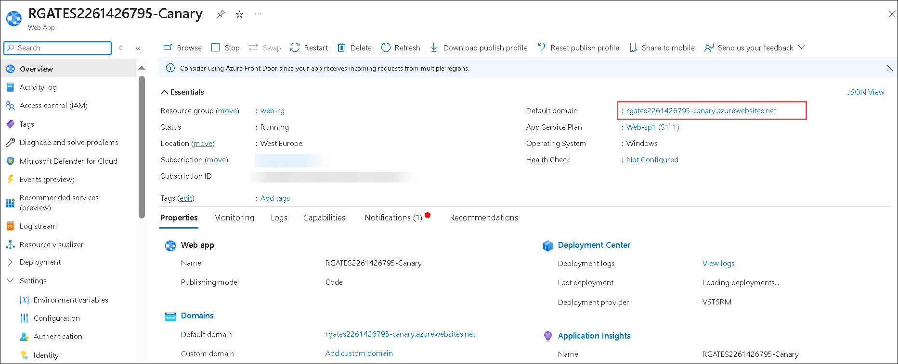
   
1. To simulate a **Failed Request**, add **/discount** to the URL, which will result in an error message, since that page does not exist. Refresh this page several times to generate multiple events.

    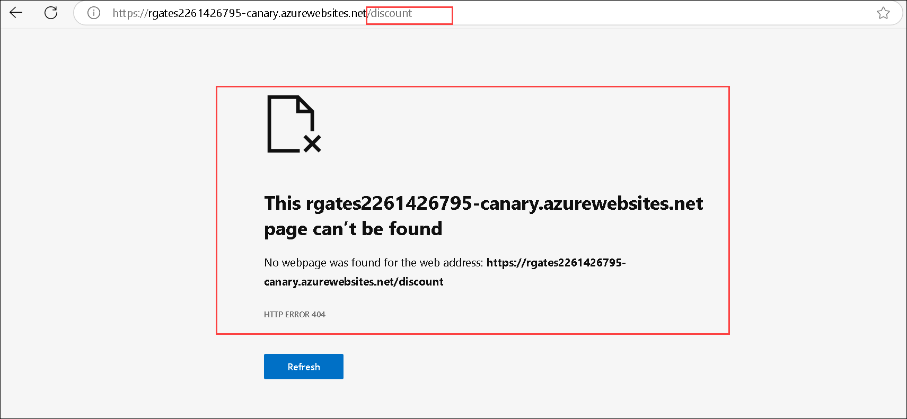

1. From the Azure Portal, in the "Search resources, services and docs" field, enter **resource group(1)** and select the **Resource group(2)** Resource created in the previous exercise.

    

1. In the Azure portal, navigate to the resource group **Web-RG** from the resource group select **RGATESCanary_FailedRequests** Metric alert rule.

    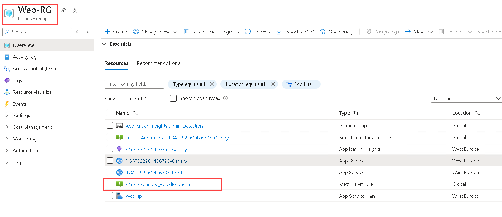

1. There should be at least **1** new alert in the list of results, having a **Severity 2**.

1. Notice there should be at least **1 Failed_Alert** with **Severity 2 - Warning** showing up in the list. This got triggered when you validated the non-existent website URL address in the previous exercise.

    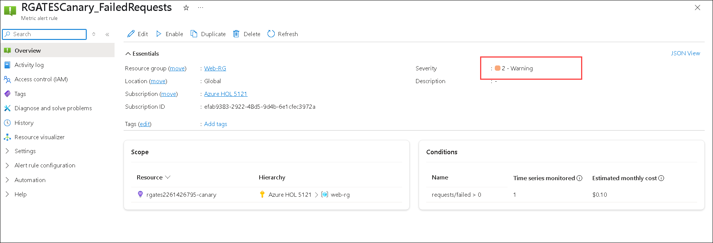

     > **Note:** If no Alert shows up yet, wait another few minutes. 

1. Return to the Azure DevOps Portal, open the **eShopOnWeb_MultiStageYAML** Project. Navigate to **Pipelines (1)**, select **Releases (2)**, and select the **New Release Pipeline (3)**. Click the **Create Release (4)** button.

    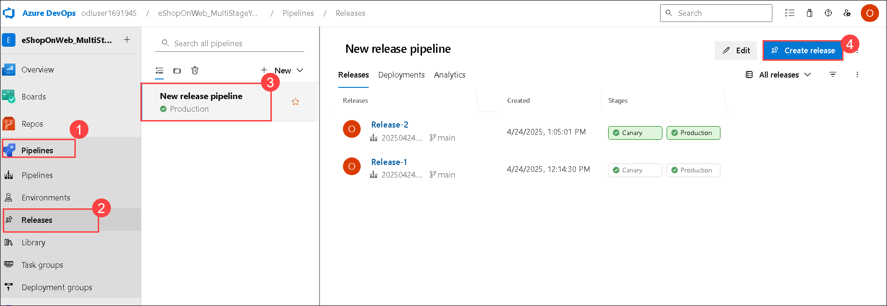 
 
1. On **Create a new release** page, click on **Create**.

1. Select the Release pipeline.

    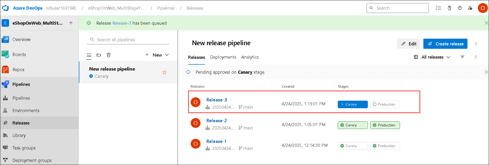
   
1. Wait for the Release pipeline to kick off, and **Approve** the Canary Stage release action.

    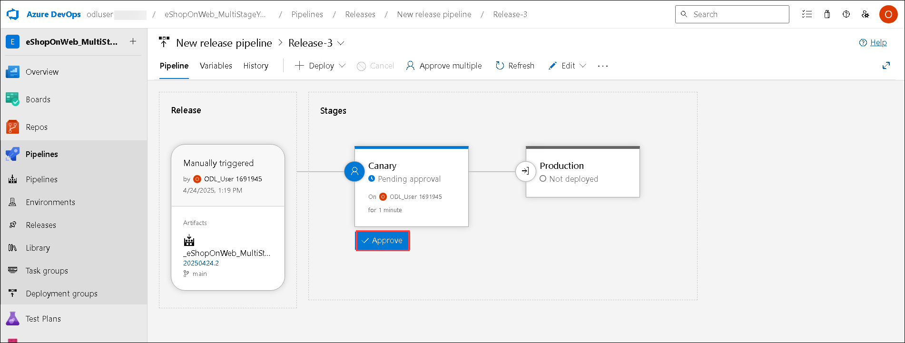

1. If prompted, click on **Approve** again.

    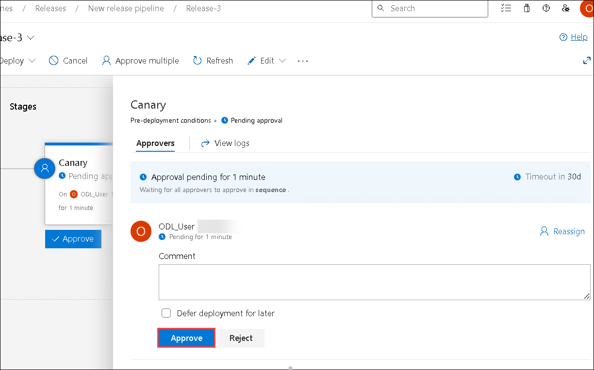

1. Wait for the Canary release Stage to complete successfully. Notice how the **Post-deployment Gates** are switching to the **Evaluation** Gates status.

     

1. Let the Release pipeline run in the pending state for the next 5 minutes.
   
1. This is expected behavior, since there is an Application Insights alert triggered for the Canary Web App.

1. Wait another 3 minutes and validate the status of the Release Gates again. Click on the **Deployment (1)** icon. As it is now +8 minutes after the initial Release Gates got checked, and it's been more than 8 minutes since the initial Application Insight Alert got triggered with action "Fired", it should result in a successful Release Gate, having allowed the deployment of the Production Release Stage as well **(2)**.

    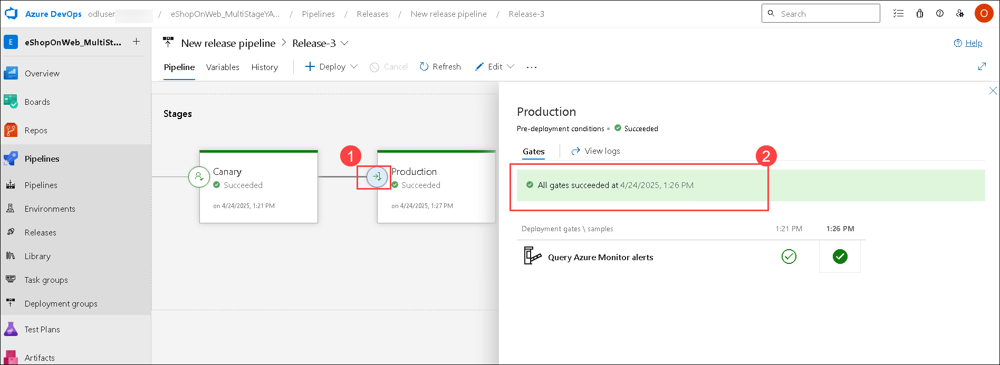 
    
### Review

In this lab, you configured release pipelines and then configured and tested release gates.

In this lab, you have accomplished the following:

- Exercise 0: Configured the lab prerequisites
- Exercise 1: Created the necessary Azure Resources for the Release Pipeline
- Exercise 2: Configured the release pipeline
- Exercise 3: Configured release gates
- Exercise 4: Tested release gates

### You have successfully completed the lab. Click on **Next >>** to proceed with the next lab.


