# Hands-on Lab 4: Implementing Security and Compliance in an Azure Pipeline 

## Exercise 1: Implement Security and Compliance in an Azure DevOps pipeline by using Mend Bolt 

### Task 1: Activate Mend Bolt extension 

1. On the Azure DevOps page click on **Azure DevOps** located at top left corner.

    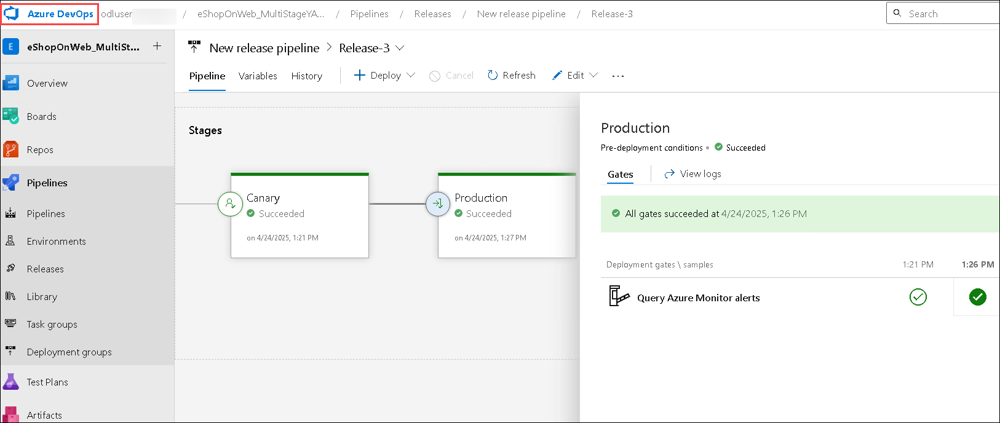

1. Then click on **Organization Setting** at the left down corner. 

    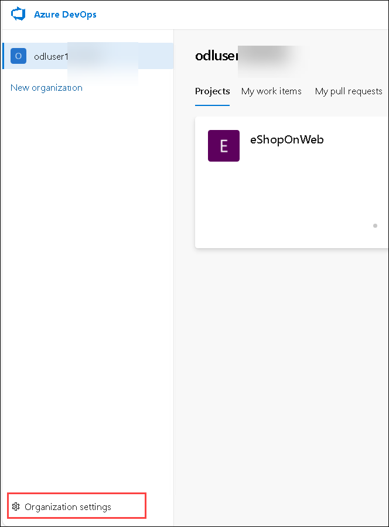

1. Navigate to **Extensions (1)** under **General** and click on **Browse marketplace**.

    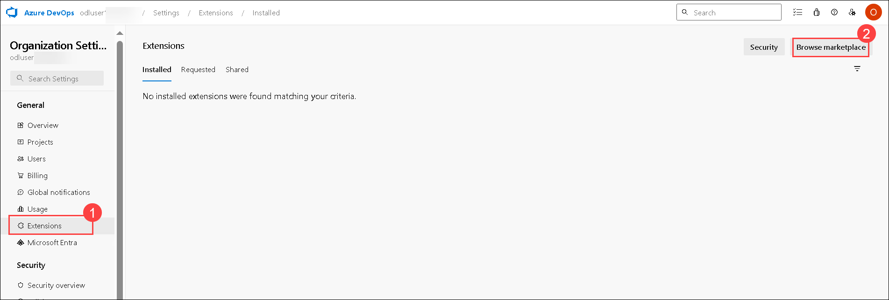

1. Search for **Mend Bolt (1)**, click on **Search (2)** icon and then select from the results **(3)**.

    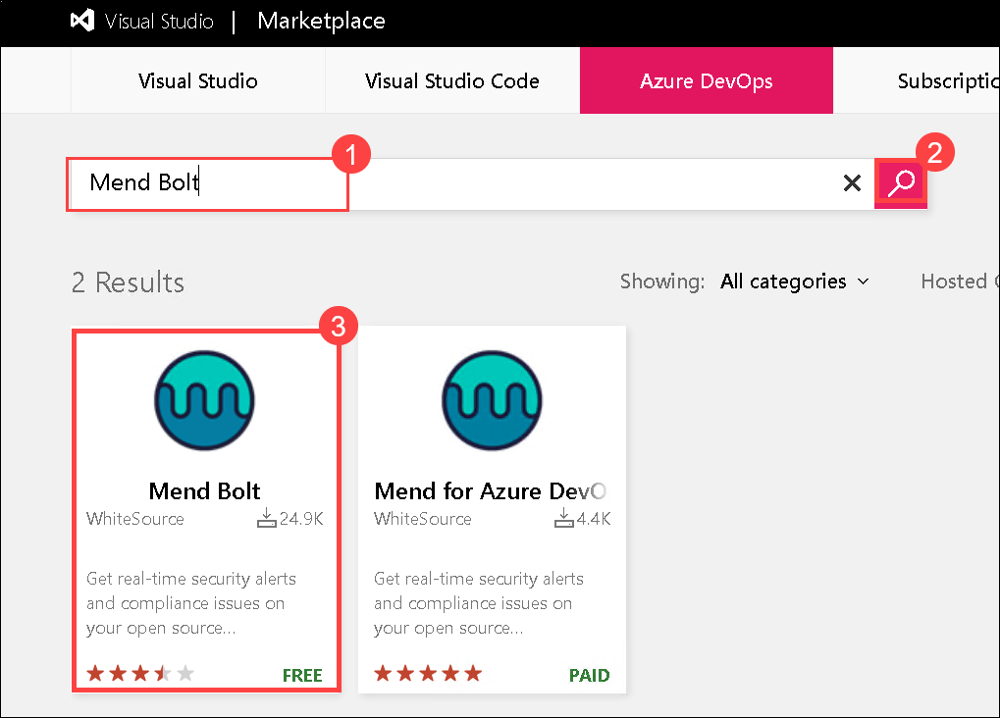

1. Select **Get it free**.

    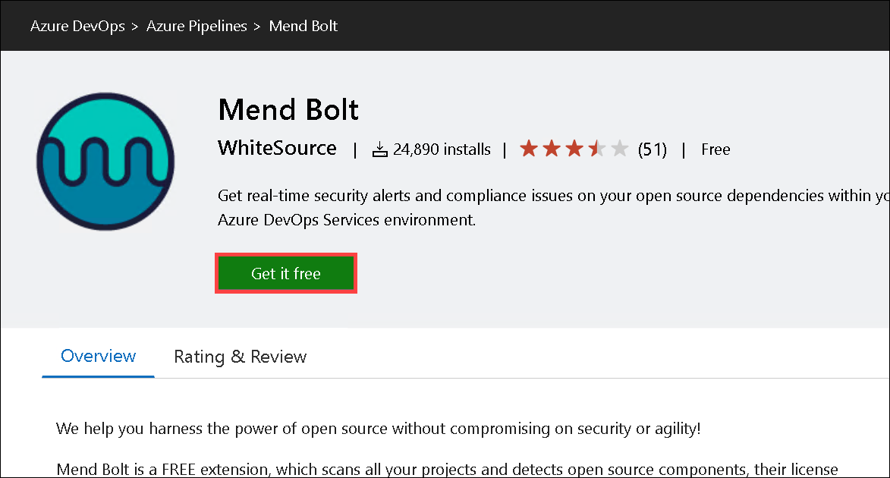

1. Click on **Install**.

    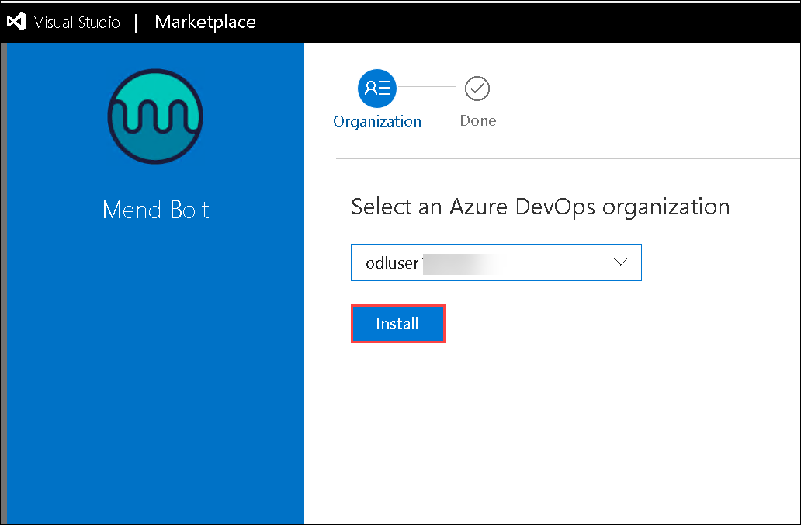

1. Click on **Proceed to organization**.

    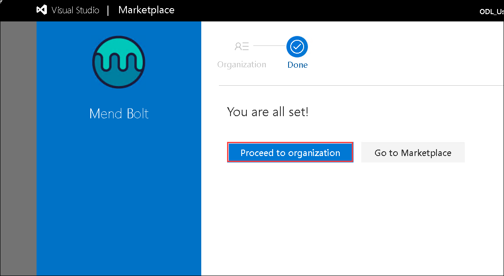

1. On the **Organization Settings**, select **Mend (1)** under Extensions. Provide your First name, Last name, Work Email, Company Name and other details **(2)** and then click **Create Account (3)** button to start using the Free version.    

    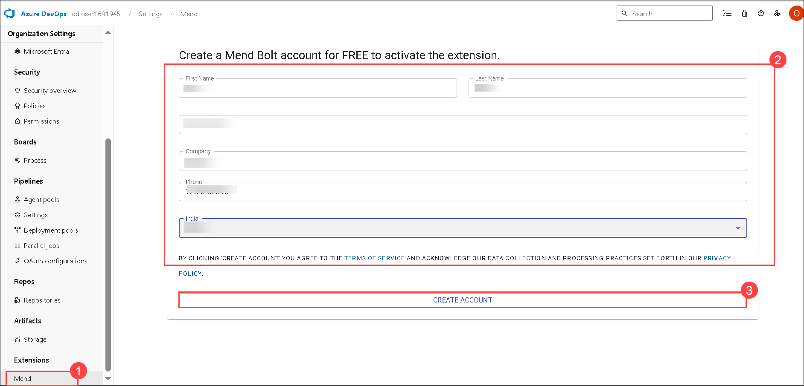

### Task 2: Create and Trigger a build 

1. On the **Organization Setting** page, click on **Azure DevOps** located at top left corner.

    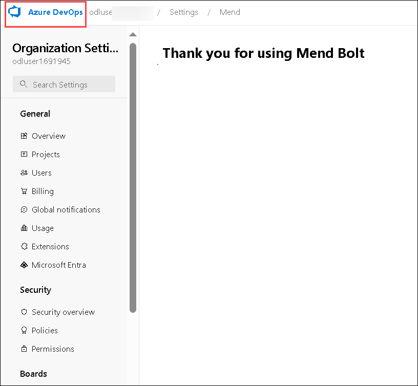

1. Select the **eShopOnWeb_MultiStageYAML** project.

    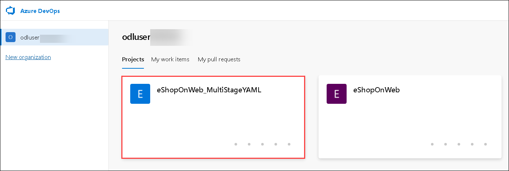

1. Select **Pipelines (1)** under **Pipelines** section, then select the recent pipeline **(2)**.

    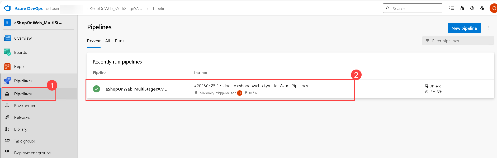

1. Click on **Edit**.

    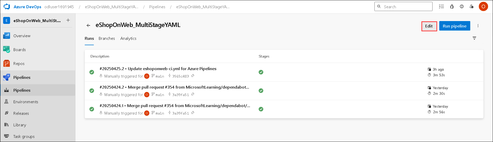

1. On the **Show assistant**, Search for **Mend (1)** and select **Mend Bolt (2)** from the results.

    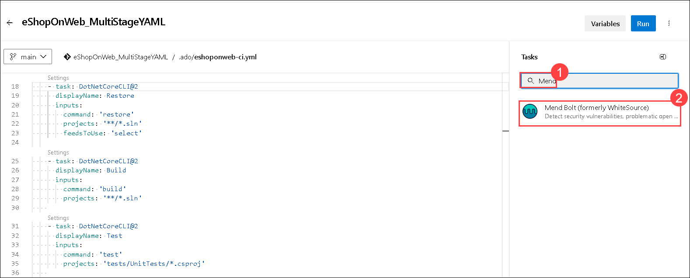

1. Under the **Project name**, enter **eShopOnWeb_MultiStageYAML (1)** and then click on **Add (2)**.

    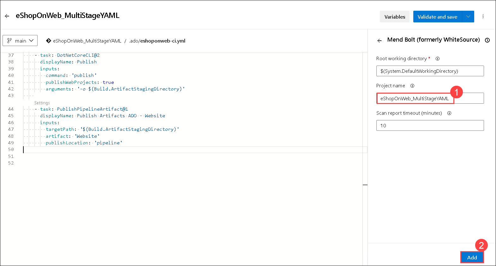

1. Give 2 Tab spaces, make sure the alignment is there as in the screenshot **(1)** and then click on **Validate and save (2)**.

    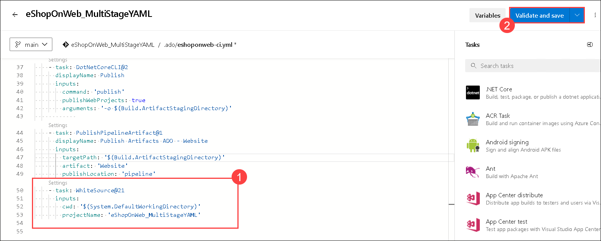

1. Click on **Save**.

    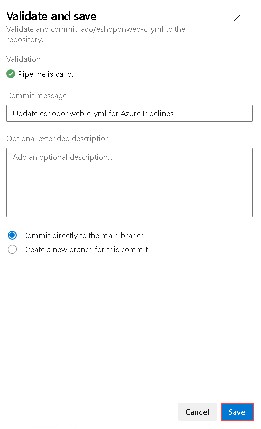

1. 
