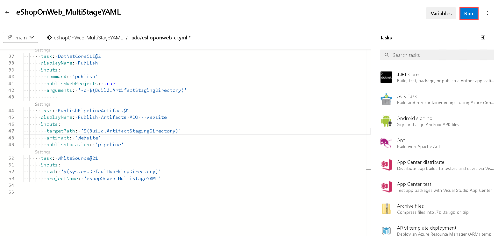
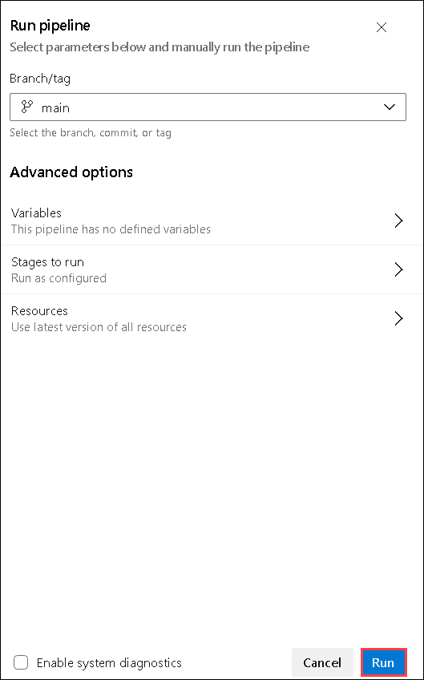
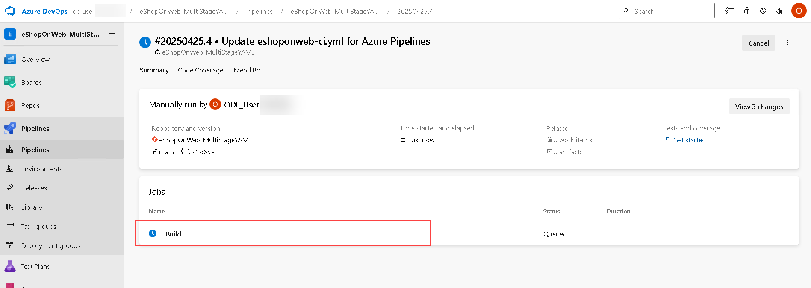
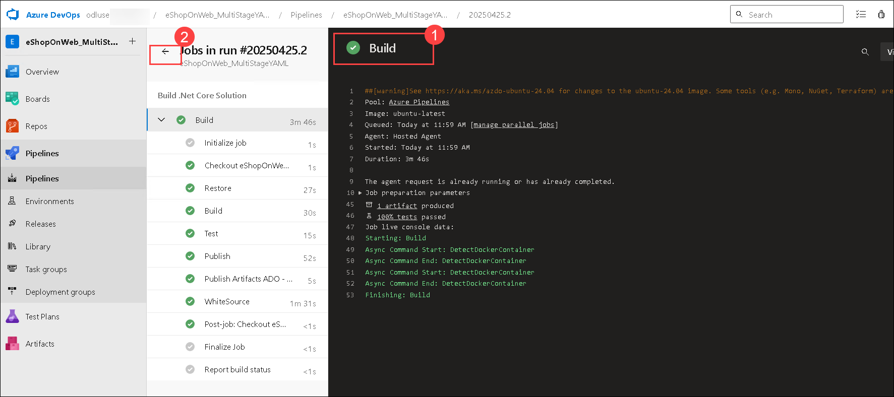
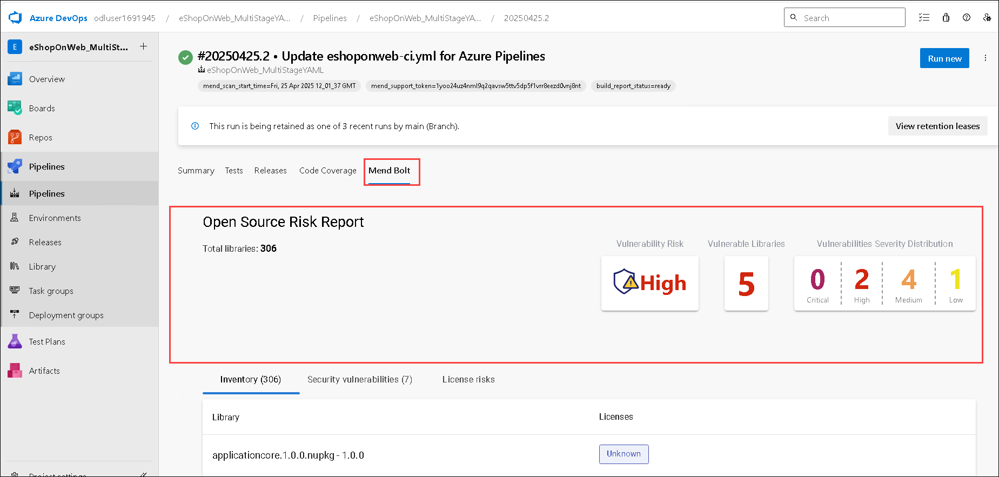
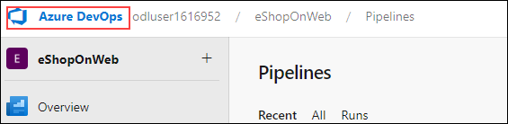
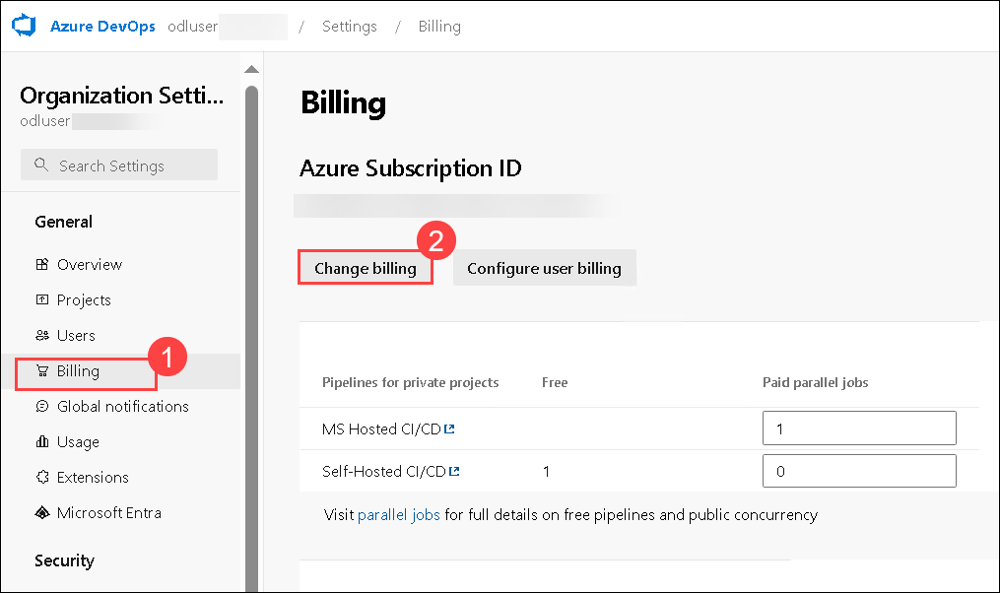
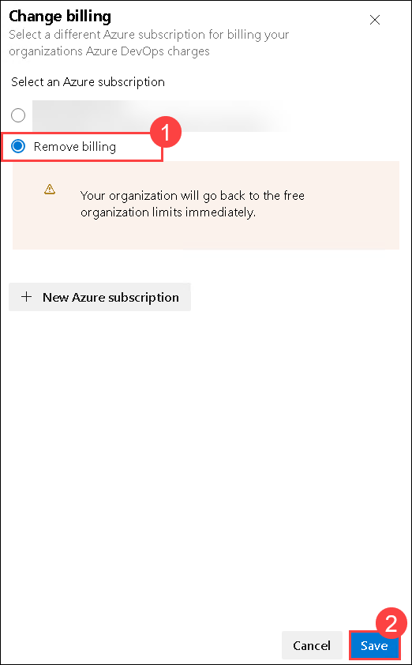

# Lab 5: Implementing Security and Compliance in an Azure Pipeline 

## Exercise 1: Implement Security and Compliance in an Azure DevOps pipeline by using Mend Bolt 

### Task 1: Activate Mend Bolt extension 

1. On the Azure DevOps page click on **Azure DevOps** located at top left corner.

    

1. Then click on **Organization Setting** at the left down corner. 

    

1. Navigate to **Extensions (1)** under **General** and click on **Browse marketplace**.

    

1. Search for **Mend Bolt (1)**, click on **Search (2)** icon and then select from the results **(3)**.

    

1. Select **Get it free**.

    

1. Click on **Install**.

    

1. Click on **Proceed to organization**.

    

1. On the **Organization Settings**, select **Mend (1)** under Extensions. Provide your First name, Last name, Work Email, Company Name and other details **(2)** and then click **Create Account (3)** button to start using the Free version.    

    

### Task 2: Create and Trigger a build 

1. On the **Organization Setting** page, click on **Azure DevOps** located at top left corner.

    

1. Select the **eShopOnWeb_MultiStageYAML** project.

    

1. Select **Pipelines (1)** under **Pipelines** section, then select the recent pipeline **(2)**.

    

1. Click on **Edit**.

    

1. On the **Show assistant**, Search for **Mend (1)** and select **Mend Bolt (2)** from the results.

    

1. Under the **Project name**, enter **eShopOnWeb_MultiStageYAML (1)** and then click on **Add (2)**.

    

1. Give 2 Tab spaces, make sure the alignment is there as in the screenshot **(1)** and then click on **Validate and save (2)**.

    

1. Click on **Save**.

    

1. Click on **Run** to run the pipeline.

    

1. Click on **Run** again.

    

1. Click on **build**.

    

1. Once the build is completed **(1)**, click back navigation **(2)** to see the summary which shows Test results, Build artifacts etc. as shown below.    

    

1. Navigate to **Mend Bolt** tab. This shows the list of all vulnerable open source components with Vulnerability Risk, Vulnerable Libraries, Severity Distribution.

    

### Task 3: Remove the Azure DevOps billing

In this task, you will remove pipeline billing to eliminate unnecessary charges.

1. On the lab computer, switch to the browser window displaying Azure DevOps organization homepage by clicking on **Azure Devops** from the top left corner.

   

1. Select **Organization Settings** at bottom left corner.

   

1. Under **Organization Settings** select **Billing (1)** from the left pane and click on **Change billing (2)** button to open Change billing pane.

   

1. In the **Change billing** pane, select **Remove billing (1)** setting and click on **Save (2)**.      

   